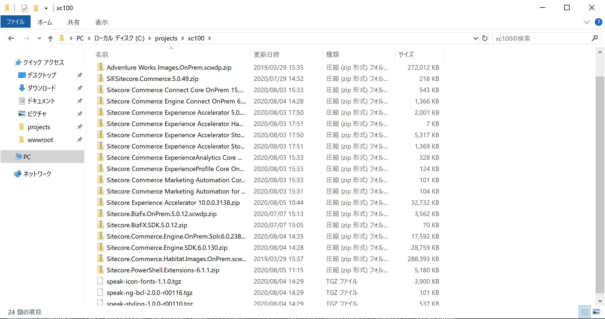
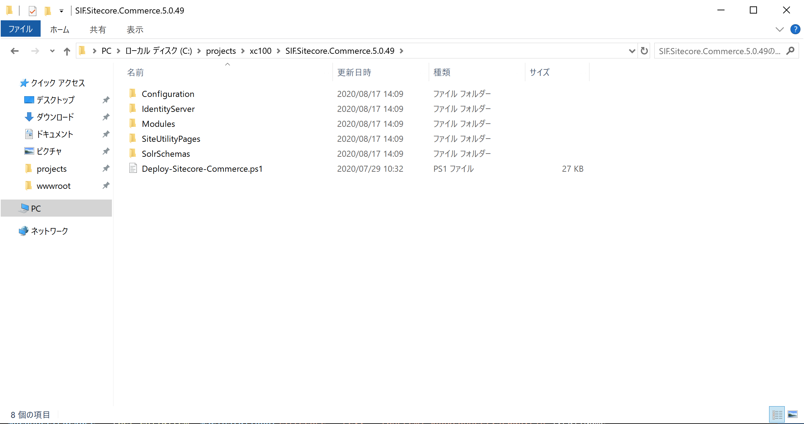
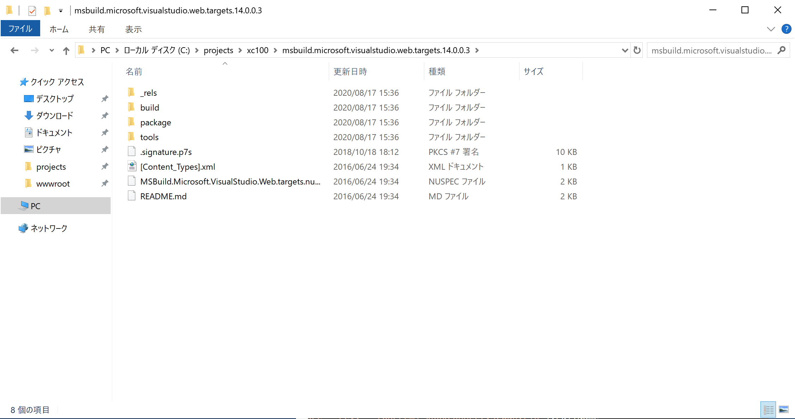
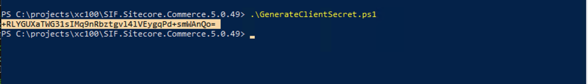

########################################
Commerce モジュールのインストール
########################################

**********************
Redis のインストール
**********************

Redis のモジュールをダウンロード、インストールしてください。

* `Redis <https://github.com/microsoftarchive/redis/releases/tag/win-3.0.504>`_

.. image:: images/redis01.png
   :align: center
   :width: 400px
   :alt: Redis インストール

*********************************
.NET Core 3.1.6 のインストール
*********************************

Sitecore Experience Commerce 10.0 は .NET Core 3.1.6 のモジュールが必要となります。以下のサイトから、Hosting Bundle を選択してインストールしてください。

* https://dotnet.microsoft.com/download/dotnet-core/3.1

**********************
.NET Core 2.1 の更新
**********************

Sitecore Experience Platform 10.0 のインストールアシスタントを利用している場合、.NET Core のランタイムとして 2.1.15 がインストールされています。Sitecore Experience Commerce 10.0 では .NET Core 2.1.18 以上が必要となりますので、以下のサイトから、Hosting Bundle を選択してダウンロード、インストールしたあと、再起動してください。

* https://dotnet.microsoft.com/download/dotnet-core/2.1

**********************
インストールの準備
**********************

モジュールを Sitecore のダウンロードサイトからダウンロードします。

* `Sitecore Experience Commerce 10.0 <https://dev.sitecore.net/Downloads/Sitecore_Commerce/100/Sitecore_Experience_Commerce_100.aspx>`_

ダウンロードしたファイルを、今回は `c:\\projects\\xc100` に展開をします。

`SIF.Sitecore.Commerce.zip` のファイルを展開します。

SXA のコンポーネント `Sitecore.PowerShell.Extensions-6.1.1.zip` と `Sitecore Experience Accelerator 10.0.0.3138.zip` を同じフォルダにコピーします。

Nuget サイトから `MSBuild Microsoft Visual Studio Web targets <https://www.nuget.org/packages/MSBuild.Microsoft.VisualStudio.Web.targets/>`_ のページ、右側から `Download package` から zip ファイルをダウンロードします。

ダウンロード後、ファイル名を `msbuild.microsoft.visualstudio.web.targets.14.0.0.3.nupkg` から `msbuild.microsoft.visualstudio.web.targets.14.0.0.3.zip` に変更し、解凍します。

展開されたフォルダは以下のようになります。

.. code-block:: 

   PS C:\projects\xc100> dir

      ディレクトリ: C:\projects\xc100

   Mode                LastWriteTime         Length Name
   ----                -------------         ------ ----
   d-----       2020/08/17     15:36                msbuild.microsoft.visualstudio.web.targets.14.0.0.3
   d-----       2020/08/18     10:58                SIF.Sitecore.Commerce.5.0.49
   ------       2019/03/29     15:35      278539353 Adventure Works Images.OnPrem.scwdp.zip
   ------       2020/07/29     14:32         222652 SIF.Sitecore.Commerce.5.0.49.zip
   ------       2020/08/03     15:33         555210 Sitecore Commerce Connect Core OnPrem 15.0.26.scwdp.zip
   ------       2020/08/04     14:28        1398649 Sitecore Commerce Engine Connect OnPrem 6.0.77.scwdp.zip
   ------       2020/08/03     17:50        2048560 Sitecore Commerce Experience Accelerator 5.0.106.scwdp.zip
   ------       2020/08/03     17:51           6386 Sitecore Commerce Experience Accelerator Habitat Catalog 5.0.106.scwdp
                                                   .zip
   ------       2020/08/03     17:50        5444315 Sitecore Commerce Experience Accelerator Storefront 5.0.106.scwdp.zip
   ------       2020/08/03     17:51        1401256 Sitecore Commerce Experience Accelerator Storefront Themes 5.0.106.scw
                                                   dp.zip
   ------       2020/08/03     15:33         335715 Sitecore Commerce ExperienceAnalytics Core OnPrem 15.0.26.scwdp.zip
   ------       2020/08/03     15:33         126267 Sitecore Commerce ExperienceProfile Core OnPrem 15.0.26.scwdp.zip
   ------       2020/08/03     15:33         103262 Sitecore Commerce Marketing Automation Core OnPrem 15.0.26.scwdp.zip
   ------       2020/08/03     15:31         106333 Sitecore Commerce Marketing Automation for AutomationEngine 15.0.26.zi
                                                   p
   -a----       2020/08/05     10:44       33517169 Sitecore Experience Accelerator 10.0.0.3138.zip
   ------       2020/07/07     15:13        3647123 Sitecore.BizFx.OnPrem.5.0.12.scwdp.zip
   ------       2020/07/07     15:05          71134 Sitecore.BizFX.SDK.5.0.12.zip
   ------       2020/08/04     14:35       18013321 Sitecore.Commerce.Engine.OnPrem.Solr.6.0.238.scwdp.zip
   ------       2020/08/04     14:28       29448805 Sitecore.Commerce.Engine.SDK.6.0.130.zip
   ------       2019/03/29     15:37      295313591 Sitecore.Commerce.Habitat.Images.OnPrem.scwdp.zip
   -a----       2020/08/05     11:15        5303614 Sitecore.PowerShell.Extensions-6.1.1.zip
   ------       2020/08/04     14:29        3993490 speak-icon-fonts-1.1.0.tgz
   ------       2020/08/04     14:29         103085 speak-ng-bcl-2.0.0-r00116.tgz
   ------       2020/08/04     14:29         549593 speak-styling-1.0.0-r00110.tgz

*********************************
インストールスクリプトの調整
*********************************

すでに展開されている `C:\\projects\\xc100\\SIF.Sitecore.Commerce.5.0.49` に入っている `Deploy-Sitecore-Commerce.ps1` のファイルを開きます。

ファイルの中にある以下の項目を確認、変更してください。サイト名などを変えている場合は、その値を変更する必要があります。

============================= ===================================================== 
パラメータ                      設定値                 
============================= ===================================================== 
$SkipInstallDefaultStorefront StoreFront （デモサイト）インストールスキップのフラグ
$SiteNamePrefix               Sitecore インストールで利用した Prefix を設定
$SiteName                     サイト名を設定
$IdentityServerSiteName       Sitecore Identity Server のインスタンス名
$SitecoreIdentityServerUrl    上記の URL
$SiteHostHeaderName           Storefront サイトの URL
$XConnectInstallDir           xConnect インストールディレクトリ
$SqlUser                      SQL Server のログイン ID
$SqlPass                      SQL Server のパスワード
$SolrRoot                     Solr をインストールしているディレクトリ
$SolrService                  Solr のサービス名
$CommerceServicesHostPostfix  Commerce Service のホスト名
============================= ===================================================== 

以下のパラメーターは Braintree のサイトからサンドボックスを作成して ID の設定を行います。

====================== ============ 
パラメータ               設定値                 
====================== ============ 
$BraintreeMerchantId   MerchantId
$BraintreePublicKey    Public Key
$BraintreePrivateKey   Private Key
$BraintreeEnvironment  sandbox
====================== ============ 

CommerceEngineConnectClientSecret のパラメーターに Client Secret を設定する必要がります。
ClientSecret の値を取得するために、以下のスクリプトを実行してください。

.. code-block:: powershell

   $bytes = New-Object Byte[] 32
   $rand = [System.Security.Cryptography.RandomNumberGenerator]::Create()
   $rand.GetBytes($bytes)
   $rand.Dispose()
   $newClientSecret = [System.Convert]::ToBase64String($bytes)

   Write-Host $newClientSecret

サンプルのファイルは、 https://github.com/SitecoreJapan/InstallScript/blob/master/XC100/GenerateClientSecret.ps1 に展開しています。

上記のパラメータを反映させて、スクリプトの保存をします。

**********************
インストール開始
**********************

編集をしたスクリプトを実行します。

.. code-block:: powershell

    .\XC100-Sitecore-Commerce.ps1
