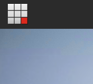

##############################
日本語リソースのインポート
##############################

ここでは Sitecore に日本語リソースをインポートする方法を紹介しています。

******************************
日本語リソースファイルの準備
******************************

日本語リソースに関しては、Sitecore のダウンロードサイトからリソースファイルのダウンロードが可能です。

* `Sitecore Experience Platform 10.0 <https://dev.sitecore.net/Downloads/Sitecore_Experience_Platform/100/Sitecore_Experience_Platform_100.aspx>`_

ページの下のほうにある、`Client translations` の一覧にある `Japanese (ja-JP)` のファイルをダウンロードしてください。

また一部の日本語リソースを修正するためのファイルを、GitHub の `SitecoreaJapan/InstallScript <https://github.com/SitecoreJapan/InstallScript/tree/master/930>`_ のリポジトリに公開しています。以下のファイルをダウンロードしてください。

* ja-jp-update.xml

**********************
日本語リソースの追加
**********************

インストールをした Sitecore の環境に管理者としてログインをしてください。

.. image:: images/jajp01.png
   :align: center
   :width: 400px
   :alt: スタート画面

* Desktop を起動します
* 右下に表示されている `master` をクリックして `core` に切り替えます

* 左上にある Sitecore メニューをクリックしてスタート画面に戻ります。

* `Controle Panel` を開きます
* `Localization` にある `Add a new language` をクリックします

.. image:: images/jajp04.png
   :align: center
   :width: 400px
   :alt: 言語の追加

* 一覧から `Japanese (Japan) : 日本語(日本)` を選択します。

* `codepage`、`Encoding` および `iso-2022-jp` に関しては標準の設定のままで次のダイアログに移動します。
* `Spellchecker file name` は空欄のまま次に進みます
* 追加が完了します

これで UI のリソースを追加する言語を追加することができました。続いて、コンテンツを追加できるように、データベースを戻します。

* スタート画面で `Desktop` を選択
* 右下のデータベースを `core` から `master` に戻します。

* `Controle Panel` を開いて、もう一度 `Localization` にある `Add a new language` から日本語を追加します（手順は上記と同じです）。

これでデータベースとして日本語のデータを扱うことができるようになりました。

***************************
日本語リソースのインポート
***************************

* `Controle Panel` を開いて、今度は `Localization` にある `Import Language` を開きます。

.. image:: images/jajp06.png
   :align: center
   :width: 400px
   :alt: 言語の追加

ファイルの選択画面が表示されます。Browse をクリックします。

.. image:: images/jajp07.png
   :align: center
   :width: 400px
   :alt: ファイルの選択

Web サーバのディレクトリが表示されます。この画面からアップロードをすることができますが、今回は手間を省くために以下のような作業を実施します。

* インストール先の `C:\\inetpub\\wwwroot\\sxa.strorefront.com\\temp` のフォルダを開きます
* ここにダウンロード済のファイルを展開します（ Sitecore 9.3.0 rev. 003498 (ja-JP).zip のファイルの中にある ja-jp.xml を temp にコピー）
* ディレクトリに2つのファイルが入っているのを確認します

* Sitecore の管理画面に戻ります
* `temp` フォルダの中に2つファイルがあることを確認します

.. image:: images/jajp09.png
   :align: center
   :width: 400px
   :alt: リソースファイルの確認

* `ja-jp.xml` のファイルを選択します

.. image:: images/jajp10.png
   :align: center
   :width: 400px
   :alt: ja-jp の選択

* `Next` をクリックして言語を確認します。ここでは `Japanese(Japan):日本語(日本)` のみが選択肢として表示されます。

.. image:: images/jajp11.png
   :align: center
   :width: 400px
   :alt: 日本語の選択

* データベースとして core を選択（デフォルト）のまま進めてインポートを開始します。

.. image:: images/jajp12.png
   :align: center
   :width: 400px
   :alt: Core データベースの選択

* 上記の手続きを、`ja-jp-update.xml` に対しても同じ手続きでインポートをします。

* Commerce のページで提供されている、Business Tools translations 、SXA Storefront translations、Commerce Connect translations の日本語リソースもインポートします。

*************
参考動画
*************

.. raw:: html

    <iframe width="560" height="315" src="https://www.youtube.com/embed/RV3oiI6eC_A" frameborder="0" allowfullscreen></iframe>

