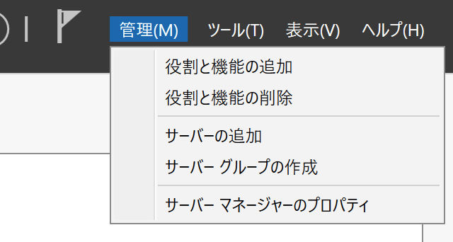
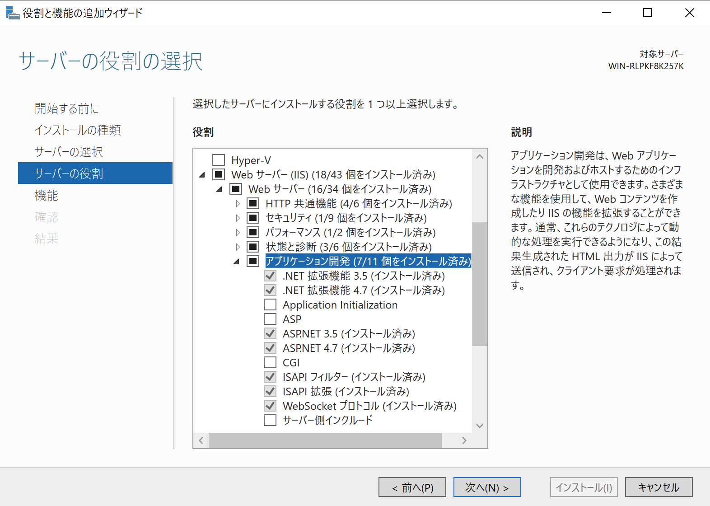
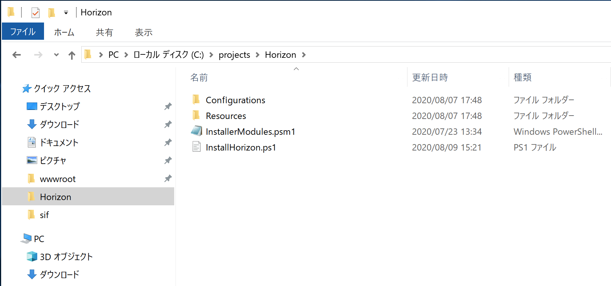
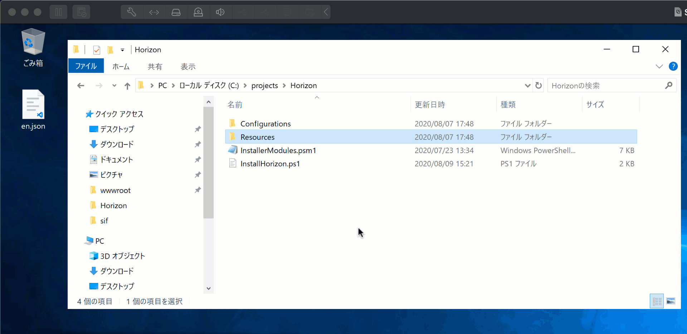
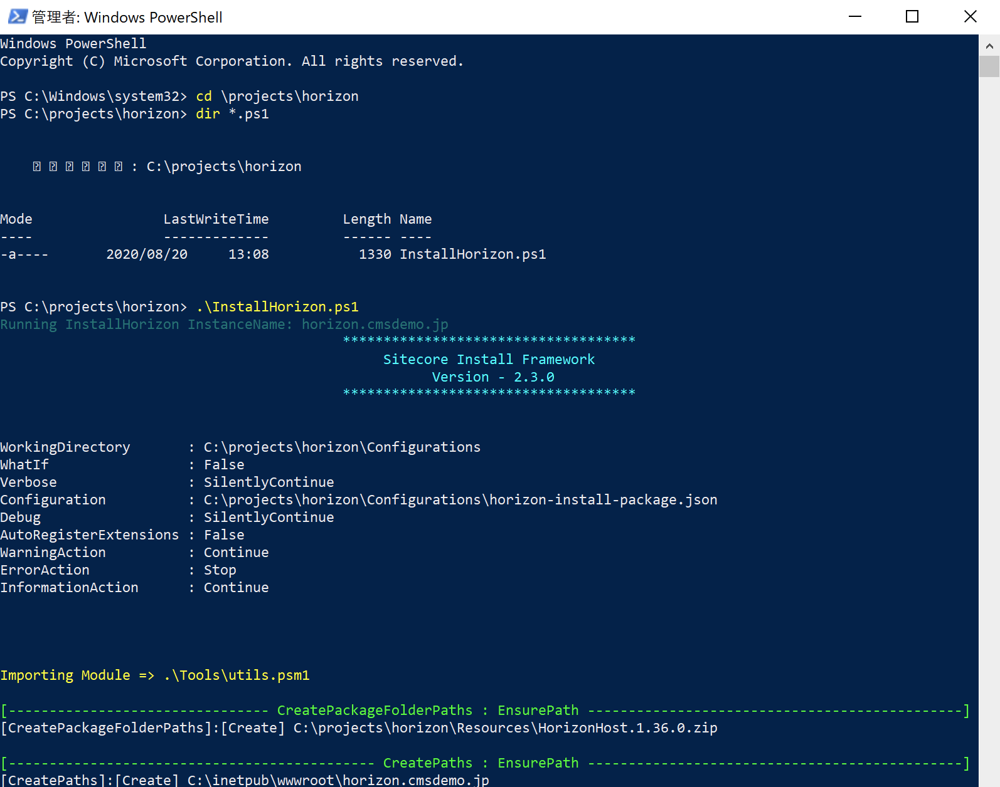

########################
Horizon エディター
########################

Sitecore Experience Platform で利用できる新しい編集ツール、Horizon エディターのインストール方法に関して紹介をしています。

*************************
システムの追加機能
*************************

Horizon エディターは、 ASP.NET Core 2.1.18 以降のランタイムが必要となります。ランタイムが入っていない場合は、以下のページから該当モジュールをダウンロード、インストールしてください。

* https://dotnet.microsoft.com/download/dotnet-core/2.1
   * ASP.NET Core 2.1 Runtime (v2.1.18) - Windows Hosting Bundle

Horizon エディターを利用するにあたって、WebSocket プロトコルを IIS にインストールする必要があります。インストールの手順は以下の通りです。

* サーバーマネージャーを起動します
* メニューから 「管理」ー「役割と機能の追加」を選択します

* サーバーの役割まで進めて、「Web サーバー（IIS)」 - 「Web サーバー」 - 「アプリケーション開発」 - 「WebSocket プロトコル」を選択します。

ウィザードを実行して環境の設定に関しては終了となります。

*************************
モジュールの展開
*************************

Horizon エディターのモジュールをダウンロードし、Sitecore Horizon 10.0.0.zip のファイルを C:\\projects\\horizon に展開します

*************************
日本語リソースの準備
*************************

Horizon エディターに関しては、標準では英語の UI のみを提供しています。ここでは、日本語リソースをダウンロードして、インストール後に日本語の UI で利用できるようにします（言語切り替え機能は将来のバージョンで提供予定）。
英語の UI のままで進める場合は、このステップはスキップできます。

手順は以下の通りです。

* https://github.com/SitecoreJapan/InstallScript/tree/master/100 から en.json ファイルをダウンロードします
* C:\\projects\\Horizon\\Resources にある zip ファイル HorizonHost.1.36.0.zip を開きます（展開せずエクスプローラーで参照）
* zip ファイルの中にある \\sitecore\\Sitecore.Horizon.Client\\Client\\dist\\assets\\i18n のフォルダに移動
* en.json ファイルを入れ替えます

************************
インストールの手順
************************

スクリプトの調整
====================

サイトに関する情報、ファイル名などを記載する必要があります。Horizon の展開されたフォルダにある InstallHorizon.ps1 スクリプトを変更します。

.. code-block:: powershell

    param (
    [string]$horizonInstanceName,
    [string]$horizonPhysicalPath = "C:\inetpub\wwwroot\$horizonInstanceName",
    [string]$horizonAppUrl = "https://$horizonInstanceName",
    [string]$sitecoreCmInstanceName,
    [string]$sitecoreCmInstanceUrl = "https://$sitecoreCmInstanceName",
    [string]$sitecoreCmInstansePath = "C:\inetpub\wwwroot\$sitecoreCmInstanceName",
    [string]$identityServerPoolName,
    [string]$identityServerUrl = "https://$identityServerPoolName",
    [string]$identityServerPhysicalPath = "C:\inetpub\wwwroot\$identityServerPoolName",
    [string]$licensePath,
    [bool]$enableContentHub,
    [ValidateSet("XP", "XM")]
    [string]$topology
    )

変更する項目は以下の通りです。

+------------------------+----------------------------------+
| パラメーター           | 設定値                           |
+------------------------+----------------------------------+
| horizonInstanceName    | Horizon エディターのインスタンス |
+------------------------+----------------------------------+
| sitecoreCmInstanceName | CM サーバーのインスタンス        |
+------------------------+----------------------------------+
| identityServerPoolName | Identity Server のインスタンス   |
+------------------------+----------------------------------+
| licensePath            | ライセンスファイルへのパス       |
+------------------------+----------------------------------+
| topology               | XP もしくは XM の設定            |
+------------------------+----------------------------------+

今回は以下のように設定をしました。

.. code-block:: powershell

    param (
    [string]$horizonInstanceName = "horizon.dev.local",
    [string]$horizonPhysicalPath = "C:\inetpub\wwwroot\$horizonInstanceName",
    [string]$horizonAppUrl = "https://$horizonInstanceName",
    [string]$sitecoreCmInstanceName = "XP0.dev.local",
    [string]$sitecoreCmInstanceUrl = "https://$sitecoreCmInstanceName",
    [string]$sitecoreCmInstansePath = "C:\inetpub\wwwroot\$sitecoreCmInstanceName",
    [string]$identityServerPoolName = "XP0.identityserver",
    [string]$identityServerUrl = "https://$identityServerPoolName",
    [string]$identityServerPhysicalPath = "C:\inetpub\wwwroot\$identityServerPoolName",
    [string]$licensePath = "c:\projects\sif\license.xml",
    [bool]$enableContentHub,
    [ValidateSet("XP", "XM")]
    [string]$topology = "XP"
    )

サンプルのソースコードは、https://github.com/SitecoreJapan/InstallScript/tree/master/100 にて参照可能です。

スクリプトの実行
====================

準備が整ったところで、更新したスクリプトを実行します。

日本語リソースの追加
====================

インストール後、https://github.com/SitecoreJapan/InstallScript/tree/master/100 にある horizon-ja-jp.xml ファイルをインポートしてください。

スタート画面から Horizon を起動してください。