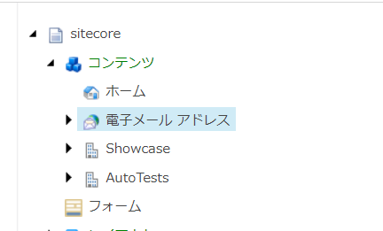
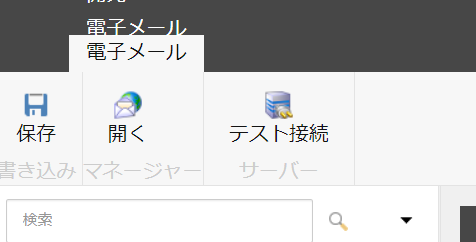
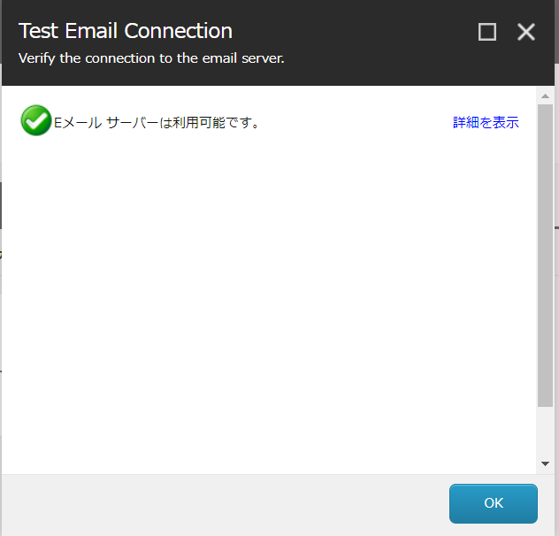

################################
Email Experience Manager 
################################

*********************
Custom SMTP の設定
*********************

Sitecore の Email Experience Manager に関しては、月間のメール利用料を基にした契約をすることで、メールの配信ができるサービスとなります。デモで利用する場合は、 Custom SMTP を利用することで、デモを実施することができます。手順に関しては以下のページが参考になります。

* `Use a Custom SMTP for email delivery <https://doc.sitecore.com/developers/exm/92/email-experience-manager/en/use-a-custom-smtp-for-email-delivery.html>`_

ここでは、web.config の項目を確認してください。以下のように CustomeSMTP になっていれば、web.config の設定は問題ありません。

.. code-block:: xml

    <add key="eds:define" value="CustomSMTP" />

Sitecore でメールを利用するためには、通常は Email Experience Manager のサービスを契約することで対応できますが、デモや検証にあたっては CustomSMTP を使う形となります。ここでは、CustomSMTP の場合のメールサービスの設定を紹介しています。

Sitecore.config の設定
========================

`App_Config` のフォルダにある `Sitecore.config` の設定を変更します。今回は Outlook.com のメールアドレス、サーバーの設定で紹介をしていますが、実際に利用するサーバーが別にある場合は、そのサーバーの値に合わせて設定をしてください。

================== ==========================
設定               値 
================== ==========================
MailServer         smtp.office365.com 
MailServerUserName メールアドレス 
MailServerPassword パスワード 
MailServerPort     587 
MailServerUseSsl   true 
================== ==========================

設定は以下の通りとなります。

.. code-block:: xml

    <!--  MAIL SERVER
            SMTP server used for sending mails by the Sitecore server
            Is used by MainUtil.SendMail()
            Default value: ""
      -->
    <setting name="MailServer" value="smtp.office365.com" />
    <!--  MAIL SERVER USER
            If the SMTP server requires login, enter the user name in this setting
      -->
    <setting name="MailServerUserName" value="メールアドレス" />
    <!--  MAIL SERVER PASSWORD
            If the SMTP server requires login, enter the password in this setting
      -->
    <setting name="MailServerPassword" value="パスワード" />
    <!--  MAIL SERVER PORT
            If the SMTP server requires a custom port number, enter the value in this setting.
            The default value is: 25
      -->
    <setting name="MailServerPort" value="587" />
    <!--  MAIL SERVER SSL
            If the SMTP server requires SSL, set the value to true.
            The default value is: false
    -->
    <setting name="MailServerUseSsl" value="true" />

******************
CustomSMTP の設定
******************

`App_Config\Sitecore\EmailExperience` のフォルダにある `Sitecore.EDS.Providers.CustomSMTP.config` および `Sitecore.EDS.Providers.CustomSMTP.Sync.config` のファイルの編集をします。

Sitecore.EDS.Providers.CustomSMTP.config
============================================

まずは SMTP サーバーとの接続に関しての設定をします。項目としては以下のとおりです。

==================== =======================
設定                 値 
==================== =======================
server               smtp.office365.com 
port                 587 
userName             メールアドレス |
password             パスワード 
authenticationMethod Login 
startTls             true 
proxySettings        exm/eds/proxySettings 
==================== =======================

サンプルのコードは以下のとおりです。

.. code-block::

    <smtpSettings type="Sitecore.EDS.Core.Net.Smtp.SmtpSettings, Sitecore.EDS.Core" singleInstance="true">
        <server>smtp.office365.com</server>
        <port>587</port>
        <userName>メールアドレス</userName>
        <password>パスワード</password>
        <authenticationMethod>Login</authenticationMethod>
        <startTls>true</startTls>
        <proxySettings ref="exm/eds/proxySettings" />
    </smtpSettings>

Sitecore.EDS.Providers.CustomSMTP.Sync.config
==============================================

続いて POP サーバーとの接続に関しての設定をします。項目としては以下のとおりです。

==================== =======================
設定                 値 
==================== =======================
server               outlook.office365.com 
port                 995 
userName             メールアドレス |
password             パスワード 
useSsl               true 
startTls             true 
proxySettings        exm/eds/proxySettings 
==================== =======================

サンプルのコードは以下のとおりです。

.. code-block::

    <pop3Settings>
        <pop3Setting type="Sitecore.EDS.Core.Net.Pop3.Pop3Settings, Sitecore.EDS.Core" singleInstance="true">
            <server>outlook.office365.com</server>
            <port>995</port>
            <userName>メールアドレス</userName>
            <password>パスワード</password>
            <useSsl>true</useSsl>
            <startTls>true</startTls>
            <proxySettings ref="exm/eds/proxySettings"/>
        </pop3Setting>
    </pop3Settings>

これで設定が完了しました。念のため、`iisreset` を実行してアプリケーションを再起動してください。

*************
接続テスト
*************

サーバーとの接続テストを実施するために、管理画面にアクセスをして、コンテンツエディターを開いてください。左側のコンテンツツリーに表示されている、 Sitecore - コンテンツ - 電子メールアドレス のアイテムを選択します。

アイテムを選択すると、メニューに `電子メール` のタブが追加され、`テスト接続` のアイコンが表示されます。これをクリックしてください。

テスト結果として、Eメールサーバーは利用可能です、と表示されることで、メールサーバーとの接続を確認することができました。

接続ができない場合は、いくつかの要因があります。

* 多要素認証を組み合わせてメールを利用している
* SMTP での接続を許可していない
* メールツールでの接続を許可していない

メールサーバーのセキュリティによって、利用できない場合があります。サーバーの管理者に確認をして、設定をしてください。

テストが完了すれば、実際にメールを送ることが可能となります。
