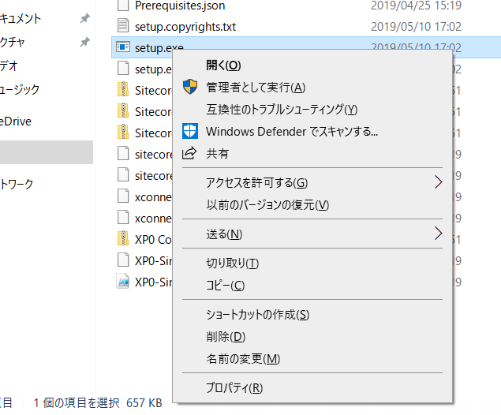
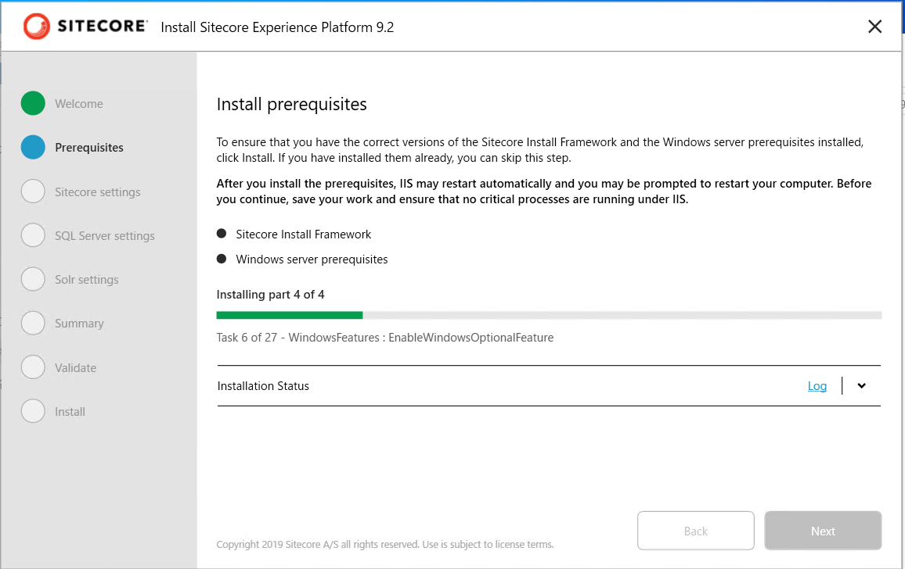
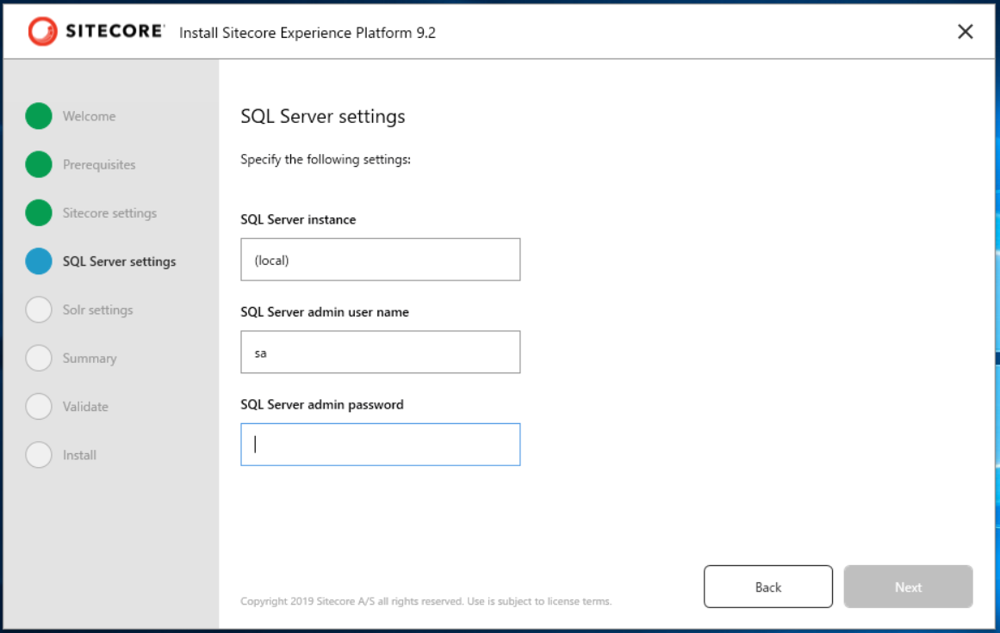

#############################################
Sitecore Experience Platform のインストール
#############################################

Sitecore 9.2 以降では Sitecore Instllation Assistant というインストール支援ツールの提供を開始しました。これにより、必要なモジュールのダウンロードなど全てツールが展開をするため、簡単にインストールをすることができるようになりました。

ここでは、すでに SQL Server 2017, Solr 7.5 がインストールされていることを前提として、このツールを利用してインストールを進めていきます。

****************************************
Sitecore のインストールプログラムの入手
****************************************

今回は Sitecore Install Assistant を利用してインストールを進めていきます。このため、以下の Web サイトからインストールファイルをダウンロードしてください。

* `Sitecore Experience Platform 9.2 Initial Release <https://dev.sitecore.net/Downloads/Sitecore_Experience_Platform/92/Sitecore_Experience_Platform_92_Initial_Release.aspx>`_

`Download options for On Premises deployment` のグループにある `Graphical setup package for XP Single` をダウンロードしてください。インストールファイルのダウンロードが完了した、ファイルを展開して次のステップに進みます。

*************************
モジュールのダウンロード
*************************

この手順に関しては、１つの環境で初回のみ実行してください。すでに Sitecore をインストールしている環境の場合は、モジュールはインストールしてあるため、スキップしてください。

Sitecore Install Assistant を立ち上げます。これはダウンロードをしたファイルを展開してください。

`setup.exe` を右クリックして、管理者としてをします。

インストーラーが立ち上がると以下のような画面となります。

Start のボタンをクリックすると、モジュールのインストール画面になります。

Install のボタンをクリックして、必要なモジュールをインストールしてください。

インストールが完了すると、`Next` のボタンが有効になります。

********************
インストールの開始
********************

モジュールのインストールが完了すると、次は Sitecore のインストールとなります。

Sitecore Settings 
==================

インストールをする際の設定を記載します。以下の項目を入力してください。以下の値は例となります。

============================= ==================== =======================
パラメータ                     入力値                説明 
============================= ==================== =======================
Installation/Solution prefix  92                   DB 名、サイト名で利用
Sitecore admin password       P@ssw0rd             管理者のパスワードの設定
Sitecore license file         license.xml へのパス  ライセンスファイル
============================= ==================== =======================

SQL Server settings
====================

続いてインストールをしている SQL Server に関する設定を入力します。

============================ ======== =======================
パラメータ                     力値     説明
============================ ======== =======================
SQL Server instance          (local)  サーバーのインスタンス名  
SQL Server admin user name   sa       管理者ユーザー名  
SQL Server admin password    ******   管理者パスワード 
============================ ======== =======================

Solr の設定
=============

すでにインストールしている Solr の設定を入力していきます。ここでは、[Solr 7.5 のインストール](./solr.md) でインストールしているパラメータを利用しています。

========================== ============================ ===============================
パラメータ                  入力値                        説明  
========================== ============================ ===============================
Solr service URL           https://localhost:8983/solr  Solr の URL
Solr file system root      C:\solr\solr-7.5.0           Solr インストール先のディレクトリ
Solr Windows service name  Solr-7.5.0                   サービスの名前
========================== ============================ ===============================

インストール最終確認
====================

設定をしたパラメーターの確認画面が表示されます。

.. image:: images/sia09.png
   :align: center
   :width: 400px
   :alt: パラメーターの確認

また各種ファイルの検証が行われます。

全てっチェックが完了したところで、Install のボタンをクリックしてください。

.. image:: images/sia11.png
   :align: center
   :width: 400px
   :alt: インストールの開始

これでインストールが無事完了します。

********************
インスタンスの確認
********************

インストールをした Sitecore のインスタンスを確認します。検索ボックスで `IIS` と入力すると、以下のように管理ツールが表示されます。

サイトの一覧を確認します。

.. image:: images/iis02.png
   :align: center
   :width: 400px
   :alt: サイトの一覧

今回の設定の場合、3つの Web サイトが立ち上がっています。

=========================== ======================
サイト名                    サイトの役割
=========================== ======================
92sc.dev.local              コンテンツ管理サーバー 
92identityserver.dev.local  認証サーバー 
92xconnect.dev.local        xConnect サーバー 
=========================== ======================

まずはコンテンツ管理サーバーにアクセスをします。ブラウザで `http://92sc.dev.local` にアクセスをしてください。初回起動は若干時間がかかりますので、待ちましょう。

管理者でログインをすることができるか確認をします。ログインをする際には、コンテンツ管理サーバーに対して `/sitecore` の URL を追加するとログインの画面に遷移します。

管理者のアカウントは `Admin` 、パスワードはインストーラーで設定したパスワードを指定してログインをします。ログインをしてスタート画面が出たら、インストールは完了で全ての機能を利用することができます。

.. image:: images/iis05.png
   :align: center
   :width: 400px
   :alt: スタート画面

標準では英語の管理画面となるため、次のステップで日本語の管理画面、日本語のサイトの追加を進めます。
