必要システム
================================

インストール環境の確認
**********************

Sitecore Experience Platform をインストールする際に必要システムは以下の通りです。

* Windows Server 2019 / Windows 10 Professional
* SQL Server 2017
* SQL Server Management Studio

ここでは、Windows 10 Professional で提供されている Hyper-V の環境で作業を進めていきます。

Windows 10 Professional のインストール
*****************************************

Hyper-V マネージャを起動して、右側に表示されている操作から、「新規」－「仮想マシン」を選択します。

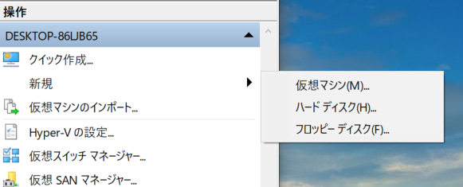

仮想マシンの名前を決めます。ここでは QuickStart という名前にします（特にこの名前には制限はありません）。

.. image:: images/sysreq02.png
   :align: center
   :width: 400px
   :alt: マシン名

今回作成する仮想マシンの世代は「第１世代」を選択します。

.. image:: images/sysreq03.png
   :align: center
   :width: 400px
   :alt: 世代の指定

仮想マシンのメモリを設定します。PC の容量に合わせて設定をしてください（推奨としては 8GB 以上）

.. image:: images/sysreq04.png
   :align: center
   :width: 400px
   :alt: メモリの指定

ネットワークの構成では、接続先を Default Switch にします。

.. image:: images/sysreq05.png
   :align: center
   :width: 400px
   :alt: ネットワークの構成

仮想ハードディスクを作成しますが、標準の設定のままここでは進めていきます。

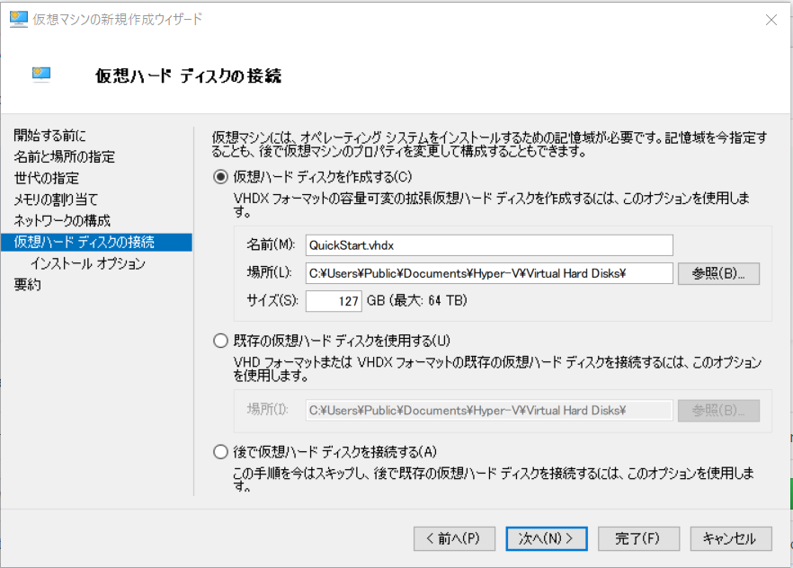

インストールオプションで、Windows 10 Professional の ISO ファイルを指定します。

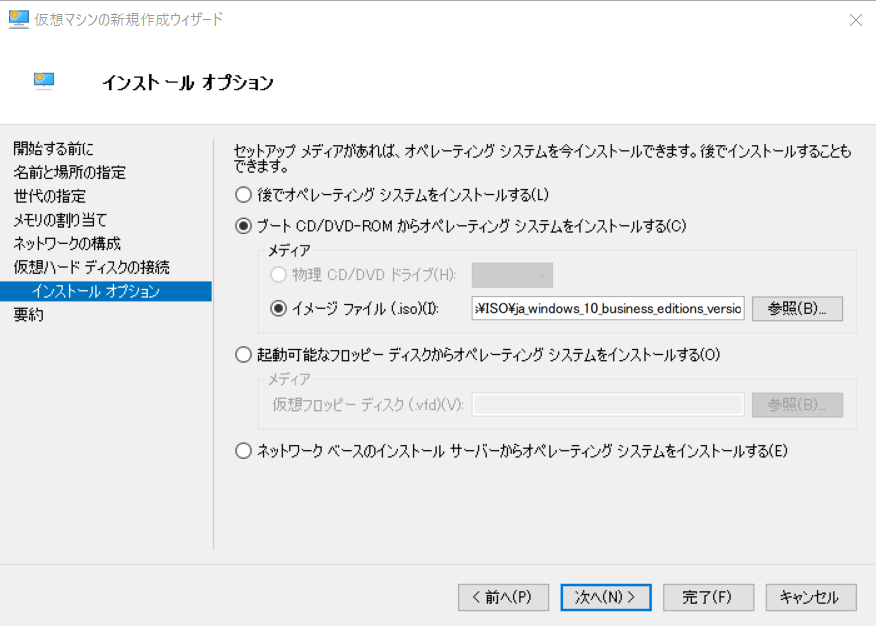

完了ボタンを押します。

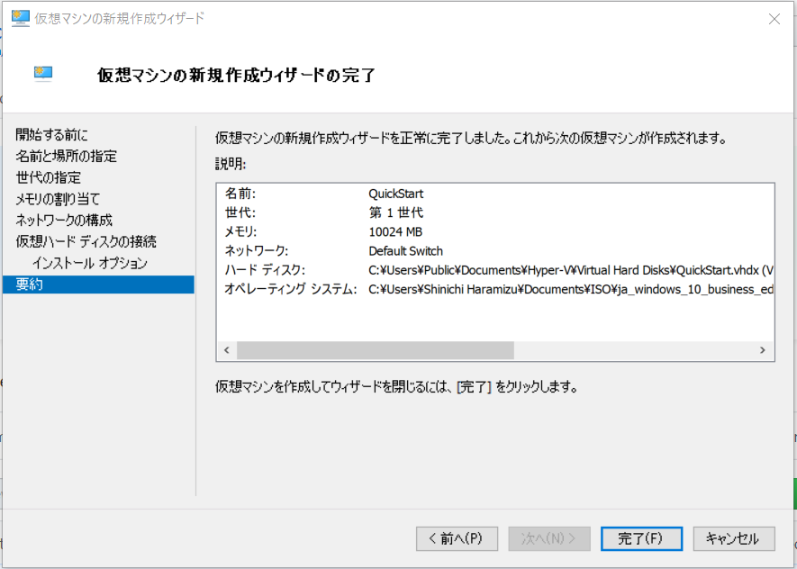

作成した仮想マシンを右クリックで選択、接続します。

.. image:: images/sysreq09.png
   :align: center
   :width: 400px
   :alt: 接続

マシンを起動します（起動をクリック）

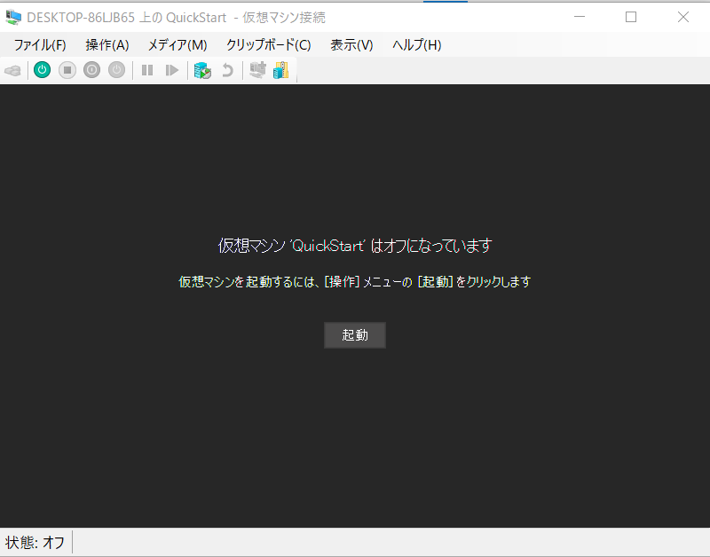

Windows 10 のインストールを進めていきます。途中、エディションが表示される場合は、Windows 10 Pro を選択してください。

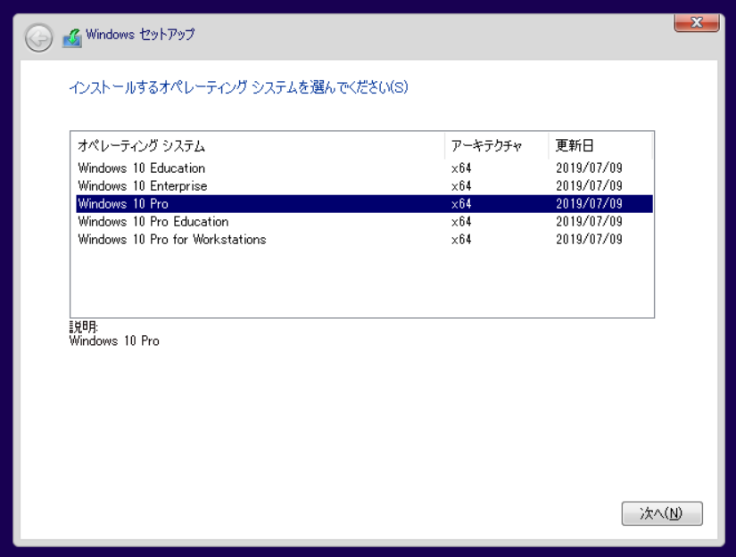

あとは Windows 10 のインストールを進めていきます。Windows update を適用して完了します。

SQL Server 2017 のインストール
*****************************************

SQL Server を今回は ISO ファイルからインストールを進めます。仮想マシンのコンソールのメニューから「メディア」－「DVD ドライブ」-「ディスクの挿入」を選択して、SQL Server の ISO ファイルを選択します。

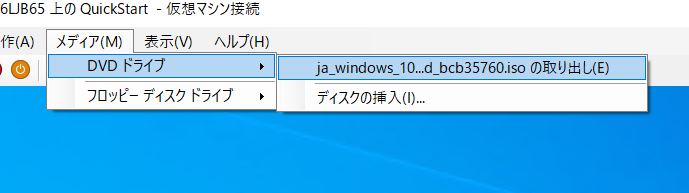

SQL Server 2017 インストールセンターの左メニューから「インストール」をクリックして、「SQL Server の新規スタンドアロンインストールを実行するか、既存のインストールに起動を追加」からインストールを開始します。

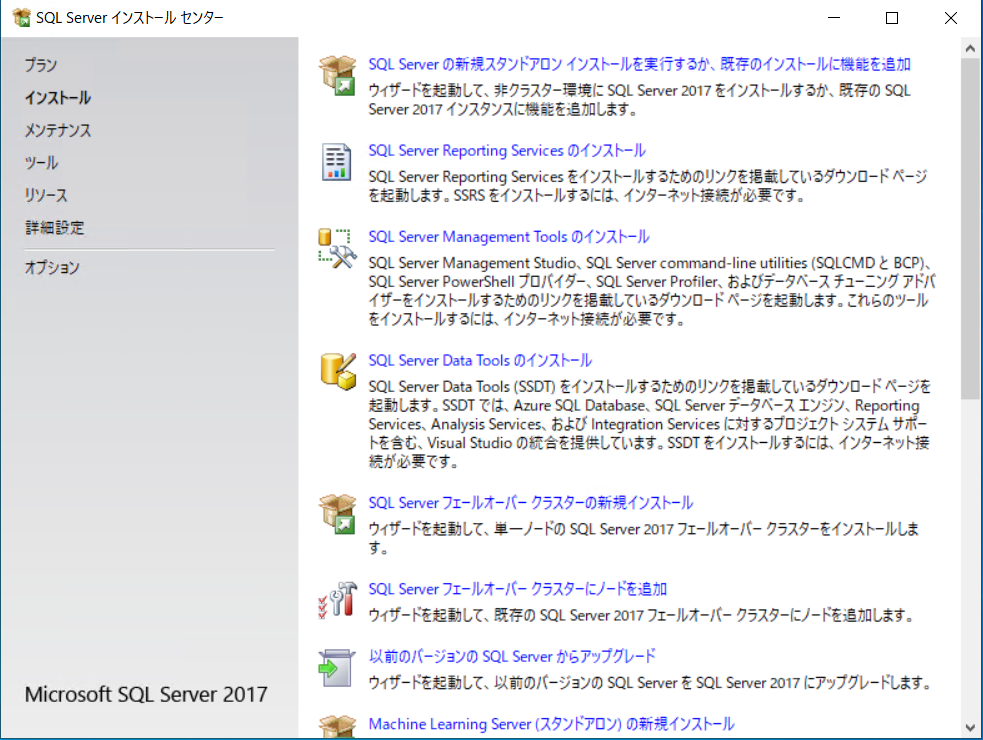

ウィザードが起動するので、デフォルトのまま機能の選択の画面まで進めていきます。表示された際には、以下の項目をチェックしてください。

* データベースエンジン
* Machine Learning サービス（データベース内）
* R

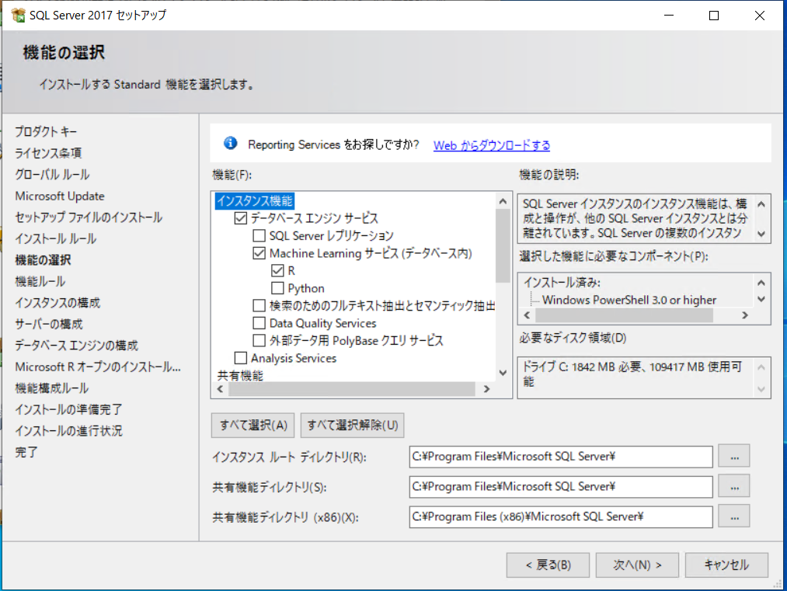

インスタンスの構成は、今回は「既定のインスタンス」を選択して進めていきます。

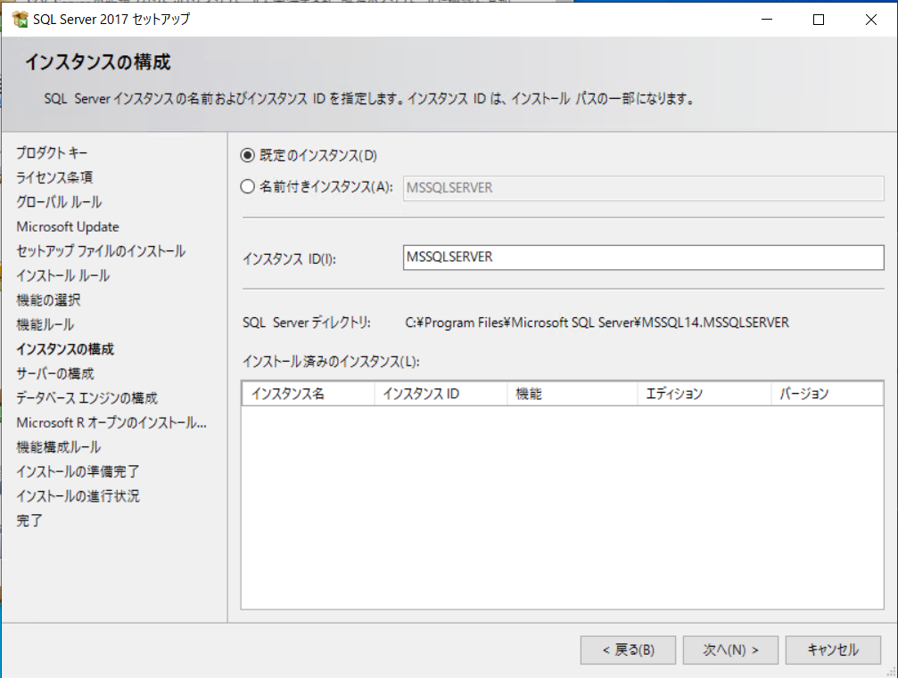

サーバーの構成は標準の設定で進めていき、データベースエンジンの構成の画面に進みます。ここでは、「サーバーの構成」のタブにて、以下の項目を選択します。

* 混合モード（SQL Server 認証と Windows 認証）
* パスワードの入力（sa のパスワード）
* パスワードの確認入力（上記で入力したパスワード）
* SQL Server 管理者の指定に関しては、「現在のユーザーの追加」をクリックして追加します。

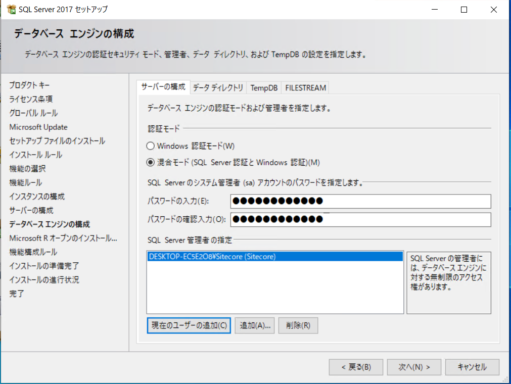

あとは標準の設定で進めていき、SQL Server のインストールを完了させてください。

SQL Server Management Studio のインストール
**********************************************

SQL Server Management Studio は、マイクロソフトのサイトからダウンロードをすることができます。

* [SQL Server Management Studio](https://docs.microsoft.com/ja-jp/sql/ssms/download-sql-server-management-studio-ssms)

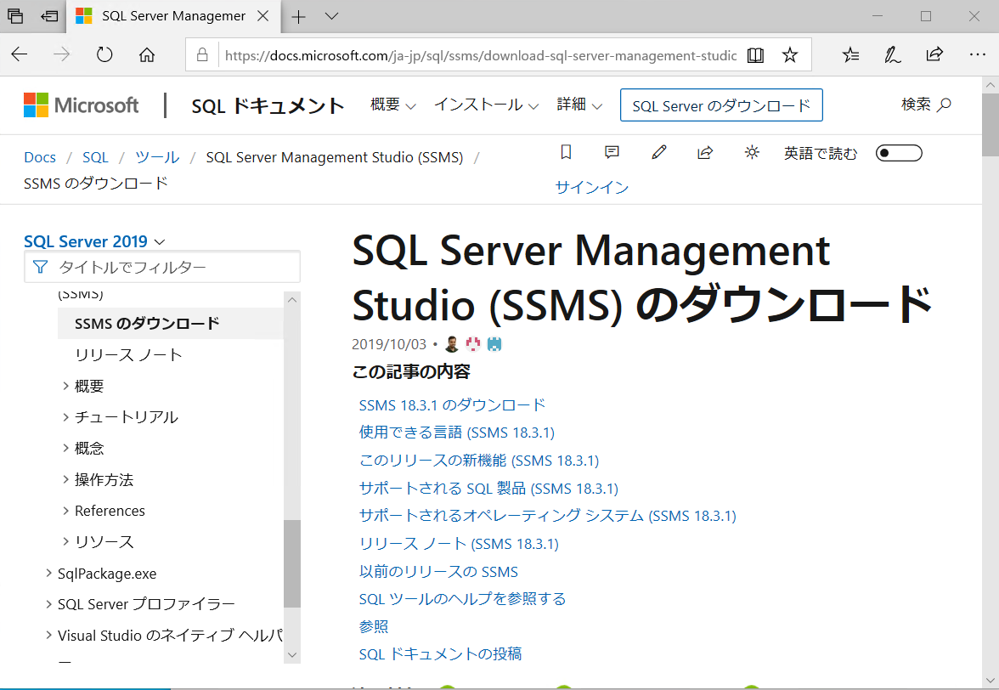

モジュールをダウンロードしたら、ダウンロードしたファイルをダブルクリックして、インストールを開始します。

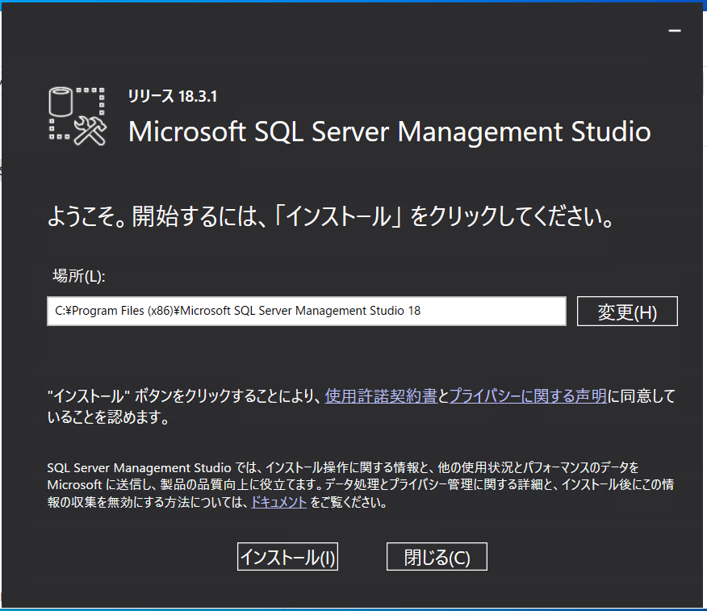

暫くするとインストールが完了します。

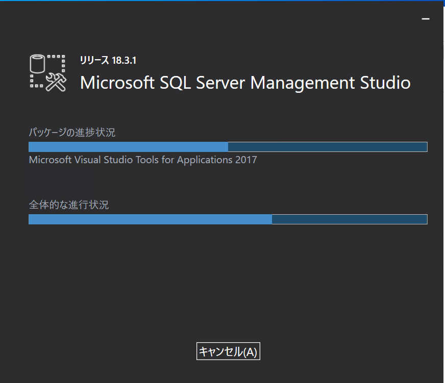

インストールが完了したあと、SQL Server Management Studio を起動します。ログイン画面が出てきますので、SQL Server をインストールしたときのパスワードを利用して、ログインしてください。

.. image:: images/ssms04.png
   :align: center
   :width: 400px
   :alt: ログイン

インストールをする前に、SQL Server の設定を1か所だけ変更をします。データベースサーバーを右クリックして、「プロパティ」を選択してください。

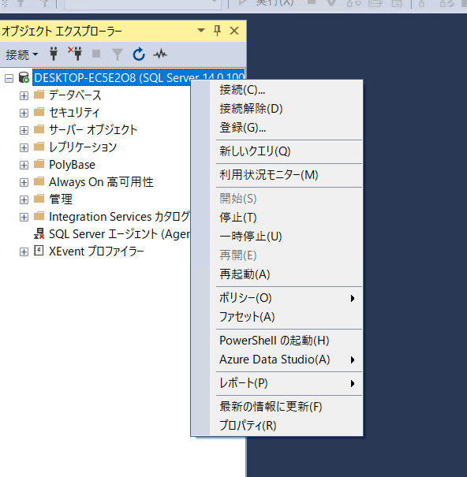

左側のメニューの「ページの選択」の中から「詳細設定」を選択し、右側に表示される「包含」の項目から、「包含データベースの有効化」を True に変更します。

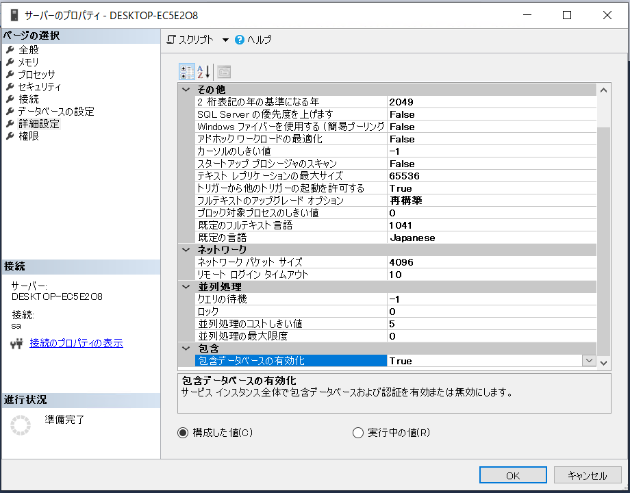

これでデータベースのインストール、設定が終了しました。

オプション
*****************************************

今後ファイルの拡張子が見えているほうが作業をしやすいので、「エクスプローラ」を起動して「表示」から「ファイル名拡張子」をチェックします。

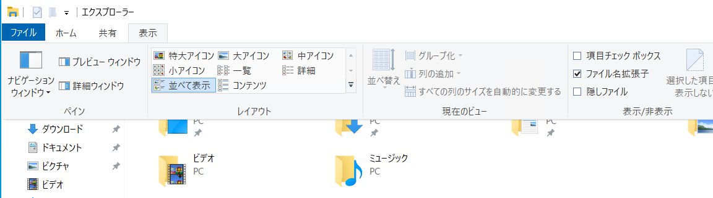

   