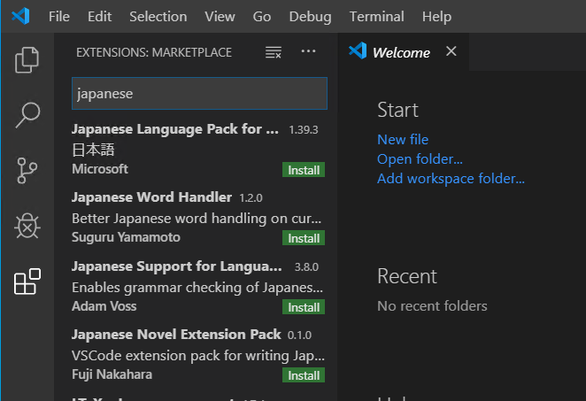

##########################
関連ツールのインストール
##########################

ここではインストールをしておくと便利なツールを紹介しています。特に必須ではないため、スキップしても問題ありません。

* `Visual Studio Code <https://code.visualstudio.com/>`_
* `Google Chrome <https://www.google.com/intl/ja_jp/chrome/>`_
* `Firefox <https://www.mozilla.org/ja/firefox/new/>`_
* `Git for Windows <https://gitforwindows.org/>`_
* `GitHub Desktop <https://desktop.github.com/>`_

ブラウザに関しては好みに合わせてご利用ください。

*****************************
Visual Studio Code 追加作業
*****************************

Visual Studio Code は標準では英語の UI になっています。このため、日本語の UI をインストールします。

* Visual Studio Code を起動します
* 左側のメニューにある Extensions をクリック、Japanese と入力すると、Japanese Language Pack for visual Studio Code が表示されます

インストールが完了するとダイアログが表示され、Restart Now のボタンをクリックすると、Visual Studio Code の UI が日本語に切り替わります。
