#######################################################
Sitecore Connect for Microsoft Dynamics 365 for Sales
#######################################################

Sitecore Experience Platform では Dynamics 365 CRM と連携するためのモジュール、Sitecore Connect for Microsoft Dynamics 365 for Sales 3.0.0 を提供しています。ここではセットアップに関しての手順を紹介しています。

**************************
モジュールのダウンロード
**************************

モジュールに関しては、Sitecore Download サイトから入手することができます。

* `Sitecore Data Exchange Framework 3.0.0 <https://dev.sitecore.net/Downloads/Data_Exchange_Framework/3x/Data_Exchange_Framework_300.aspx>`_

    * Data Exchange Framework

* `Sitecore Connect for Microsoft Dynamics 365 for Sales 3.0.0 <https://dev.sitecore.net/Downloads/Dynamics_CRM_Connect/3x/Sitecore_Connect_for_Microsoft_Dynamics_365_for_Sales_300.aspx>`_

    * Sitecore Connect for Microsoft Dynamics 365 for Sales
    * Staging Database for Sitecore Connect for Microsoft Dynamics 365 for Sales

**************************
モジュールのインストール
**************************

モジュールのインストールは以下の手順で進めていきます。

* 管理者の権限でログインをします
* スタート画面からコントロールパネルを選択
* 「管理」グループにある `パッケージをインストールする` を選択します

.. image:: images/jss02.png
   :align: center
   :width: 400px
   :alt: パッケージをインストールする

* まず最初に、`Sitecore Data Exchange Framework 3.0.0` のファイルをアップロードします（すでにインストール済の場合は省略できます）。

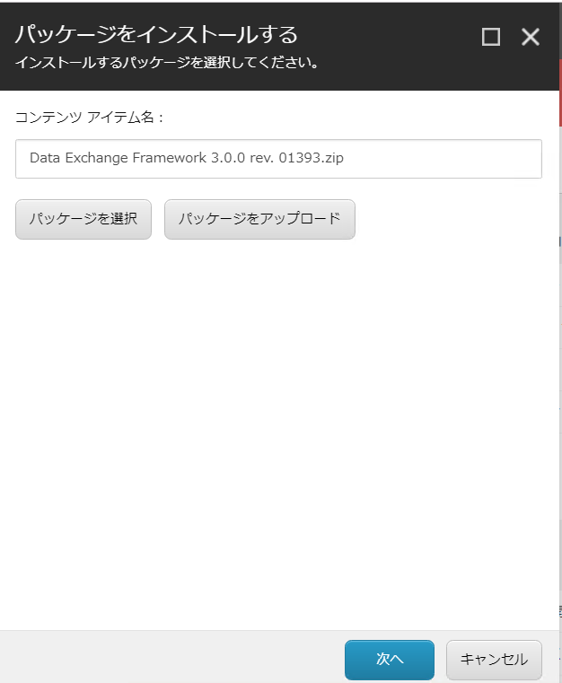

* インストールを実行します
* 続いて `Sitecore Connect for Microsoft Dynamics 365 for Sales` のファイルをアップロードします。

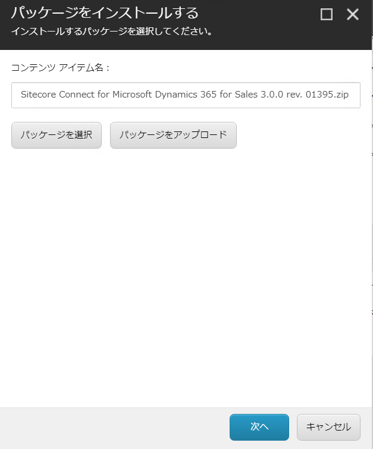

* モジュールのインストールは完了です。

*******************************
ステージングデータベースの追加
*******************************

Microsoft Dynamics とマーケティングリストを同期させるためのデータベースのセットアップをします。 ファイルダウンロードの `Staging Database for Sitecore Connect for Microsoft Dynamics 365 for Sales` をクリックして、 `Sitecore.DataExchange.Staging.dacpac` のファイルをダウンロードします。

* SQL Server Management Studio を起動して SQL Server に接続します。

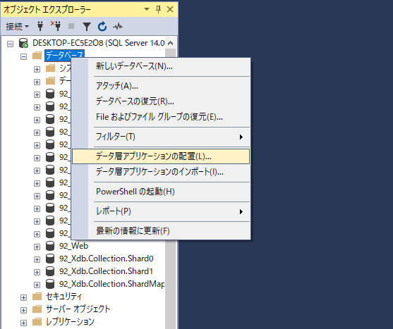

* ダウンロードしたファイルを指定します。

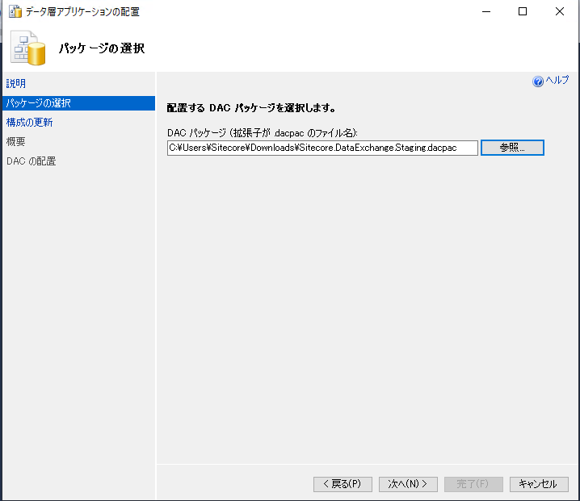

* データベース名は変更せずにそのまま進めていきます。

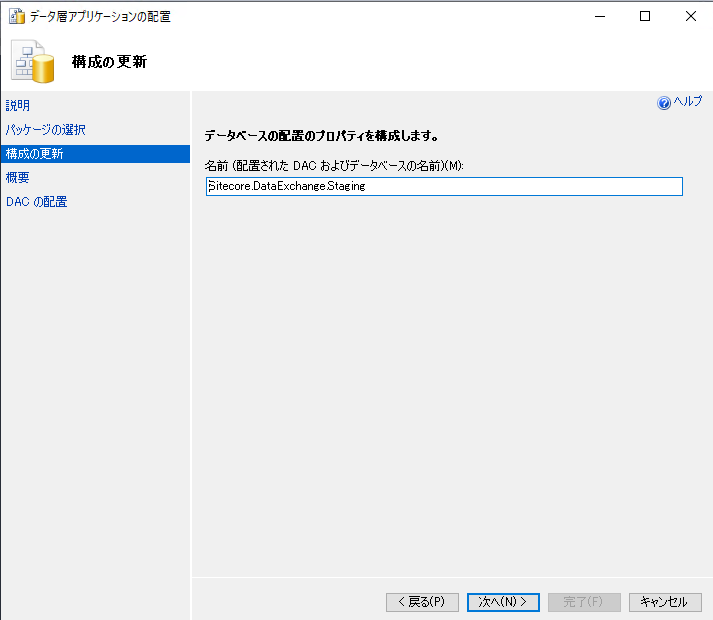

* 実行をするとデータベースが追加されます。これでデータベースの設定は完了です。

*******************
Web.config の変更
*******************

Web.config の  configuration > runtime > assemblyBinding に以下の設定を追加します。 

.. code-block:: xml

  <dependentAssembly>
    <assemblyIdentity name="Microsoft.Xrm.Sdk" publicKeyToken="31bf3856ad364e35" culture="neutral" />
    <bindingRedirect oldVersion="0.0.0.0-9.0.0.0" newVersion="9.0.0.0" />
  </dependentAssembly>
  <dependentAssembly>
    <assemblyIdentity name="Microsoft.Crm.Sdk.Proxy" publicKeyToken="31bf3856ad364e35" culture="neutral" />
    <bindingRedirect oldVersion="0.0.0.0-9.0.0.0" newVersion="9.0.0.0" />
  </dependentAssembly>

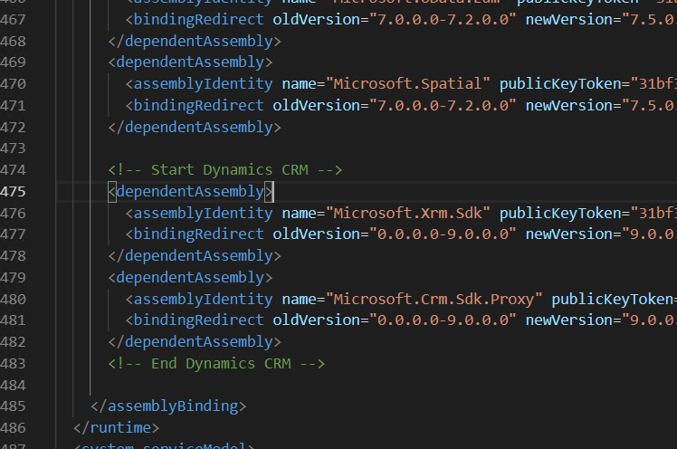

**********************************
Dynamics 365 for Sales を準備する
**********************************

今回は試用版として、無料トライアルを利用しています。このサイトからアクセスをして、無料で利用できるインスタンスを用意してください。

* `Dynamics 365 <https://trials.dynamics.com/Dynamics365/Signup/>`_

評価版の立ち上げに関しては、他のブログとかで紹介されていますので、分からない場合は検索をしてみてください。

******************
接続文字列の作成
******************

Sitecore と Dynamics 365 を接続するための接続文字列を作成して、`Connectionstrings.config` に設定を追加する必要があります。

ログインをした後、右上に表示されているメニューの `詳細設定` をクリックしてください。

.. image:: images/dcrm04.png
   :align: center
   :width: 400px
   :alt: 詳細設定

トップのメニュー項目から `設定` を開きます。表示された項目から、 `カスタマイズ` を選択してください。

.. image:: images/dcrm05.png
   :align: center
   :width: 400px
   :alt: カスタマイズ

カスタマイズを開くと、`開発者リソース` の項目を見つけることができます。これをクリックすると、設定に必要な項目が表示されます。

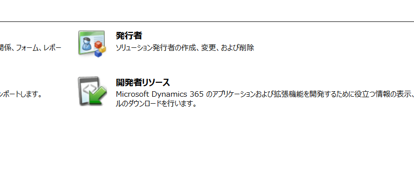

* organization: 一意の名前
* url: エンドポイント アドレス

あとは以下の情報が必要となります。

* user id : ログインをするユーザーのメールアドレス
* password : パスワード

上記の項目を利用して、以下の1行を作成、ConnectionStrings.config に追加してください。これで接続の準備が完了しました。

.. code-block:: xml

  <add name="mycrm" connectionString="url=https://####/XRMServices/2011/Organization.svc;user id=####;password=####;organization=###;authentication type=2" />

******************************
ステージングデータベースの追加
******************************

上記の接続文字列と同じく、ステージングデータベースに関する情報も ConnectionStrings.config に追加する必要があります。

ここでは以下のように追加してください（ユーザー名、パスワードは変更してください）。

.. code-block:: xml

  <add name="Sitecore.DataExchange.Staging" connectionString="Data Source=(local);Initial Catalog=Sitecore.DataExchange.Staging;User ID=username;Password=password" />

********************
xConnect との接続
********************

続いてモジュールをインストールしたあと、xConnect との連携に関する手順を追加します。コンテンツエディタを開いて、 `sitecore/system/Settings/Data Exchange/Providers/xConnect/Collection Models/Connect for Dynamics/Connect for Dynamics Collection Model` のアイテムを選択します。

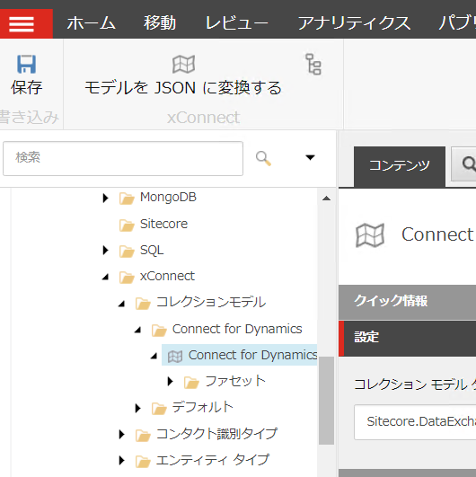

選択をしたあと、メニューに表示されている `モデルを　JSON に変換する` をクリックして JSON ファイルをダウンロードします。ダウンロードをした JSON ファイルは、xConnect のインスタンスの以下のフォルダにコピーしてください。

* `\\App_Data\\Models\\`
* `\\App_Data\\jobs\\continuous\\IndexWorker\\App_Data\\Models\\`

***************
テナントの作成
***************

テナントを作成するために `sitecore/system/Data Exchange` のアイテムを選択、右クリックをして `Connect for Dynamics Tenant` をクリックします。

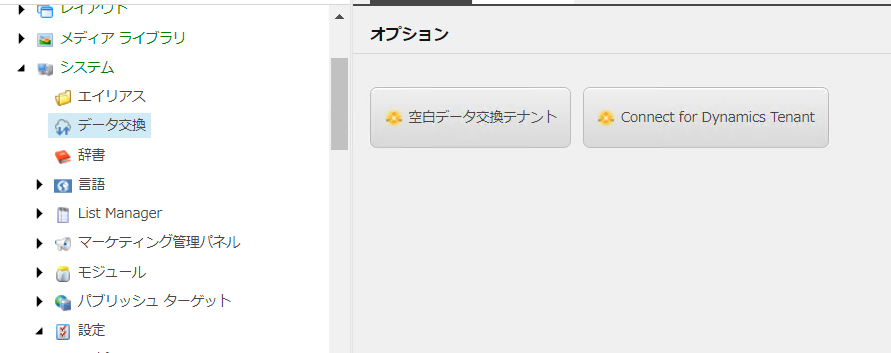

テナント名は任意で問題ありません、ここでは `My Dynamics Tenant` とします。

**********************
エンドポイントの登録
**********************

テナントに接続に関する情報を登録していきます。作成をしたテナントの `Endpoints/Providers/Dynamics/Dynamics Organization Endpoint` のアイテムを開き、`mycrm` を接続文字列として設定します。

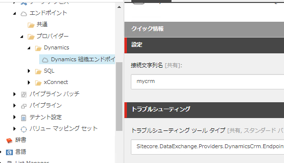

トラブルシューティングツールを実行して、設定が正しいことを確認します。

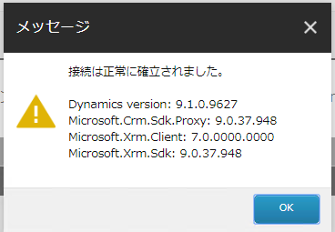

続いて、 `Endpoints/Providers/xConnect/xConnect Client Endpoint` のアイテムに関して、以下の設定をします。

============================================= ======================= =========================================
フィールド名                                  必須かどうか            設定情報 
============================================= ======================= =========================================
コレクション サービス接続文字列名             常に必須                標準では xconnect.collection 
コレクション サービス証明書の接続文字列名     SSL が有効な場合必須    標準では xconnect.collection.certificate 
コレクション サービスの資格情報接続文字列名   認証が必要な場合は必須  今回は空欄 
============================================= ======================= =========================================

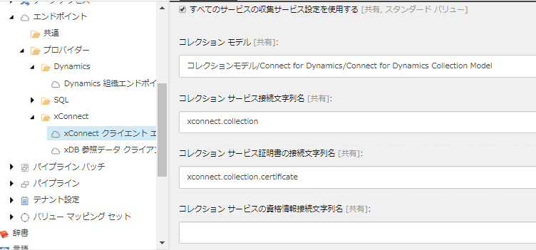

トラブルシューティングツールを実行してください。以下のダイアログが表示されれば、接続文字列は正しい形となります。

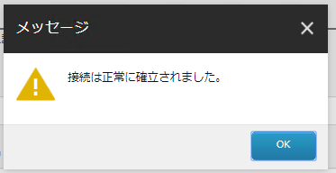

同様に、`Endpoints/Providers/xConnect/xDB Reference Data Client Endpoint` のアイテムに対して下記の設定をします。

================================= =====================================
フィールド名                      設定情報 
================================= =====================================
クライアント接続文字列名          xdb.referencedata.client 
クライアント証明書の接続文字列名  xdb.referencedata.client.certificate 
================================= =====================================

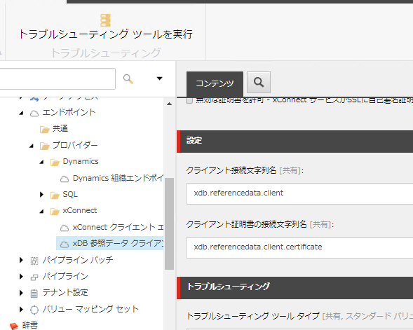

接続の確認をするために、トラブルシューティングツールを実行してください。

.. image:: images/dcrm15.png
   :align: center
   :width: 400px
   :alt: 接続の確認

最後に Staging のデータベースに関する設定を確認します。テナントのアイテム `Endpoints/Providers/SQL/Staging Database` を開いて、接続文字列が記載されていることを確認してください。

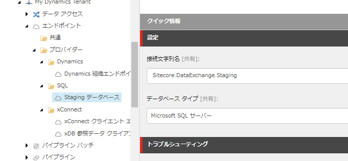

トラブルシューティングツールを実行して、接続できることを確認します。

.. image:: images/dcrm17.png
   :align: center
   :width: 400px
   :alt: 接続の確認

上記ですべて接続が確認できれば、設定が完了となります。

**********************
テナントを有効にする
**********************

作成したテナントを指定して、タブを「コンテンツ」に切り替えてください。

.. image:: images/dcrm18.png
   :align: center
   :width: 400px
   :alt: テナントの有効化

有効にしたあと、パイプラインバッチを実行してください。

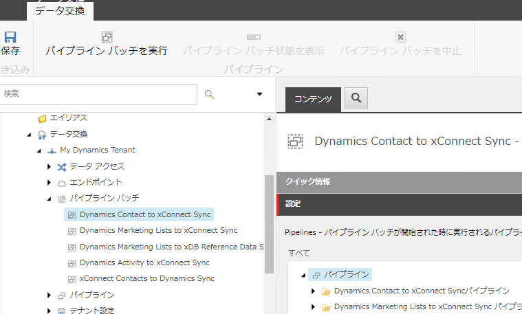

エクスペリエンスプロファイルにコンタクトが作成されて、同期できたことを確認できました。
