#######################################
Sitecore Connect for Salesforce CRM
#######################################

Sitecore Connect for Salesforce CRM 3.0.0 モジュールのインストール

Salesforce CRM との連携に関しては、Salesforce CRM のサービスとつなげることができる環境を用意できることが前提となります。

************************
モジュールのダウンロード
************************

モジュールに関しては、Sitecore Download サイトから入手することができます。

* `Sitecore Data Exchange Framework 3.0.0 <https://dev.sitecore.net/Downloads/Data_Exchange_Framework/3x/Data_Exchange_Framework_300.aspx>`_

    * Data Exchange Framework

* `Sitecore Connect for Salesforce CRM 3.0.0 <https://dev.sitecore.net/Downloads/Salesforce_Connect/3x/Sitecore_Connect_for_Salesforce_CRM_300.aspx>`_

    * Sitecore Connect for Salesforce CRM

*************************
モジュールのインストール
*************************

モジュールのインストールは以下の手順で進めていきます。

* 管理者の権限でログインをします
* スタート画面からコントロールパネルを選択
* 「管理」グループにある `パッケージをインストールする` を選択します

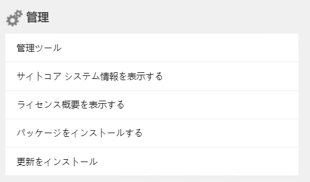

* まず最初に、`Sitecore Data Exchange Framework 3.0.0` のファイルをアップロードします（すでにインストール済の場合は省略できます）。

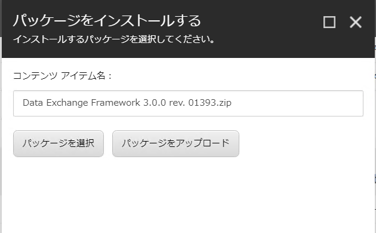

* インストールを実行します
* 続いて `Sitecore Connect for Salesforce CRM 3.0.0` のファイルをアップロードします。

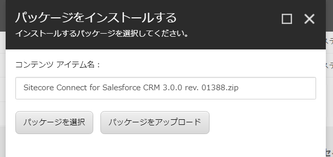

* インストールを完了させます。

**************************
Salesforce CRM を準備する
**************************

Salesforce CRM と Sitecore を接続するためには、API を有効にして Web サービス経由で接続する必要があります。開発者の方は無料で利用できる Developer Edition が提供されているため、申込みをして連携の開発をすることが可能です。

* `Salesforce 開発者 <https://developer.salesforce.com/ja/>`_

***************************
接続アプリケーションの作成
***************************

以下の手順で、Sitecore と接続をするための設定を取得します。

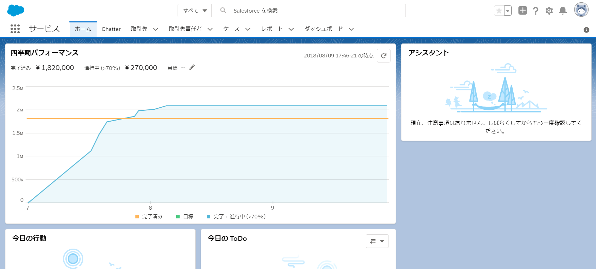

* 右上のメニューから「設定」を開きます。

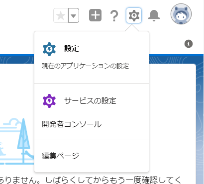

* 左側のメニューから「プラットフォームツール」－「アプリケーション」－「アプリケーション マネージャ」を選択します

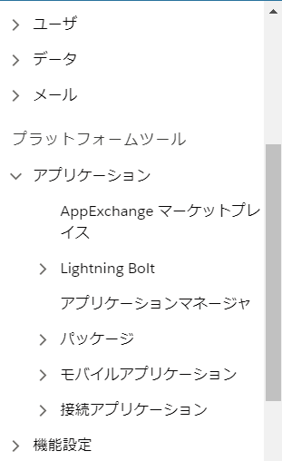

* 右上に表示される「新規接続アプリケーション」をクリックします

以下のように項目を入力してください。

============================ ====================================== 
項目名                        設定内容
============================ ====================================== 
接続アプリケーション名         任意の文字列 
API参照名                     自動的に作成するキーの利用を推奨 
取引先責任者メール             メールアドレス 
OAuth設定の有効化              チェック 
コールバック URL               この値は使いませんが設定が必要 
選択したOAuth範囲              データへのアクセス管理（api）を選択 
Web サーバフローの秘密が必要    チェック 
============================ ====================================== 

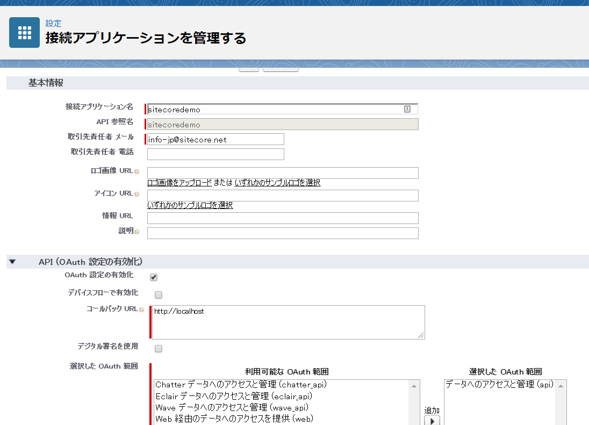

************************************
CRM 項目のカスタマイズ（オプション）
************************************

この項目はインストールガイドでもオプションとなっていますので、スキップすることは可能です。

* 右上のメニューから「設定」を開きます。

* 左側のメニューから「プラットフォームツール」－「オブジェクトおよび項目」－「オブジェクトマネージャ」を開く。

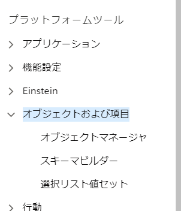

ここから `取引先責任者` と `活動` にカスタムフィールドを追加します。

==============
取引先責任者
==============

追加する内容は、以下の内容を含んだキーを追加します。

================ ==============
設定項目          設定する情報 
================ ==============
データ型          テキスト 
項目の表示ラベル   Sitecore Id 
文字数            36 
項目名            SitecoreId 
外部 ID           チェック 
================ ==============

手順は以下の通り。

* オブジェクト一覧から「取引先責任者」を選択します。

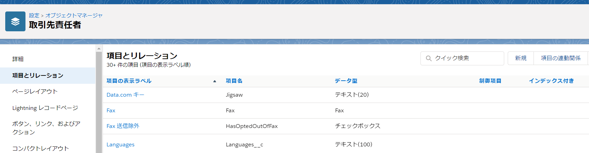

* 「項目とリレーション」を選択します。

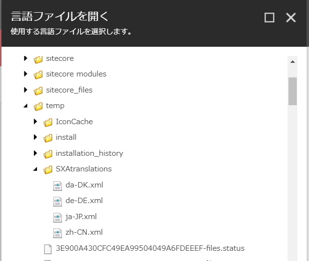

* 右上のメニューから「新規」をクリックして実行。
* データ型では「テキスト」を選択します、選択したら次へ。

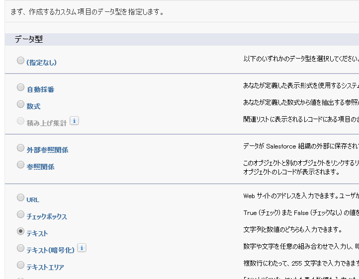

* 項目の表示ラベル、文字数、項目名を上記の表の通りに入力をする。

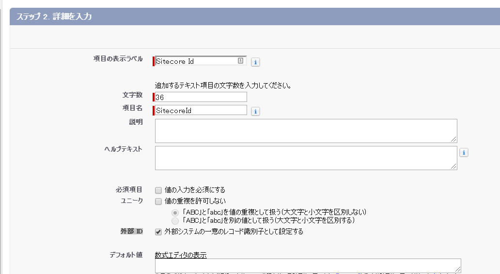

あとは保存をして終わります。続いて `活動` の設定をします。

=======
活動
=======

追加する内容は、以下の内容を含んだキーを追加します。

================ ==============
設定項目          設定する情報 
================ ==============
データ型         テキスト 
項目の表示ラベル  SitecoreId 
文字数           36 
項目名           SitecoreId 
外部 ID          チェック 
================ ==============

手順は以下の通り。

* オブジェクト一覧から「活動」を選択します。

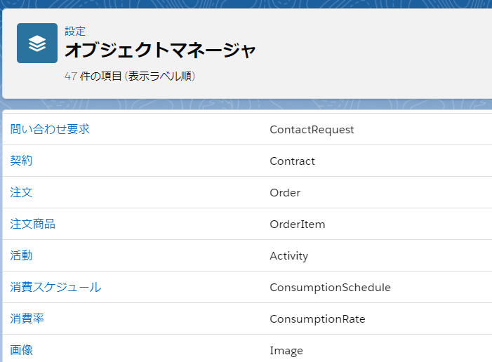

* 「項目とリレーション」を選択します。

.. image:: images/sfcrm18.png
   :align: center
   :width: 400px
   :alt: 日本語リソース

* あとは `取引先責任者` と同様に追加していきます。

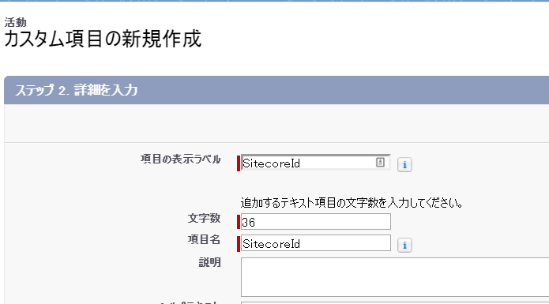

*************************
ConnectionString の作成
*************************

Sitecore が Salesforce に接続するための ConnectionString を作成します。必要な項目は以下の通りです。

================ =======================================
項目              設定内容 
================ =======================================
user id          CRM にログインをするユーザー名 
password         CRM にログインをするユーザーのパスワード 
client id        コンシューマ鍵 
secret key       コンシューマの秘密 
security token    セキュリティトークン 
================ =======================================

`user id` と `password` に関しては、アクセスするためのアカウントを用意することになります。`コンシューマー鍵` と `コンシューマの秘密` は以下の手順で取得することができます。

* 左側のメニューから「プラットフォームツール」－「アプリケーション」－「アプリケーション マネージャ」を選択します
* 先ほど作成をしたアプリケーションの右側に表示されている「▼」をクリック、参照を開きます

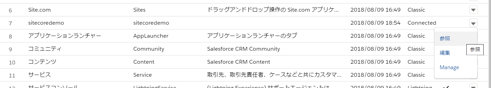

* 画面に表示される `コンシューマー鍵` と `コンシューマの秘密` を利用することになります。`コンシューマの秘密` はクリックすると表示されます。

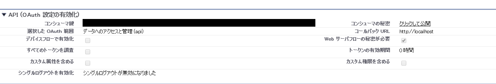

セキュリティトークンを以下の手順で取得します。なお、すでに取得している場合は以前のセキュリティトークンを利用する形でこの手続きは省略できます。

* 右上のアイコンから「設定」を開きます。

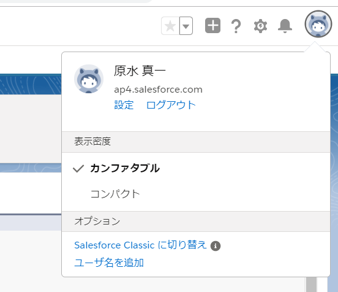

* 左側のメニューから「私のセキュリティトークンのリセット」を選択

.. image:: images/sfcrm10.png
   :align: center
   :alt: セキュリティトークン

* 「セキュリティトークンのリセット」のボタンをクリックしてください。セキュリティトークンはメールで届きます。

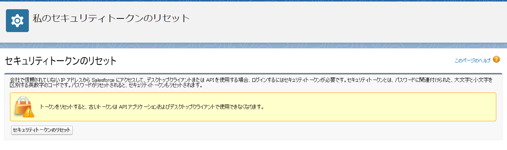

上記取得したキーを以下に入れて完成させます。

.. code-block:: xml

  <add name="mysf" connectionString="user id=`[user id]`;password=`[password]`;client id=`[client id]`;secret key=`[secret key]`;security token=`[security token]`" />

例：

.. code-block:: xml

  <add name="mysf" connectionString="user id=someone@email.com;password=b;client id=GEH9zlTNB8o8BA45pAeDtC8W.DIqrAzuky2uffEEOwtHxIEhLzkmPwjz8KF_vzWY8dNIfurWHpfbZPGdtc3b;secret key=5468568999798354123;security token=g3ygFuNzGgm33YTfsM3WKG3AA" />

上記の一行は、 /config/connectionstring.config に追加してください。

****************
Sitecore の設定
****************

=================================
xConnect Collection Model の展開
=================================

* Sitecore の管理画面を開きます
* コンテンツエディターを開きます
* アイテム `sitecore/system/Settings/Data Exchange/Providers/xConnect/Collection Models/Connect for Salesforce/Connect for Salesforce Collection Model` を選択します。

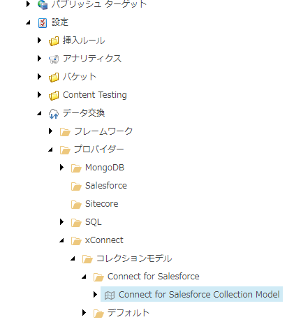

* リボンに表示されている「モデルを JSON に変換する」をクリックします。

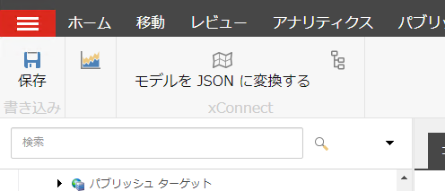

* JSON ファイルのダウンロードが完了します。
* xConnect のサーバー（例： C:\\inetpub\\wwwroot\\92xconnect.dev.local）に、ダウンロードした JSON ファイルをコピーします。コピー先は以下の2か所です。

    * \\App_Data\\Models\\
    * \\App_Data\\jobs\\continuous\\IndexWorker\\App_Data\\Models\\

===============
テナントの作成
===============

コンテンツエディターを利用して、アイテム `sitecore/system/Data Exchange` を選択します。

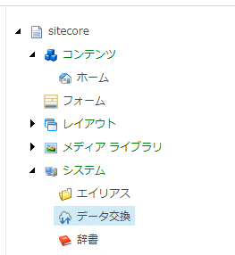

Connect for Salesforce Tenant をクリックします。

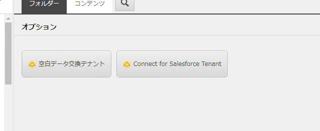

テナント名を設定します

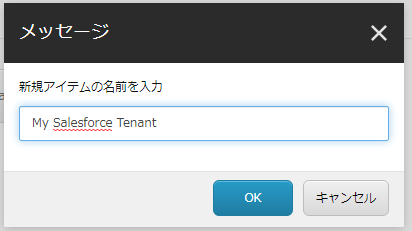

テナントが作成されます。

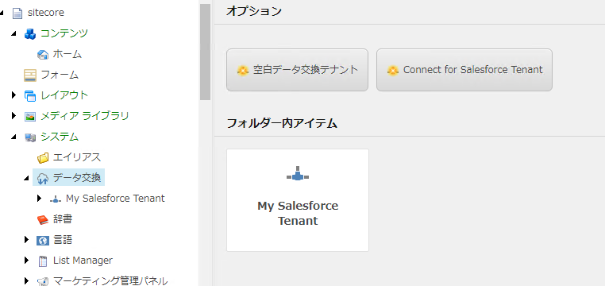

作成したテナントの、 `Endpoints/Providers/Salesforce/Salesforce Client Endpoint` のアイテムを選択します。

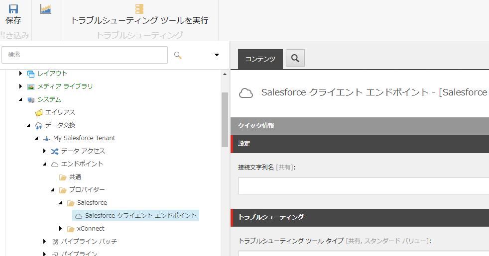

ConnectionString で設定をした接続文字列（上記の例では mysf ）を、接続文字列名に入力します。

.. image:: images/sfcrm27.png
   :align: center
   :width: 400px
   :alt: Endpoint の選択

リボンに表示されている、「トラブルシューティングツールの実行」をクリックします。

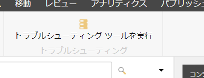

接続に成功した場合は、以下のようなダイアログが表示されます。

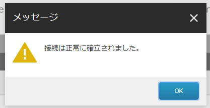

接続が失敗するケースとしては、ConnectionString の作成に失敗しているケースか、CRM にアクセスできるように Web サービスを利用できていない形があります。

続いて、xConnect との接続の設定を進めます。同じテナントで作成されているアイテム `Endpoints/Providers/xConnect/xConnect Client Endpoint` のアイテムを選択します。

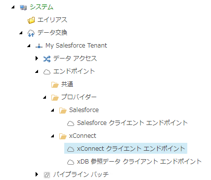

このアイテムには、以下の情報を入力します。

============================================ ======================== ==========================================
フィールド名                                 必須かどうか              設定情報 
============================================ ======================== ==========================================
コレクション サービス接続文字列名            常に必須                  標準では xconnect.collection 
コレクション サービス証明書の接続文字列名    SSL が有効な場合必須      標準では xconnect.collection.certificate 
コレクション サービスの資格情報接続文字列名  認証が必要な場合は必須    今回は空欄 
============================================ ======================== ==========================================

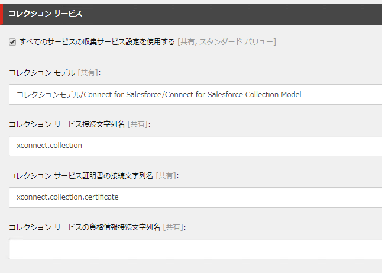

設定をした情報で正しく接続できるか、トラブルシューティングツールを実行して確認します。

.. image:: images/sfcrm32.png
   :align: center
   :alt: トラブルシューティングツール

設定が正しい場合は、以下のようにメッセージが表示されます。

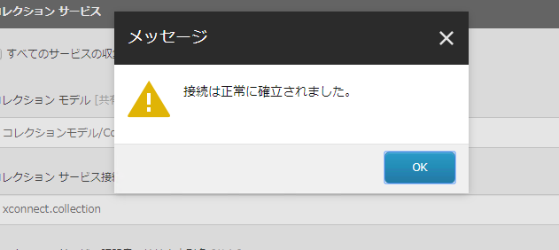

同じ階層にある、 `Endpoints/Providers/xConnect/xDB Reference Data Client Endpoint` を開きます。設定項目は以下の通り。

================================= ======================================
フィールド名                       設定情報
================================= ======================================
クライアント接続文字列名           xdb.referencedata.client 
クライアント証明書の接続文字列名   xdb.referencedata.client.certificate 
================================= ======================================

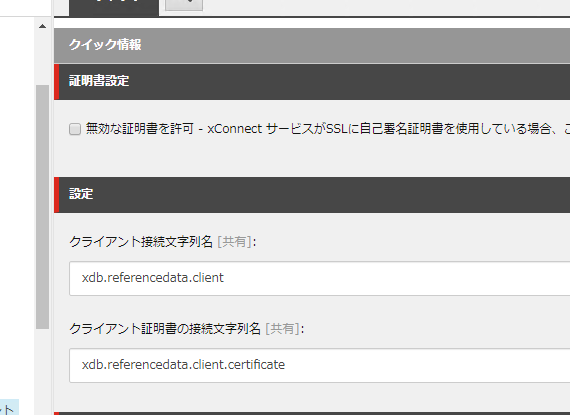

接続が全て成功した段階で設定が終了となります。

****************************************
カスタムフィールドの設定（オプション）
****************************************

Salesforce CRM の `取引先責任者` と `活動` の項目をカスタマイズで追加している場合は、以下の手順でカスタムフィールドを設定してください。

* テナントに作成されている、 `Data Access/Value Accessor Sets/Providers/Salesforce/Salesforce Contact Fields/Sitecore Id on Salesforce Contact` のアイテムを選択します

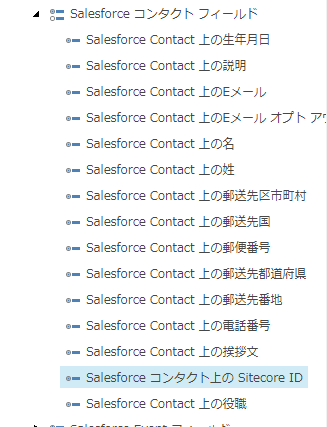

* アイテムのフィールド「管理」セクションにあるチェックボックスをチェックして保存してください。

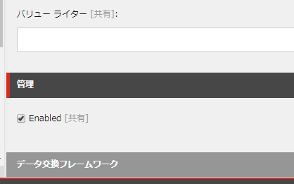

* アクティビティに関しても設定をする場合は、 `Data Access/Value Accessor Sets/Providers/Salesforce/Salesforce Event Fields/Sitecore Id on Salesforce Activity` のアイテムで同様の手続きをします。

*********************
Salesforce との同期
*********************

Salesforce CRM と同期をさせる場合、初回に関しては Salesforce Contact ID が設定されていないため、このままでは同期することはできません。そこで、設定を変更して同期できるようにします。

* アイテム `/sitecore/system/Data Exchange/<tenant>/Value Mapping Sets/xConnect Contact to Salesforce Contact Mappings/Contact Model to Salesforce Contact/Salesforce Contact Id` を選択します

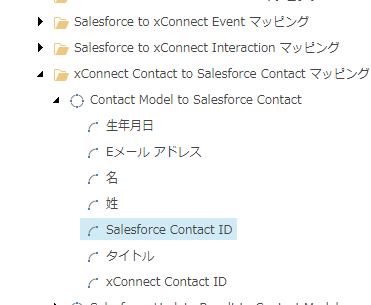

* アイテムのフィールド `ソース バリュー を読み込めなくてもエラーにしない` をチェックします。

.. image:: images/sfcrm38.png
   :align: center
   :width: 400px
   :alt: ソースバリューをチェック

****************************************
PII フィールドのインデックスを有効にする
****************************************

個人情報に紐づく情報に関しては、 xConnect はデフォルトでインデックスをする形になっていません。Salesforce CRM と連動する場合、FirstName と Email の項目を検索できるようにするために、インデックスの対象にすることになります。CRM と同期しない場合はこの設定は不要です。

* フォルダ `wwwroot\\<sitecoreInstanceName>_xconnect\\App_Data\\Config\\Sitecore\\SearchIndexer\\` にある `sc.Xdb.Collection.IndexerSettings.xml` のファイルを開きます
* ファイルの `Sitecore\\XConnect\\SearchIndexer\\Services\\IndexerSettings\\Options\\IndexPIISensitiveData` のノードの値を True にします。

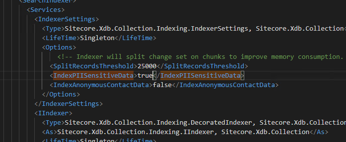

* フォルダ `wwwroot\\<sitecoreInstanceName>_xconnect\\App_Data\\jobs\\continuous\\IndexWorker\\App_data\\config\\sitecore\\SearchIndexer\\` にある `sc.Xdb.Collection.IndexerSettings.xml` のファイルを開きます
* ファイルの `Sitecore\\XConnect\\SearchIndexer\\Services\\IndexerSettings\\Options\\IndexPIISensitiveData` のノードの値を True にします。

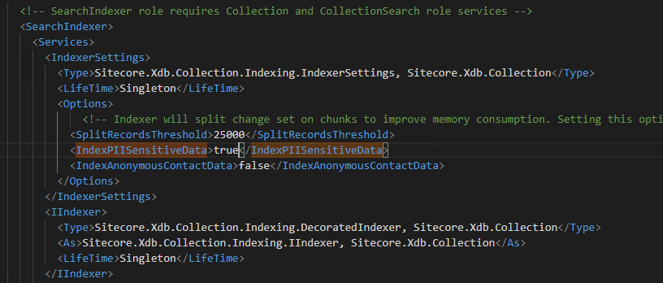

**********************
テナントを有効にする
**********************

設定がすべて完了したあと、テナントを有効にすることができます。有効にする手順としては、コンテンツエディターで作成をしたテナントのアイテムを選択します。

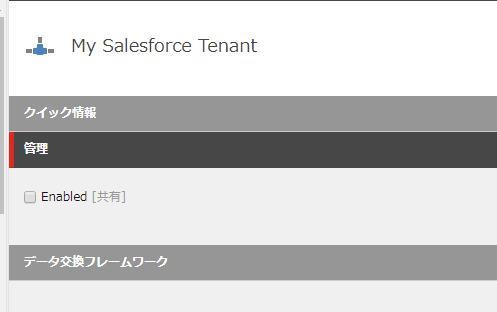

*************
同期のテスト
*************

テナントが有効にしたあと、`エクスペリエンスプロファイル` のツールを開いても初回の同期が実行されるまでは、プロファイルが表示されません。

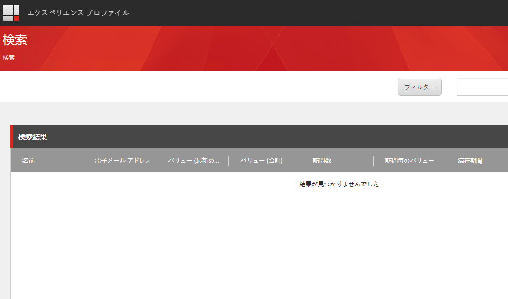

そこで、パイプラインバッチを実行して、初回同期を実行します。このパイプラインバッチは、作成したテナントの配下にあります。コンテンツエディターで、`パイプラインバッチ/Salesforce Contact  to xConnect Sync` のアイテムを選択します。

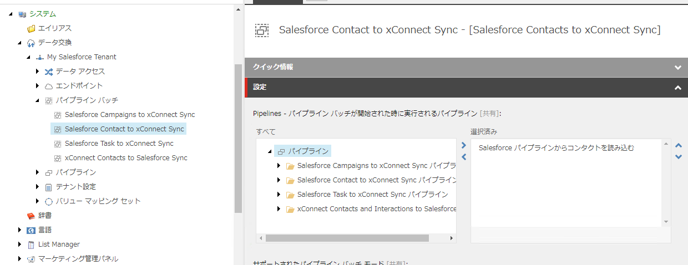

実行をする場合、`データ交換` のリボンを開いて、`パイプラインバッチを実行` をクリックします。

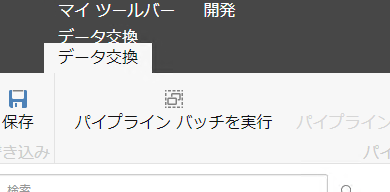

実行をすると、ダイアログが表示されます。

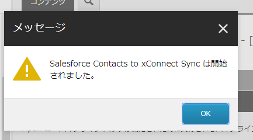

エクスペリエンスプロファイルを開くと以下のようになっています。

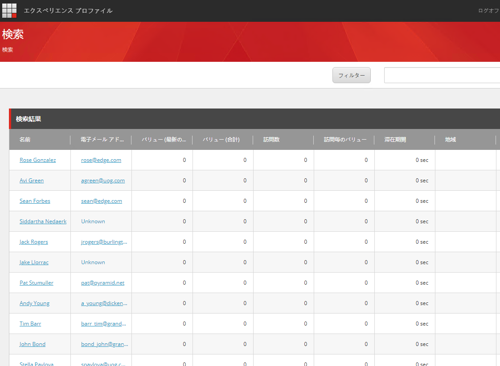

プロファイルを開くと、コンタクト詳細情報が同期されていることも確認できます。

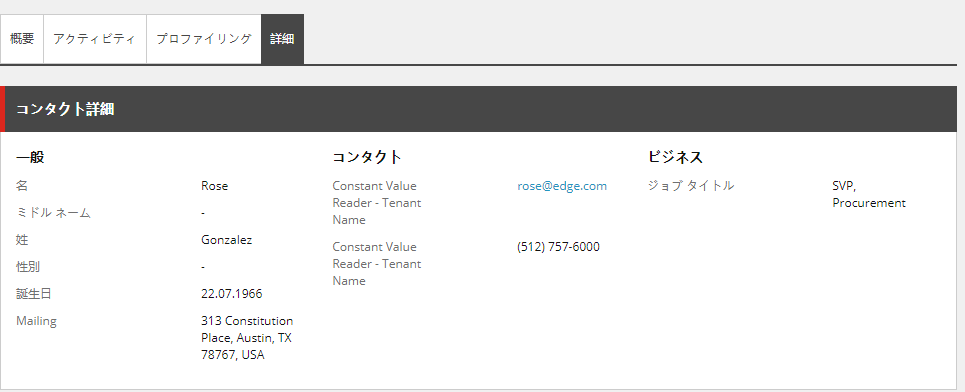

これで Salesforce CRM 連携の設定が完了しました。
