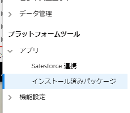

#######################################################
Sitecore Connect for SFMC - Behavioral Data Exchange
#######################################################

この文書では、 Sitecore Connect for Salesforce Marketing Cloud 3.0 のモジュールのうち、Behavioral Data Exchange に関するセットアップの手順を紹介しています。

.. note:: Sitecore Connect for Salesforce Marketing Cloud 3.0 は Sitecore Experience Platform 9.2 向けのモジュールとなります。Sitecore 9.0, 9.0.1, 9.1 を利用されている方は、別のバージョンのモジュールをご利用ください。

**************************
必要システム
**************************

Behavioral Data Exchange 3.0 は、以下の環境で利用することが可能です。

* Sitecore Experience Platform 9.2.0
* `Data Exchange Framework 3.0 <https://dev.sitecore.net/Downloads/Data_Exchange_Framework/3x/Data_Exchange_Framework_300.aspx>`_ 
* Salesforce Marketing Cloud の管理者権限

すでに上記の環境が整っていることを前提として、インストール、設定に関して紹介をしていきます。

**************************
モジュールのインストール
**************************

以下の手順でインストールを進めていきます。

1. モジュールを Sitecore Connect for Salesforce Marketing Cloud 3.0 にある Behavioral Data Exchange の Installation Package をクリックしてダウンロードをします。
2. インストールをする Sitecore の環境に管理者権限でログインをします
3. 「コントロールパネル」－「管理」パネル－「パッケージをインストールする」を開きます
4. ダウンロードしたモジュールのインストールをします

.. image:: images/sfmcbde01.png
   :align: center
   :width: 400px
   :alt: パッケージをインストールする

5．インストールの手順を確認します。

.. image:: images/sfmcbde02.png
   :align: center
   :width: 400px
   :alt: インストールの注意点

.. image:: images/sfmcbde02.png
   :align: center
   :width: 400px
   :alt: インストールの注意点

6. ファイルの上書きの警告が出た場合は、「はい」を選択してください。
7. インストールの手順で紹介されていた、「サイトコア クライアントを再起動します。」をチェックしてブラウザ側の設定をリセットします。

8. コンテンツエディターを開いて、 `/sitecore/system/Data Exchange` のアイテムを右クリック、`SFMC テナント用接続` を選択できるようになっている段階で、モジュールのインストールは成功しています。

.. image:: images/sfmcbde04.png
   :align: center
   :width: 400px
   :alt: インストール完了の確認

*************************************
Salesforce Marketing Cloud との接続
*************************************

Salesforce Marketing Cloud にて以下の設定を進めていきます。

Salesforce Markering Cloud API 連携の設定
============================================

以下の手順で API 連携を作成します。

.. note:: API 連携に関しては、すでに :doc:`Sitecore Connect for SFMC - Content Exchange <salesforcemcce>` で作成している場合は共有することができます。この場合、アクセス権に関して既存の設定に追加してください。

1. 右上に表示されているアカウントにマウスカーソルを合わせて、表示されたメニューの「セットアップ」をクリックします。

2. 左側のメニューの「プラットフォームツール」－「アプリ」－「インストール済パッケージ」をクリックします。

3. 右上にある「新規」のボタンをクリックして、新しいパッケージを作成します。
4. 新しいパッケージの詳細のダイアログでアプリケーションの名前を設定してください。

.. image:: images/sfmcbde07.png
   :align: center
   :width: 400px
   :alt: インストール済パッケージ

5. コンポーネントの追加をクリックします

.. image:: images/sfmcbde08.png
   :align: center
   :width: 400px
   :alt: コンポーネントの追加

6. API 連携を選択して「次へ」をクリックします。

7. サーバー間連携を選択して「次へ」をクリックします。

8. コンポーネントの追加の画面では、以下の権限を設定してください。

=========== ================ ==================
カテゴリ　  タイプ　          権限
=========== ================ ==================
Data        Data Extensions   Read and Write
=========== ================ ==================

9. 設定が終わったら保存して、API 連携の設定は完了です。

Sitecore Connection String の設定
=====================================

Sitecore の設定としては、Salesforce Marketing Cloud で作成をしたパッケージを利用して接続文字列を作る必要があります。接続文字列のサンプルは以下の通りです。

.. code-block:: xml

  <add name="sfmc" connectionString="client id=Client Id;
      client secret=Client Secret;
      auth endpoint=Authentication Base URI;
      rest endpoint=REST Base URI;
      soap endpoint=SOAP Base URI" />

パラメーターは作成したパッケージから、以下の項目をそのまま反映させてください。

======================= ===========================
ConnectionString の表記  パッケージの表記
======================= ===========================
Client Id                クライアント ID
Client Secret            クライアントシークレット
Authentication Base URI  認証ベース URI
REST Base URI            REST ベース URI
SOAP Base URI            SOAP ベース URI 
======================= ===========================

ConnectionString の変更が終わったタイミングで、Sitecore のインスタンスを再起動して反映させます。

******************
テナントの設定
******************

テナントの作成
===============

Sitecore の設定を追加していきます。

1. コンテンツエディターを開いて、 `/sitecore/system/Data Exchange` のアイテムを右クリック、`SFMC テナント用接続` を選択してください。

.. image:: images/sfmcbde04.png
   :align: center
   :width: 400px
   :alt: コネクタを選択

2. テナントの名前を決めます

3. 自動的に必要とされるアイテムが作成されます。

4. 作成したテナントアイテムを選択、「コンテンツ」タブを開いて `Enabled` をクイックしてください。

.. image:: images/sfmcbde14.png
   :align: center
   :width: 400px
   :alt: 設定を有効にする

5. アイテムを保存します

エンドポイントの設定
========================

作成したテナントに必要な値を追加していきます。

1. 作成したテナントの `name>/Endpoints/Providers/SFMC/SFMC Endpoint` のアイテムを選択します
2. 接続文字列名の項目に `sfmc` を記入します（異なる接続文字列の場合は、設定している値にしてください）。

.. image:: images/sfmcbde15.png
   :align: center
   :width: 400px
   :alt: 接続文字列の設定

3. 「データ交換」のタブにあるボタン「トラブルシューティングツールを実行」をクリックしてください。

4. 「接続が正常に確立されました」と表示されれば、設定が正しい形となります。

.. image:: images/sfmcbde17.png
   :align: center
   :width: 400px
   :alt: トラブルシューティングツールを実行

xConnect のエンドポイントの設定
================================

ここでは xConnect の接続に関して確認をします。

1. 作成したテナントの `/Endpoints/Providers/xConnect/xConnect Client Endpoint` のアイテムを選択します。
2. 以下の項目が設定されていることを確認します。

========================================== ============================================================
フィールド名　                              設定値     
========================================== ============================================================
コレクション モデル                         コレクションモデル/デフォルト/デフォルトコレクションモデル
コレクション サービス接続文字列名           xconnect.collection
コレクション サービス証明書の接続文字列名   xconnect.collection.certificate
========================================== ============================================================

.. image:: images/sfmcbde18.png
   :align: center
   :width: 400px
   :alt: コレクションサービス

3. 「データ交換」のタブにあるボタン「トラブルシューティングツールを実行」をクリックしてください。

4. 「接続が正常に確立されました」と表示されれば、設定が正しい形となります。

.. image:: images/sfmcbde17.png
   :align: center
   :width: 400px
   :alt: トラブルシューティングツールを実行

