###################################################
Sitecore Connect for SFMC - Content Exchange
###################################################

この文書では、 Sitecore Connect for Salesforce Marketing Cloud 3.0 のモジュールのうち、Content Exchange に関するセットアップ手順を紹介しています。

.. note:: Sitecore Connect for Salesforce Marketing Cloud 3.0 は Sitecore Experience Platform 9.2 向けのモジュールとなります。Sitecore 9.0, 9.0.1, 9.1 を利用されている方は、別のバージョンのモジュールをご利用ください。

*****************
必要システム
*****************

モジュールのインストールには、以下のバージョンが必須となります。

* Sitecore Experience Platform 9.2 もしくは Sitecore Experience Manager 9.2
* Salesforce Marketing Cloud の設定権限のあるアカウント

**************************
モジュールのインストール
**************************

以下の手順でインストールを進めていきます。

1. モジュールを `Sitecore Connect for Salesforce Marketing Cloud 3.0 <https://dev.sitecore.net/Downloads/Sitecore_Connect_software_for_Salesforce_Marketing_Cloud/1x/Sitecore_Connect_software_for_Salesforce_Marketing_Cloud_30.aspx>`_ にある Content Exchange の Installation Package をクリックしてダウンロードをします。
2. インストールをする Sitecore の環境に管理者権限でログインをします
3. 「コントロールパネル」－「管理」パネル－「パッケージをインストールする」を開きます
4. ダウンロードしたモジュールのインストールをします

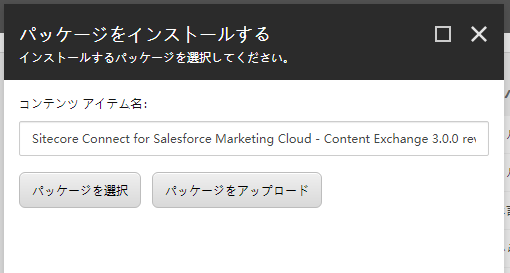

5．インストールの手順を確認します。

.. image:: images/sfmcce02.png
   :align: center
   :width: 400px
   :alt: インストールの注意点

6. インストールの手順で紹介されていた、「サイトコア クライアントを再起動します。」をチェックしてブラウザ側の設定をリセットします。

.. image:: images/sfmcce03.png
   :align: center
   :width: 400px
   :alt: サイトコア クライアントを再起動します。

これでモジュールのインストールは完了となります。

*************************************
Salesforce Marketing Cloud の設定
*************************************

Salesforce Marketing Cloud の設定手順として、セットアップの権限のあるユーザーでログインをします。ログインをすると、右上のユーザーアイコンにマウスカーソルを合わせると、セットアップのメニューが表示されますので、クリックしてください。

.. note:: API 連携に関しては、すでに :doc:`Sitecore Connect for SFMC - Behavioral Data Exchange <salesforcemcbde>` で作成している場合は共有することができます。この場合、アクセス権に関して既存の設定に追加してください。

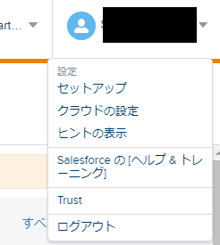

メニューの「プラットフォームツール」から、「アプリ」－「インストール済パッケージ」をクリックしてください。

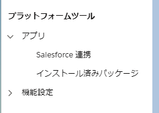

以下の手順で新しいパッケージを作成します。

1. 「新規」ボタンをクリックします
2. 新しいパッケージ詳細では、以下の項目を入力してください。

========= ===========================================
設定項目  設定内容
========= ===========================================
名前      アプリケーション名
説明      アプリケーションに関する説明（オプション）
========= ===========================================

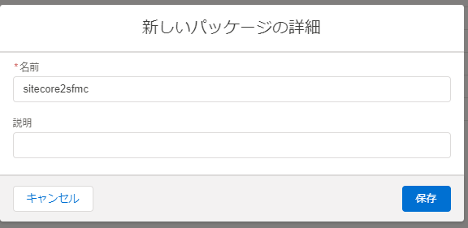

3. 作成されたパッケージにコンポーネントを追加します。

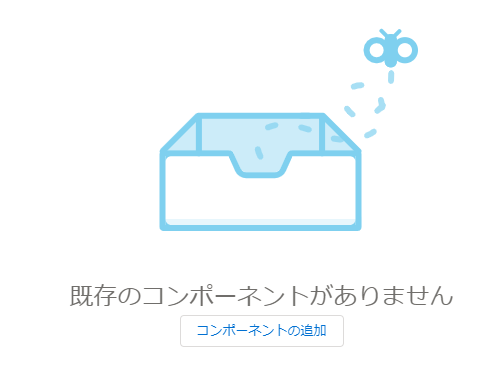

4. コンポーネントの種別としては API 連携を選択します

.. image:: images/sfmcce08.png
   :align: center
   :width: 400px
   :alt: API 連携

5. 連携の種別を選択のダイアログでは、「サーバー間」を選択します。

.. image:: images/sfmcce09.png
   :align: center
   :width: 400px
   :alt: サーバー間連携

6. アクセス権に関しては、以下の設定をします

=========== ===================== ==================
カテゴリ　  タイプ　               権限
=========== ===================== ==================
Assets      Documents and Imags    Read and Write
Assets      Saved content          Read and Write
Hub         Tags                   Write
=========== ===================== ==================

.. image:: images/sfmcce10.png
   :align: center
   :width: 400px
   :alt: Assets

.. image:: images/sfmcce11.png
   :align: center
   :width: 400px
   :alt: Hub - Tags

上記の設定で Salesforce 側の設定が完了しました。作成したパッケージの情報を利用して、Sitecore と接続するための設定を実施します。

**********************
Sitecore の設定
**********************

Sitecore の設定としては、Salesforce Marketing Cloud で作成をしたパッケージを利用して接続文字列を作る必要があります。接続文字列のサンプルは以下の通りです。

.. code-block:: xml

  <add name="sfmc" connectionString="client id=<Client Id>;
    client secret=<Client Secret>;
    auth endpoint=<Authentication Base URI>;
    rest endpoint=<REST Base URI>;
    soap endpoint=<SOAP Base URI>" />

パラメーターは作成したパッケージから、以下の項目をそのまま反映させてください。

======================= ===========================
ConnectionString の表記  パッケージの表記
======================= ===========================
Client Id                クライアント ID
Client Secret            クライアントシークレット
Authentication Base URI  認証ベース URI
REST Base URI            REST ベース URI
SOAP Base URI            SOAP ベース URI 
======================= ===========================

ConnectionString の変更が終わったタイミングで、Sitecore のインスタンスを再起動して反映させます。

*****************************
画像ファイルの公開テスト
*****************************

ここでは Salesforce Marketing Cloud と連携させるフォルダを Sitecore のメディアライブラリに作成し、連携、同期させます。

Sitecore の追加設定
=====================

まず連携をさせるためのフォルダを指定ます。今回は、 `/sitecore/media library/SFMC Demo` のフォルダを作成しました。

.. image:: images/sfmcce12.png
   :align: center
   :alt: フォルダの作成

続いてシステムにフォルダの同期をするためのアイテムを作成します。 `/sitecore/system/Settings/SFMC Connector/Configuration` のアイテムを選択し、 `SFMC 設定` のボタンをクリックします。

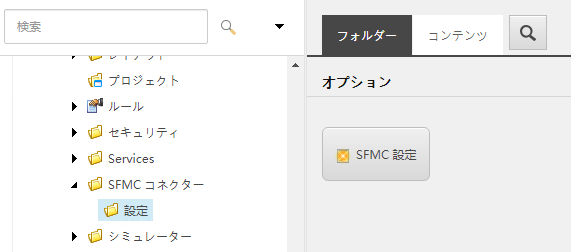
   
アイテムの名前は任意で設定できます。今回はテストのため `SFMC Test` という名前を付けました。

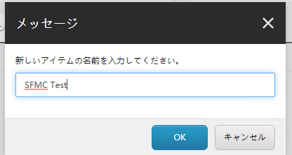

事前に作成をしたメディアライブラリのフォルダを指定します。

.. image:: images/sfmcce15.png
   :align: center
   :width: 400px
   :alt: フォルダの指定

これで設定は完了です。

ファイルの同期のテスト
========================

デフォルトの設定では 10 時間に一度同期する設定になっています（設定は　`App_Config\\Modules\\Connector.Sfmc\\Sitecore.Connector.Sfmc.config` で変更が可能です）。
今回はマニュアルで同期させます。

まず Salesforce Marketing Cloud の画面で、「Content Builder」－「Content builder」を選択してください。

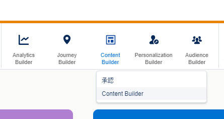

設定してすぐは、フォルダーの中に Sitecore から同期された情報はありません。

.. image:: images/sfmcce17.png
   :align: center
   :alt: 設定後のフォルダの状況

同期させるファイルを、作成したフォルダにアップロードします。

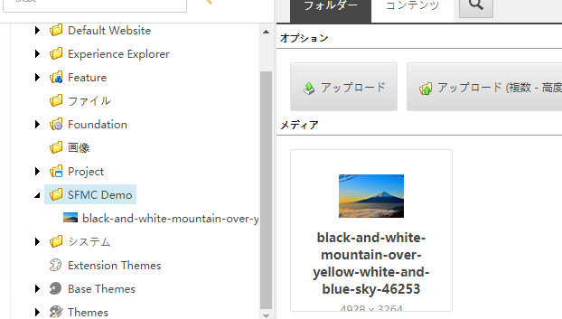

対象となるフォルダを右クリックして「アイテムをパブリッシュ」を実行します。

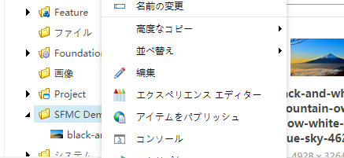

「開発」タブにある「メディアをプッシュ」のボタンをクリックしてください。

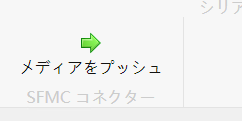

すぐに手動プッシュが開始されます。

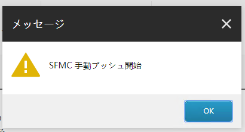

しばらくすると、Content Builder にフォルダが出来上がり、ファイルが連携されていることを確認できます。

.. image:: images/sfmcce22.png
   :align: center
   :alt: フォルダが作成されている

.. image:: images/sfmcce23.png
   :align: center
   :width: 400px
   :alt: 画像が同期されている

このように、Sitecore で公開している画像ファイルを Salesforce Marketing Cloud で利用することが可能となります。
