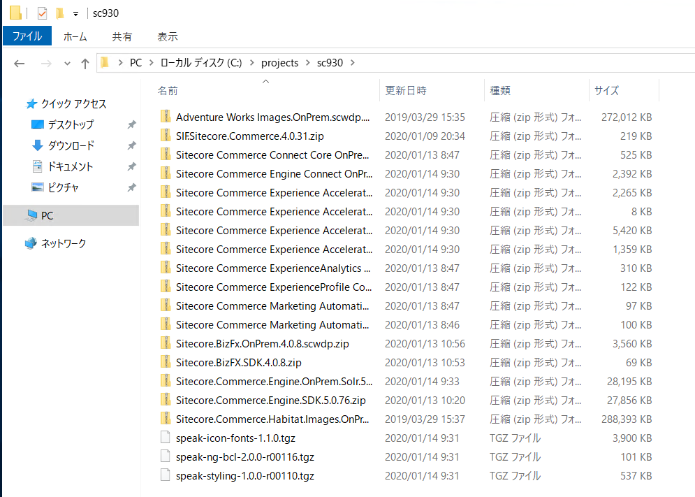
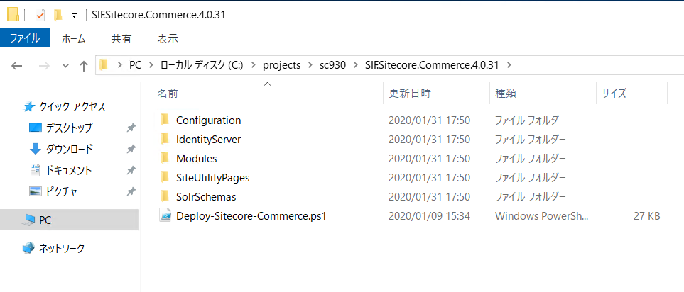

########################################
Commerce モジュールのインストール
########################################

**********************
Redis のインストール
**********************

Redis のモジュールをダウンロード、インストールしてください。

* `Redis <https://github.com/microsoftarchive/redis/releases/tag/win-3.0.504>`_

.. image:: images/redis01.png
   :align: center
   :width: 400px
   :alt: Redis インストール

**********************
インストールの準備
**********************

モジュールを Sitecore のダウンロードサイトからダウンロードします。

* `Sitecore Experience Commerce 9.3 Initial Release <https://dev.sitecore.net/Downloads/Sitecore_Commerce/93/Sitecore_Experience_Commerce_93_Initial_Release.aspx>`_

ダウンロードしたファイルを、今回は `c:\projects\sc930` に展開をします。

`SIF.Sitecore.Commerce.zip` のファイルを展開します。

SXA のコンポーネント `Sitecore.PowerShell.Extensions-6.0.zip` と `Sitecore.PowerShell.Extensions-6.0.zip` を同じフォルダにコピーします。

Nuget サイトから `MSBuild Microsoft Visual Studio Web targets <https://www.nuget.org/packages/MSBuild.Microsoft.VisualStudio.Web.targets/>`_ のページ、右側から `Download package` から zip ファイルをダウンロードします。

ダウンロード後、ファイル名を `msbuild.microsoft.visualstudio.web.targets.14.0.0.3.nupkg` から `msbuild.microsoft.visualstudio.web.targets.14.0.0.3.zip` に変更し、解凍します。

.. image:: images/commerce03.png
   :align: center
   :width: 400px
   :alt: ダウンロード後解凍

**********************
インストール開始
**********************

