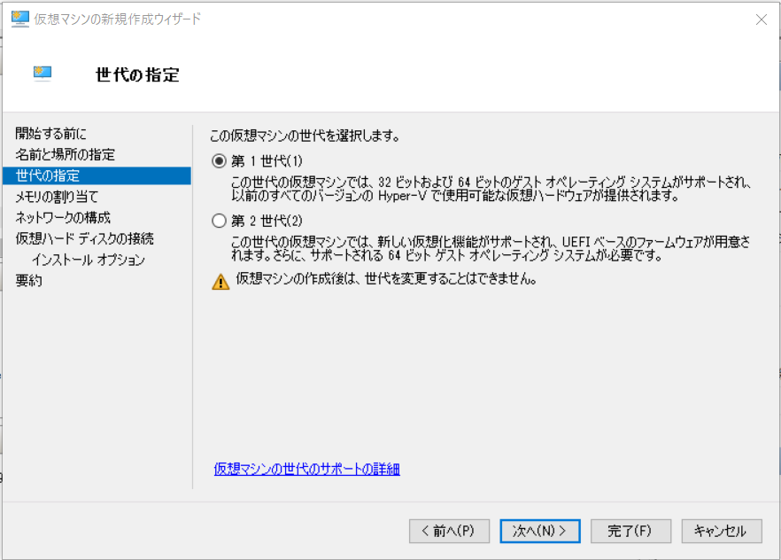
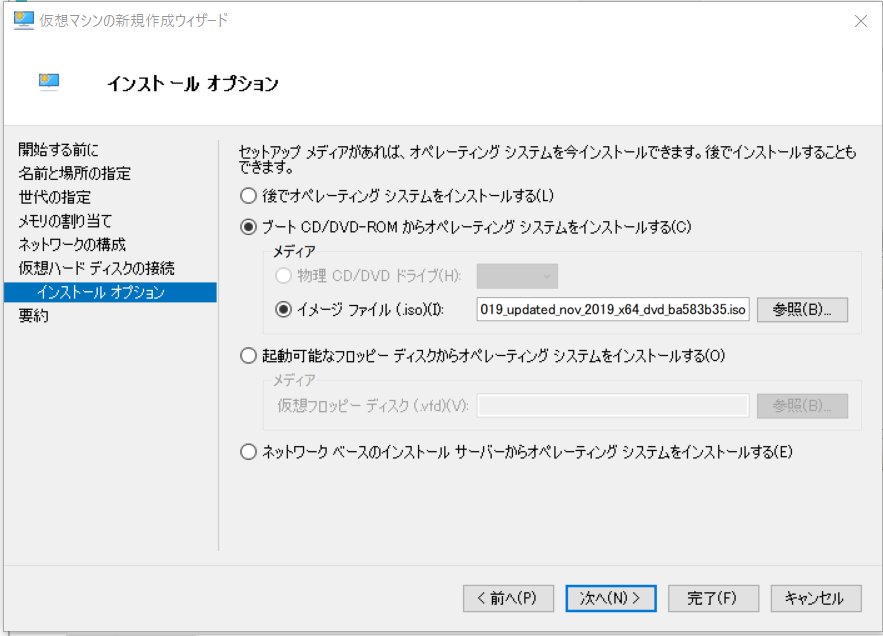
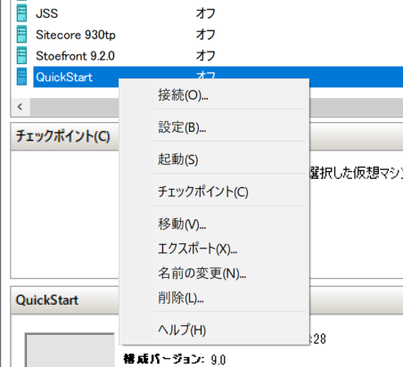
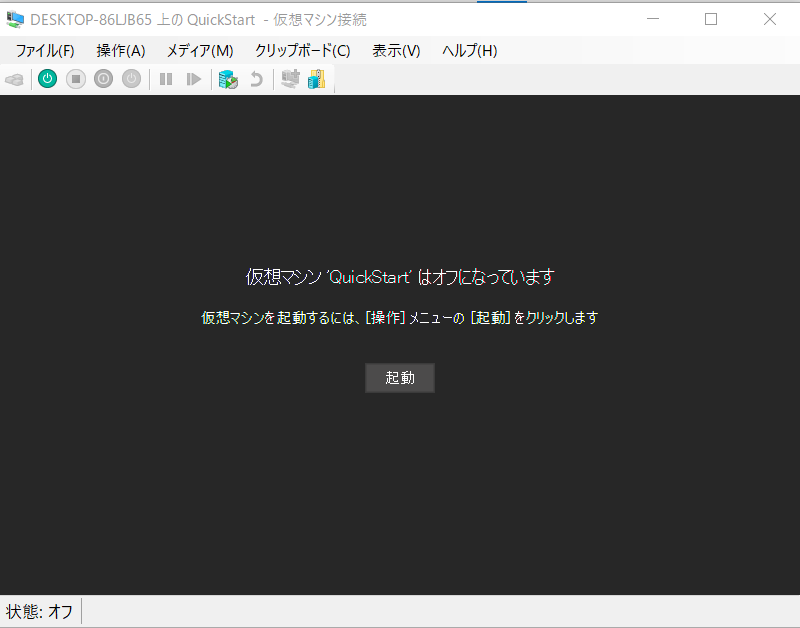
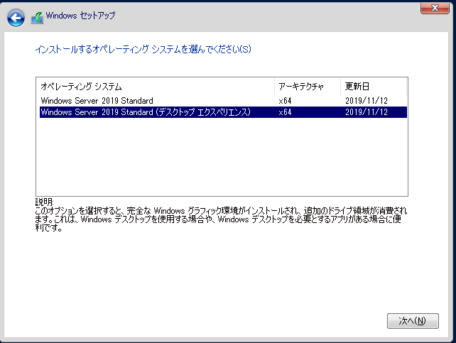
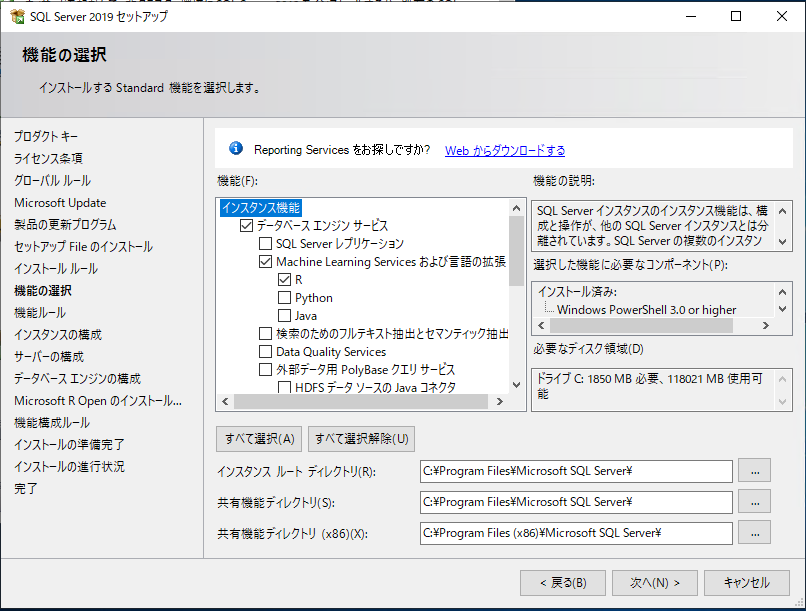
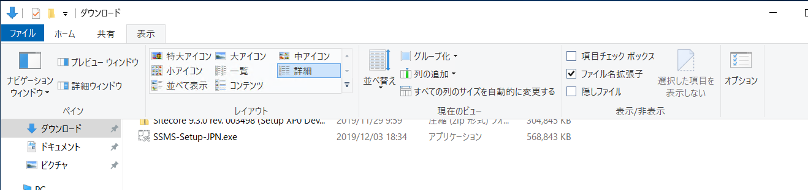

###################
必要システム
###################

**********************
インストール環境の確認
**********************

Sitecore Experience Commerce をインストールする際に必要システムは以下の通りです。

* Windows Server 2019 / Windows 10 Professional
* SQL Server 2019
* SQL Server Management Studio

ここでは、Windows 10 Professional で提供されている Hyper-V の環境で作業を進めていきます。

*****************************************
Windows Server 2019 のインストール
*****************************************

Hyper-V マネージャを起動して、右側に表示されている操作から、「新規」－「仮想マシン」を選択します。

.. image:: images/sysreq01.png
   :align: center
   :width: 400px
   :alt: 仮想マシン

仮想マシンの名前を決めます。ここでは QuickStart という名前にします（特にこの名前には制限はありません）。

.. image:: images/sysreq02.png
   :align: center
   :width: 400px
   :alt: マシン名

今回作成する仮想マシンの世代は「第１世代」を選択します。

仮想マシンのメモリを設定します。PC の容量に合わせて設定をしてください（推奨としては 8GB 以上）

.. image:: images/sysreq04.png
   :align: center
   :width: 400px
   :alt: メモリの指定

ネットワークの構成では、接続先を Default Switch にします。

.. image:: images/sysreq05.png
   :align: center
   :width: 400px
   :alt: ネットワークの構成

仮想ハードディスクを作成しますが、作成するディレクトリを `QuickStart` に変更した画面です（標準のままでも問題ありません）。

.. image:: images/sysreq06.png
   :align: center
   :width: 400px
   :alt: 仮想ハードディスクの接続

インストールオプションで、Windows Server 2019 Standard の ISO ファイルを指定します。

完了ボタンを押します。

.. image:: images/sysreq08.png
   :align: center
   :width: 400px
   :alt: 最終確認

作成した仮想マシンを右クリックで選択、接続します。

マシンを起動します（起動をクリック）

Windows Server 2019 のインストールを進めていきます。途中、エディションが表示される場合は、 `Windows Server 2019 Standard (デスクトップエクスペリエンス)` を選択してください。

あとは Windows Server 2019 のインストールを進めていきます。Windows update を適用して完了します。

*******************************
SQL Server 2019 のインストール
*******************************

SQL Server を今回は ISO ファイルからインストールを進めます。仮想マシンのコンソールのメニューから「メディア」－「DVD ドライブ」-「ディスクの挿入」を選択して、SQL Server の ISO ファイルを選択します。

.. image:: images/sql01.png
   :align: center
   :width: 400px
   :alt: ISO の挿入

SQL Server 2019 インストールセンターの左メニューから「インストール」をクリックして、「SQL Server の新規スタンドアロンインストールを実行するか、既存のインストールに起動を追加」からインストールを開始します。

.. image:: images/sql02.png
   :align: center
   :width: 400px
   :alt: インストーラーの起動

ウィザードが起動するので、デフォルトのまま機能の選択の画面まで進めていきます。表示された際には、以下の項目をチェックしてください。

* データベースエンジン
* Machine Learning サービス（データベース内）
* R

インスタンスの構成は、今回は「既定のインスタンス」を選択して進めていきます。

.. image:: images/sql04.png
   :align: center
   :width: 400px
   :alt: インスタンスの構成

サーバーの構成は標準の設定で進めていき、データベースエンジンの構成の画面に進みます。ここでは、「サーバーの構成」のタブにて、以下の項目を選択します。

* 混合モード（SQL Server 認証と Windows 認証）
* パスワードの入力（sa のパスワード）
* パスワードの確認入力（上記で入力したパスワード）
* SQL Server 管理者の指定に関しては、「現在のユーザーの追加」をクリックして追加します。

.. image:: images/sql05.png
   :align: center
   :width: 400px
   :alt: データベースエンジンの構成

あとは標準の設定で進めていき、SQL Server のインストールを完了します。

************
オプション
************

今後ファイルの拡張子が見えているほうが作業をしやすいので、「エクスプローラ」を起動して「表示」から「ファイル名拡張子」をチェックします。

