################################
Azure Active Directory の設定
################################

.. todo:: 本文書は Sitecore 9.3 リリース後に更新予定です。

Sitecore は Active Directory を利用したシングルサインオンの連携を標準で利用することできるようになっています。ここでは、その手順に関して紹介をしています。

******************************
Azure Active Directory の準備
******************************

ここでは検証用の Active Directory を Microsoft Azure 上で準備します。なお、テスト・検証用程度で利用するのであれば無料で利用することが可能です。

* `Azure Portal <https://portal.azure.com>`_ へアクセス、ログインします
* 左側のメニューから「リソースの作成」を選択
* Azure Marketplace の ID をクリック
* Azure Active Directory の項目を選択します

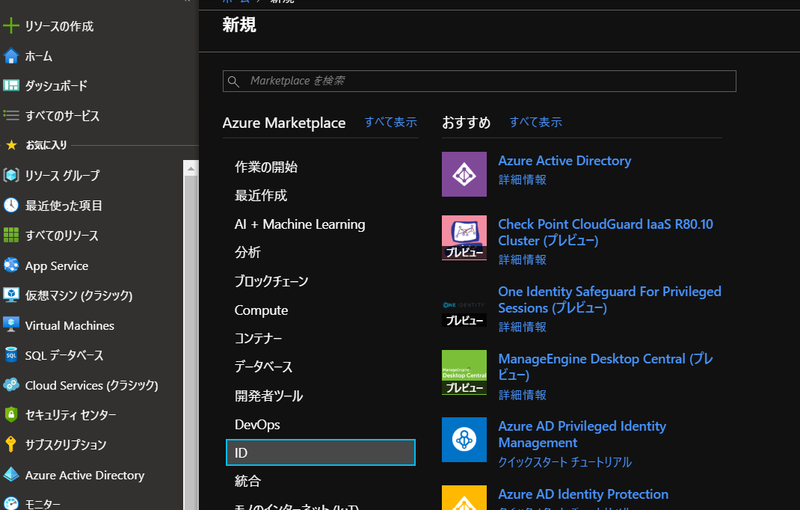

* `組織名` と `初期ドメイン名` を選択します。初期ドメイン名に関しては `onmicrosoft.com` のドメインが設定される形となりますが、あとで独自ドメインを設定することも可能です。

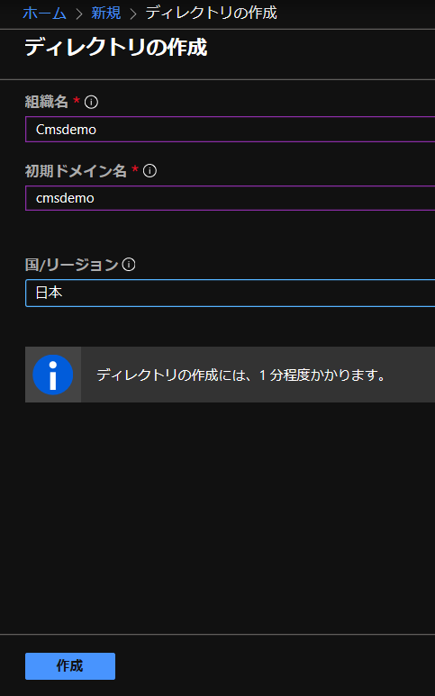

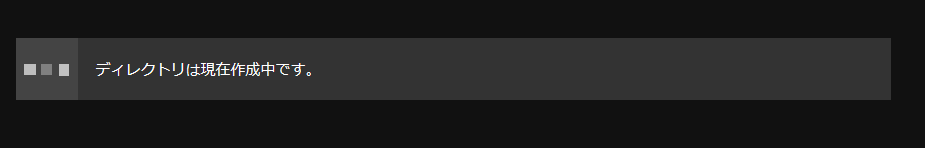

* 数分で Azure Active Directory が作成されます

******************************
アプリの登録（AD の設定）
******************************

作成した AD のポータルに移動します。ウィンドウの右側に表示されている「作成」エリアにある「アプリの登録」をクリックします。

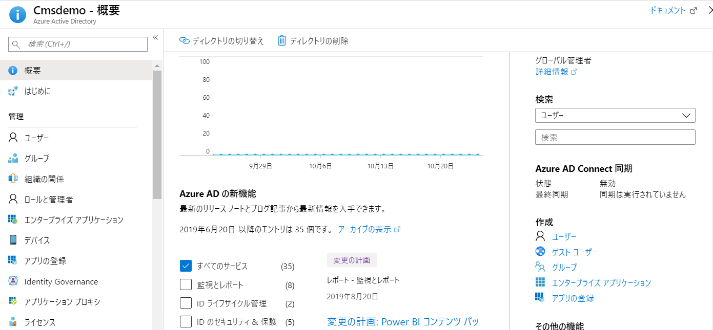

アプリケーションの登録では、`アプリケーション名`を入力、`シングルテナント`を選択します。リダイレクト URI には Sitecore Identity Server のドメイン名に対して、 `/signin-oidc` 追加した URI を設定します。

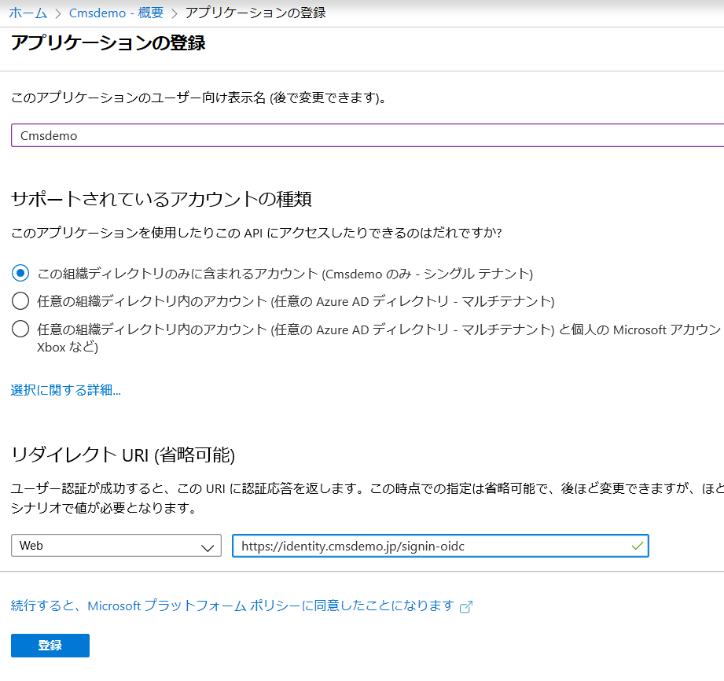

作成したアプリについて、管理「認証」を開いて、ID トークンの項目をチェックします。

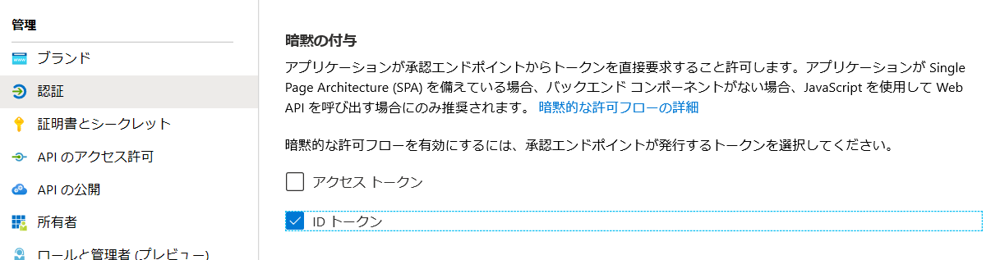

管理「マニフェスト」をチェックして、表示される JSON のデータに関して、groupmembershipClaims の項目が最初は空欄になっていますが、ここに `SecurityGroup` を追加してください。

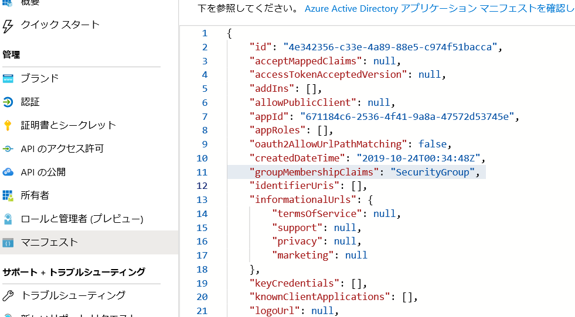

概要を選択して、以下の２つの項目が表示されているのを確認してください。
* アプリケーション（クライアント）ID
* ディレクトリ（テナント）ID

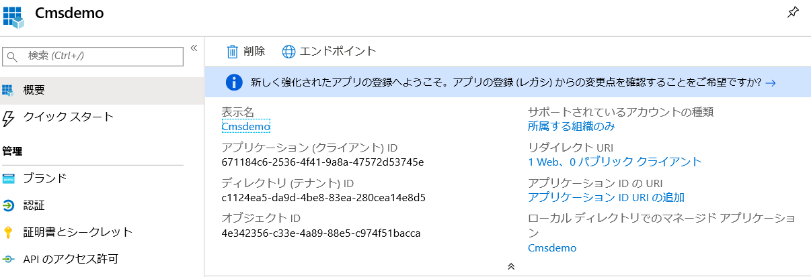

******************************
Sitecore の設定
******************************

続いて Sitecore の設定を進めていきます。まず、Sitecore Identity Server の設定ファイル、 `\sitecore\Sitecore.Plugin.IdentityProvider.AzureAd\Config` のフォルダの中にある `Sitecore.Plugin.IdentityProvider.AzureAd.xml` を編集します。

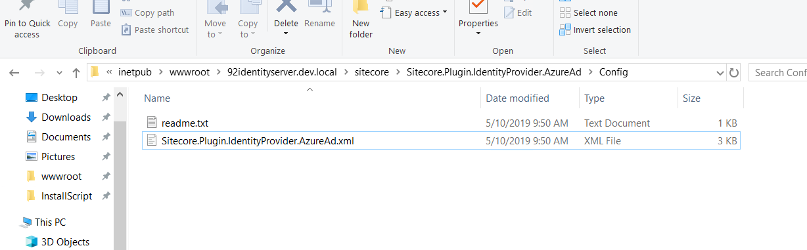

このファイルの項目のうち、Settings : Sitecore : ExternalIdentityProviders : IdentityProviders : AzureAd にある3つの項目を変更してください。ID に関しては Azure AD の概要の項目になります。

========= ====================================
設定項目  設定する値 
========= ====================================
Enabled   True 
ClientId  アプリケーション（クライアント）ID 
TenantId  ディレクトリ（テナント）ID 
========= ====================================

.. code-block:: xml

  <AuthenticationScheme>IdS4-AzureAd</AuthenticationScheme>
  <DisplayName>Azure AD</DisplayName>
  <Enabled>true</Enabled>
  <ClientId>{Place ClientID here}</ClientId>
  <TenantId>{Place TenantID here}</TenantId>

.. image:: images/azure07.png
   :align: center
   :width: 400px
   :alt: 設定ファイルの確認

これで設定が完了となります。Sitecore Identity Server を再起動すると、ログイン画面が変わります。

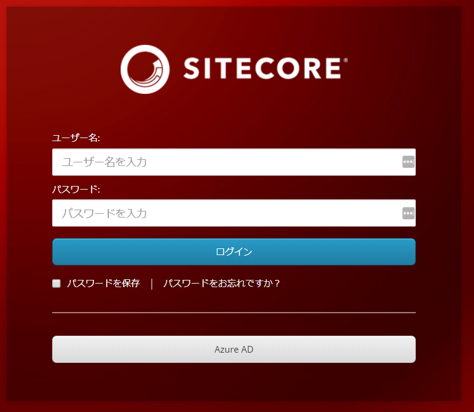

******************************
ログインの検証
******************************

Azure AD にログインできるユーザーを作成します。メニューの「管理」－「ユーザー」をクリックして、メニューに表示される「新しいユーザー」をクリックして作成をします。

続いて、現在管理画面を開いているブラウザとは別のブラウザ、もしくはプライベートモードで別のウィンドウを開いてください。この手順を実施する理由としては、AD 管理画面に入っている場合、マイクロソフトアカウントとしてログインをしている状態となるためテストができないためです。

新しく開いたブラウザでログイン画面を開き「Azure AD」のボタンをクリックしてください。

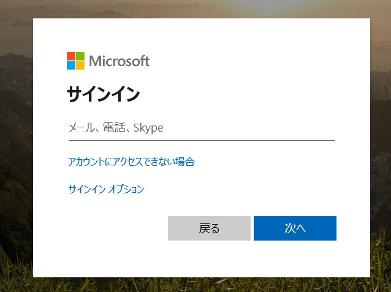

作成をしたアカウントでログインを進めていきます。ログインの手続きが終わった段階で、以下のようなエラーが出ればシングルサインオン自体は成功しています。

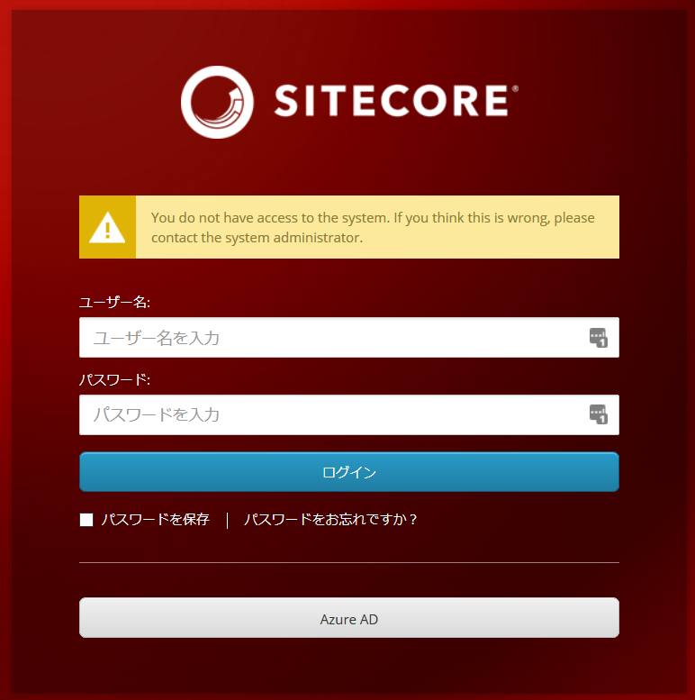

******************************
ロールのマッピング
******************************

Sitecore のロールと AD のグループを紐づけることで、シングルサインオンをした後、使うことができる権限を設定することができます。

まず Active Directory にグループを作成します。今回は、SitecoreAuthor というグループを作成しました。

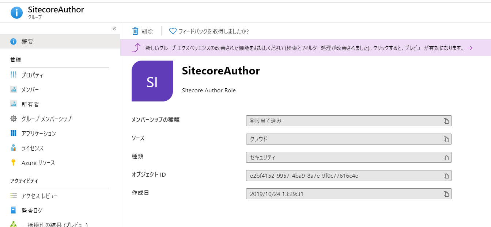

作成したグループにユーザーを追加します。

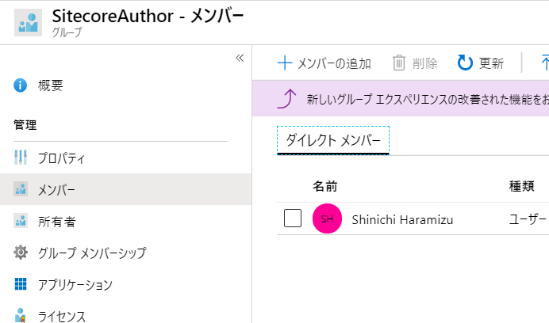

続いてグループの「概要」を開いて、オブジェクト ID を確認します。

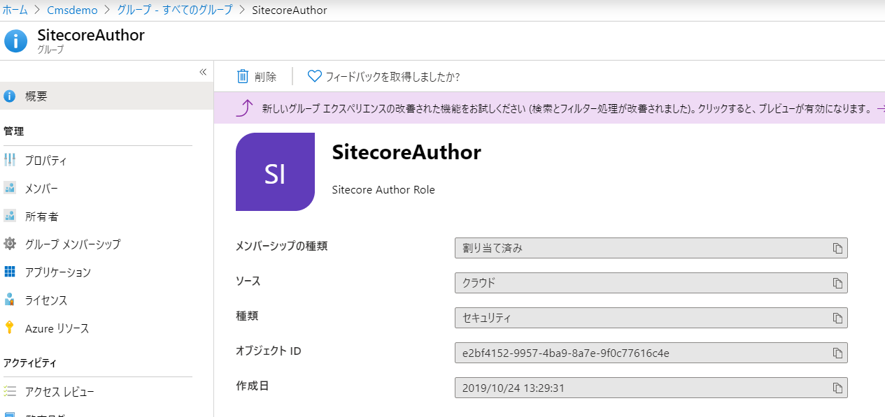

このオブジェクト ID を Sitecore Identity Server の設定に反映をさせます。反映させるファイルは、`\sitecore\Sitecore.Plugin.IdentityProvider.AzureAd\Config` のフォルダにある `Sitecore.Plugin.IdentityProvider.AzureAd.xml` です。

取得したオブジェクト ID を 以下のように `Claim1 type="groups"` の value に反映させます。

.. code-block:: xml

  <AzureGroupTransformation type="Sitecore.Plugin.IdentityProviders.DefaultClaimsTransformation, Sitecore.Plugin.IdentityProviders">
    <SourceClaims>
      <Claim1 type="groups" value="e2bf4152-9957-4ba9-8a7e-9f0c77616c4e" />
    </SourceClaims>
    <NewClaims>
      <Claim1 type="role" value="sitecore\Author" />
    </NewClaims>
  </AzureGroupTransformation>

この設定の場合は、Sitecore のロールとして `Sitecore\Author` に反映させる設定になっています。

この状態でログインをすると、AD を利用してログインをすることが可能となります。

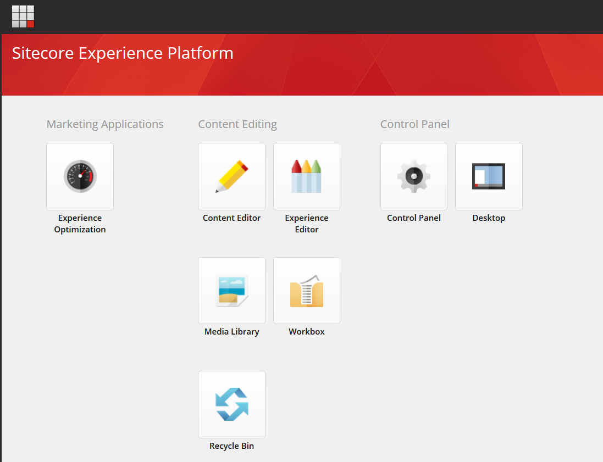
