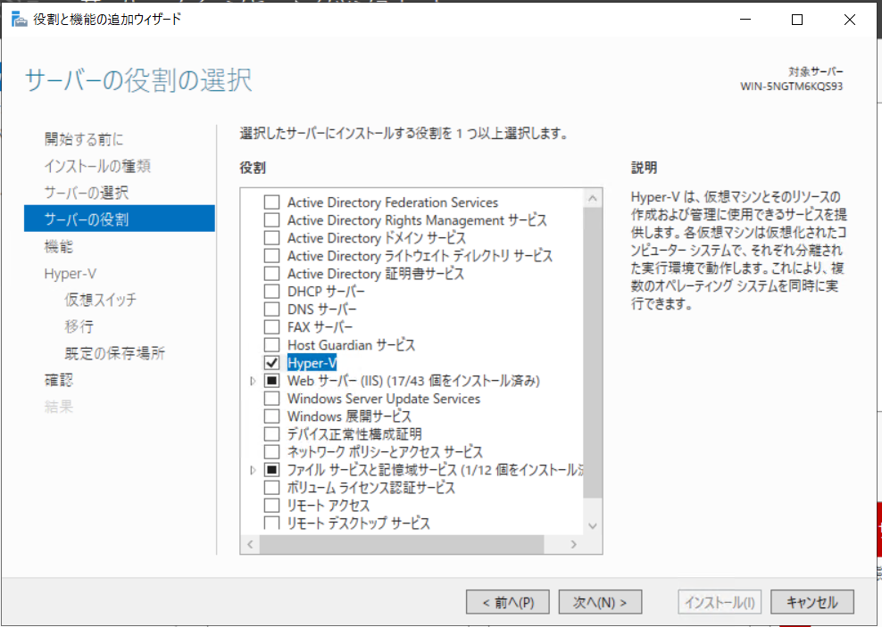
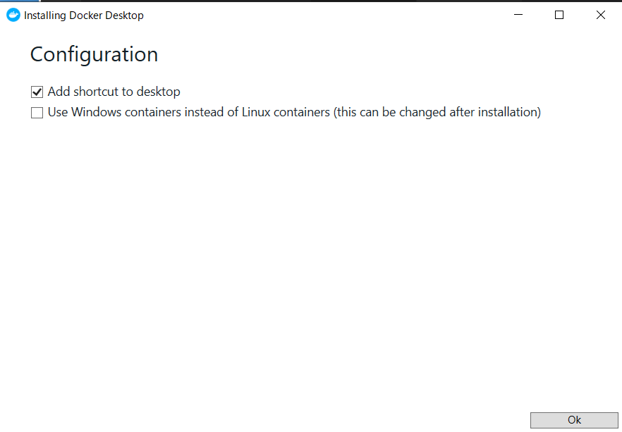
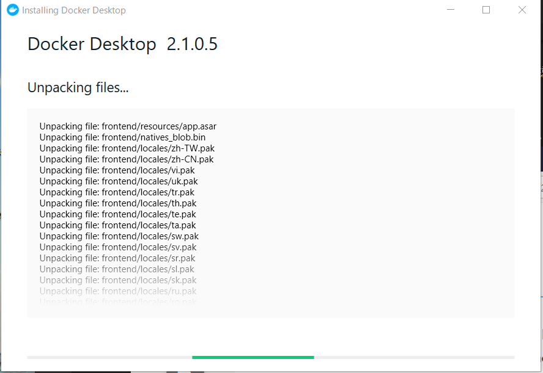
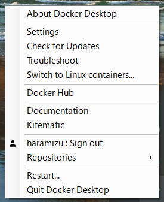
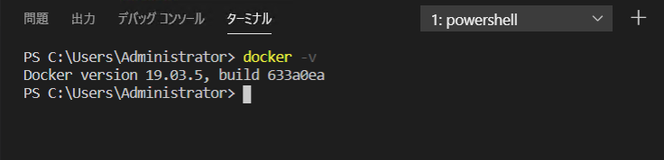
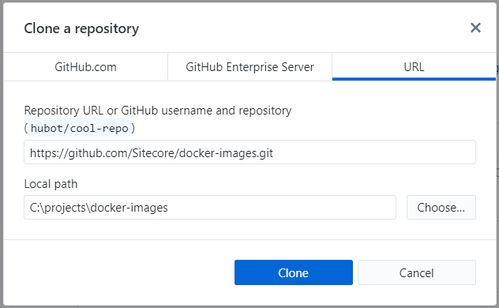
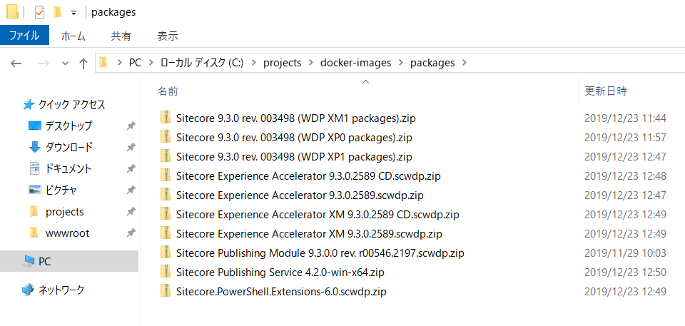

#############################
Docker Images の活用
#############################

ここでは Sitecore Experience Platform 9.3.0 を Docker に展開するための手順を紹介しています。
作業環境として便利な Git for Windows、GitHub Desktop および Visual Studio Code を事前にインストールしてください。

******************
Docker 環境の構築
******************

Windows 上で Docker を利用するための環境を設定していきます。まず Windows の環境において、Containers と Hyper-V の機能を有効にしてください。

.. image:: images/docker02.png
   :align: center
   :width: 400px
   :alt: Containers を有効化

環境を仮想マシン上に展開する場合は、以下のように仮想マシン上で Hyper-V を利用できるように設定してください。

* `入れ子になった仮想化による仮想マシンでの Hyper-V の実行 <https://docs.microsoft.com/ja-jp/virtualization/hyper-v-on-windows/user-guide/nested-virtualization>`_

続いて、Docker for Windows をインストールします。インストールは以下のサイトからダウンロードをして実行してください。

* `Docker for Windows <https://docs.docker.com/docker-for-windows/install/>`_

ダウンロードしたファイルを実行すると、Docker のインストールが始まります。初期設定に関して、今回は Windows Container を利用することになるため、チェックしてください（インストール後変更は可能です）。

ファイルのコピーなどが進みます。

インストールが終了すると画面が切り替わります。はじめてインストールするときには、ユーザーの権限を有効にするために一度ログオフが求められます。

.. image:: images/docker05.png
   :align: center
   :width: 400px
   :alt: インストール完了

Windows のコンテナが有効になっているか確認をします。Switch to Linux .. と記載されている場合は、Windows が有効になっている形です。

PowerShell を起動して、`docker -v` のコマンドを実行します。

これで Docker の準備ができました。

***********************
Docker Images の準備
***********************

ここから先は、 https://dev.sitecore.net からモジュールのダウンロードが出来る権限、およびライセンスファイルが必要となります。

Docker の環境が整った次のステップとして、Github に公開されている Docker images リポジトリを活用します。

* `Sitecore/docker-images <https://github.com/Sitecore/docker-images>`_

今回は Github Desktop を利用して、 `c:\projects\docker-images` のディレクトリにリポジトリのクローンを展開します。

すでに手元にパッケージがある場合、 packages というフォルダを作成してファイルをコピーしてください。ダウンロードの時間を省略することができます。

ファイルとして、以下のファイル一覧が揃っていることを確認してください。

.. code-block:: 

  PS C:\projects\docker-images\packages> dir

      ディレクトリ: C:\projects\docker-images\packages

  Mode                LastWriteTime         Length Name
  ----                -------------         ------ ----
  -a----       2019/12/23     11:44      392594063 Sitecore 9.3.0 rev. 003498 (WDP XM1 packages).zip
  -a----       2019/12/23     11:57      293163136 Sitecore 9.3.0 rev. 003498 (WDP XP0 packages).zip
  -a----       2019/12/23     12:47     1306889900 Sitecore 9.3.0 rev. 003498 (WDP XP1 packages).zip
  -a----       2019/12/23     12:48        3907601 Sitecore Experience Accelerator 9.3.0.2589 CD.scwdp.zip
  -a----       2019/12/23     12:47       17235647 Sitecore Experience Accelerator 9.3.0.2589.scwdp.zip
  -a----       2019/12/23     12:49        3907601 Sitecore Experience Accelerator XM 9.3.0.2589 CD.scwdp.zip
  -a----       2019/12/23     12:49       17235627 Sitecore Experience Accelerator XM 9.3.0.2589.scwdp.zip
  -a----       2019/11/29     10:03        2508447 Sitecore Publishing Module 9.3.0.0 rev. r00546.2197.scwdp.zip
  -a----       2019/12/23     12:50       17626005 Sitecore Publishing Service 4.2.0-win-x64.zip
  -a----       2019/12/23     12:49        1921044 Sitecore.PowerShell.Extensions-6.0.scwdp.zip

作成したクローンの中に `build.ps1` というファイルがあります。このコマンドに、ユーザー名、パスワードを渡して実行をします。

.. code-block:: 

  .\Build.ps1 -SitecoreUsername "YOUR dev.sitecore.net USERNAME" -SitecorePassword "YOUR dev.sitecore.net PASSWORD"

このプロセスは非常に時間がかかります。プロセス上タイムアウトをしてしまうようなケースでは、再度実行をすることでイメージのビルドを続けることができます。

========================================================================= ========= ======= ====== =======================
イメージ名                                                                フラグ    フラグ  Num    ベースイメージ
========================================================================= ========= ======= ====== =======================
sitecore-assets:9.3.0-nanoserver-1809                                     True      False        0 {mcr.microsoft.co...
mssql-developer:2017-windowsservercore-ltsc2019                           True      False        3 {mcr.microsoft.co...
sitecore-xp-xconnect:9.3.0-windowsservercore-ltsc2019                     True      False        6 {sitecore-assets:...
sitecore-xm-sqldev:9.3.0-windowsservercore-ltsc2019                       True      False       13 {sitecore-assets:...
sitecore-xp-sqldev:9.3.0-windowsservercore-ltsc2019                       True      False       13 {sitecore-assets:...
sitecore-xm-cd:9.3.0-windowsservercore-ltsc2019                           True      False       14 {sitecore-assets:...
sitecore-xm-cm:9.3.0-windowsservercore-ltsc2019                           True      False       14 {sitecore-assets:...
sitecore-xp-cd:9.3.0-windowsservercore-ltsc2019                           True      False       14 {sitecore-assets:...
sitecore-xp-standalone:9.3.0-windowsservercore-ltsc2019                   True      False       14 {sitecore-assets:...
sitecore-xp-xconnect-automationengine:9.3.0-windowsservercore-ltsc2019    True      False       15 {sitecore-assets:...
sitecore-xp-xconnect-indexworker:9.3.0-windowsservercore-ltsc2019         True      False       15 {sitecore-assets:...
sitecore-xp-xconnect-processingengine:9.3.0-windowsservercore-ltsc2019    True      False       15 {sitecore-assets:...
sitecore-xm-spe-sqldev:9.3.0-windowsservercore-ltsc2019                   True      False       16 {sitecore-assets:...
sitecore-xp-spe-sqldev:9.3.0-windowsservercore-ltsc2019                   True      False       16 {sitecore-assets:...
sitecore-xm-spe-cm:9.3.0-windowsservercore-ltsc2019                       True      False       17 {sitecore-assets:...
sitecore-xp-spe-standalone:9.3.0-windowsservercore-ltsc2019               True      False       17 {sitecore-assets:...
sitecore-xm-sxa-sqldev:9.3.0-windowsservercore-ltsc2019                   True      False       18 {sitecore-assets:...
sitecore-xp-sxa-sqldev:9.3.0-windowsservercore-ltsc2019                   True      False       18 {sitecore-assets:...
sitecore-xm-sxa-cd:9.3.0-windowsservercore-ltsc2019                       True      False       19 {sitecore-assets:...
sitecore-xm-sxa-cm:9.3.0-windowsservercore-ltsc2019                       True      False       19 {sitecore-assets:...
sitecore-xp-sxa-cd:9.3.0-windowsservercore-ltsc2019                       True      False       19 {sitecore-assets:...
sitecore-xp-sxa-standalone:9.3.0-windowsservercore-ltsc2019               True      False       19 {sitecore-assets:...
sitecore-ps:9.3.0-windowsservercore-ltsc2019                              True      False     1000 {sitecore-assets:...
sitecore-redis:3.0.504-windowsservercore-ltsc2019                         True      False     1000 {mcr.microsoft.co...
sitecore-xm-solr:9.3.0-nanoserver-1809                                    True      False     1000 {mcr.microsoft.co...
sitecore-xm-sxa-solr:9.3.0-nanoserver-1809                                True      False     1000 {mcr.microsoft.co...
sitecore-xp-solr:9.3.0-nanoserver-1809                                    True      False     1000 {mcr.microsoft.co...
sitecore-xp-sxa-solr:9.3.0-nanoserver-1809                                True      False     1000 {mcr.microsoft.co...
========================================================================= ========= ======= ====== =======================

***********************
参考動画
***********************

上記の手順を早送りで紹介している動画を公開しています。

.. raw:: html

    <iframe width="560" height="315" src="https://www.youtube.com/embed/Q9HJB-HYb4k&" frameborder="0" allowfullscreen></iframe>
