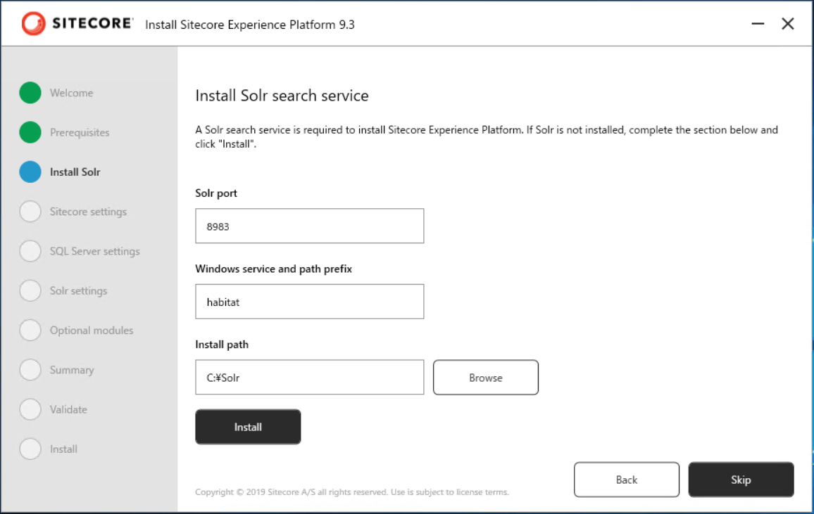

#################################
Sitecore HabitatHome Platform
#################################

ここで紹介をしている Sitecore HabitatHome Plathome は以下の GitHub のリポジトリで公開されているものを紹介しています。

* `https://github.com/Sitecore/Sitecore.HabitatHome.Platform <https://github.com/Sitecore/Sitecore.HabitatHome.Platform>`_

インストールをする際には、 `release/9.3.0` のブランチを選択してください。

**************************
Sitecore のインストール
**************************

Sitecore Experience Platform 9.3 Initial Release をインストールします。デモ環境は、Sitecore のインストール環境としては、以下の設定が標準で設定されています。

========================= ====================================================
設定項目　                 設定値
========================= ====================================================
プロジェクトの場所         c:\\projects\\Sitecore.HabitatHome.Platform\\
Habitat サイトドメイン     habitathome.dev.local
Web Root                   c:\\inetpub\\wwwroot
Host Suffix                dev.local
xConnectRoot               habitathome_xconnect.dev.local
インストールディレクトリ    C:\\inetpub\\wwwroot\\habitathome.dev.local
ドメイン名                 https://habitathome.dev.local/
xConnect ルート            C:\\inetpub\\wwwroot\\habitathome_xconnect.dev.local\\
xConnect ホスト            habitathome_xconnect.dev.local
========================= ====================================================

今回のデモ環境の構築は、以下の環境で構築しています。

* Windows Server 2019 Standard
* SQL Server 2019 Standard
* SQL Server Management Studio

Sitecore Install Assistant の利用
======================================

モジュールや Solr のインストールを手軽に実施するために、Sitecore Install Assistant を利用してインストールをします。手順は以下のように進めてください。

* Graphical setup package for XP Single ファイルをダウンロード、 `C:\\projects\\sif` に展開してください。
* Setup.exe を実行して、モジュールのインストールを完了させます

.. image:: images/habitat01.png
   :align: center
   :width: 400px
   :alt: モジュールをインストールする

* Solr のインストールを実行します、prefix は habitat とします。

上記の手順が終わったところでインストールウィザードを終了させます。

インストールスクリプトの活用
================================

Solr までインストールが完了した後は、Sitecore Install Framework のスクリプトを利用してインストールを進めます。

* `https://github.com/SitecoreJapan/InstallScript/tree/master/demo/HabitatPlatform <https://github.com/SitecoreJapan/InstallScript/tree/master/demo/HabitatPlatform>`_

手順は以下の通りです。

1. `Habitat-930-XP0.ps1` のファイルをダウンロードして、 `C:\\projects\\sif` にコピーします。
2. ダウンロードした `Habitat-930-XP0.ps1` ファイルのデータベースに関する情報を更新してください。
3. 同じフォルダにライセンスファイルをコピーします

上記の手順のあと、 PowerShell のスクリプトを実行することで、Sitecore のインストールが完了します。

*************************
モジュールのインストール
*************************

デモサイトで必要なモジュールをインストールしていきます。モジュールは以下の順番でインストールを進めてください。

* Sitecore.PowerShell.Extensions-6.0.zip 
* Sitecore Experience Accelerator 9.3.0.2589.zip

**********************
日本語リソースの追加
**********************

Sitecore Experience Platform 9.3 Initial Release の日本語リソースの追加および SXA の日本語リソースを追加してください。追加の手順は、[Youtube の動画](https://www.youtube.com/watch?v=iJGBN0wj10s) が参考になります。

**********************
リポジトリのクローン
**********************

https://github.com/Sitecore/Sitecore.HabitatHome.Platform のリポジトリのクローンを作成してください。Build を実行するにあたっては、以下の2つのファイルが設定ファイルになっています。

* cake-config.json
* publishsettings.targets

Sitecore Experience Platform のインストール環境に合わせて、パラメーターを変更してください。

****************************
必要なツールのインストール
****************************

以下のツールをインストールしてください。

* `Node.js <https://nodejs.org/ja/>`_ 推奨版をインストールします
* `Build Tools for Visual Studio 2019 <https://visualstudio.microsoft.com/ja/downloads/>`_ 

    * リンク先のページで、Tools for Visual Studio 2019 の中に含まれています。
    * Web development build tools をチェック、合わせて .NET Framework 4.7.1 をチェックしてください。

.. image:: images/vs2019install.png
   :align: center
   :width: 400px
   :alt: インストール

**************************
ソリューションを構築する
**************************

上記の準備が完了したあと、準備されている build.ps1 を実行してください。

.. code-block:: 

  PS C:\projects\Sitecore.HabitatHome.Platform> .\build.ps1
  Preparing to run build script...
  Running build script...
  The assembly 'Cake.Azure, Version=0.3.0.0, Culture=neutral, PublicKeyToken=null'
  is referencing an older version of Cake.Core (0.28.0).
  For best compatibility it should target Cake.Core version 0.33.0.
  The assembly 'Cake.XdtTransform, Version=0.16.0.0, Culture=neutral, PublicKeyToken=null'
  is referencing an older version of Cake.Core (0.28.1).
  For best compatibility it should target Cake.Core version 0.33.0.

  ----------------------------------------
  Setup
  ----------------------------------------

     ) )       /\
    =====     /  \
   _|___|____/ __ \____________
  |:::::::::/ ==== \:::::::::::|
  |:::::::::/ ====  \::::::::::|
  |::::::::/__________\:::::::::|
  |_________|  ____  |_________|
  | ______  | / || \ | _______ |            _   _       _     _ _        _     _   _
  ||  |   | | ====== ||   |   ||           | | | |     | |   (_) |      | |   | | | |
  ||--+---| | |    | ||---+---||           | |_| | __ _| |__  _| |_ __ _| |_  | |_| | ___  _ __ ___   ___
  ||__|___| | |   o| ||___|___||           |  _  |/ _` | '_ \| | __/ _` | __| |  _  |/ _ \| '_ ` _ \ / _ \
  |======== | |____| |=========|           | | | | (_| | |_) | | || (_| | |_  | | | | (_) | | | | | |  __/
  (^^-^^^^^- |______|-^^^--^^^)            \_| |_/\__,_|_.__/|_|\__\__,_|\__| \_| |_/\___/|_| |_| |_|\___|
  (,, , ,, , |______|,,,, ,, ,)
  ','',,,,'  |______|,,,',',;;

   --------------------  ------------------
     The Habitat Home source code, tools and processes are examples of Sitecore Features.
     Habitat Home is not supported by Sitecore and should be used at your own risk.
   

スクリプトの実行が完了したタイミングで、インストールが完了します。

**********************
インストール後の作業
**********************

インストールが完了したあと、以下の手順を実行してください。

Unicorn の設定をオフにする
==========================================

デモ環境を構築する際に、コンテンツのインポートで Unicorn というツールを使っています。デモや検証ではこのツールは不要となるため、 `web.config` の設定を以下のように変更します。

.. code-block:: xml

    <add key="unicorn:define" value="Disabled" />

マーケティングリソースの追加
=============================

デモ環境には日本語リソースが不足している部分があり、このリソースをまとめたファイルを以下の URL からダウンロードできます。

* https://github.com/SitecoreJapan/InstallScript/tree/master/demo/HabitatPlatform

`920-marketing-ja-jp.xml` のファイルをマスターデータベースにインポートすることで、環境が整います。

インストールしたデータを反映させる
=====================================

内容が更新されているため、以下の手順を実行してください。

* 全コンテンツの Republish
* インデックスの再構築

***********
関連動画
***********

.. raw:: html

    <iframe width="560" height="315" src="https://www.youtube.com/embed/G53Uc4kDJVA" frameborder="0" allowfullscreen></iframe>

***********
関連サイト
***********

* `Github - Sitecore//Sitecore.HabitatHome.Platform <https://github.com/Sitecore/Sitecore.HabitatHome.Platform>`_
