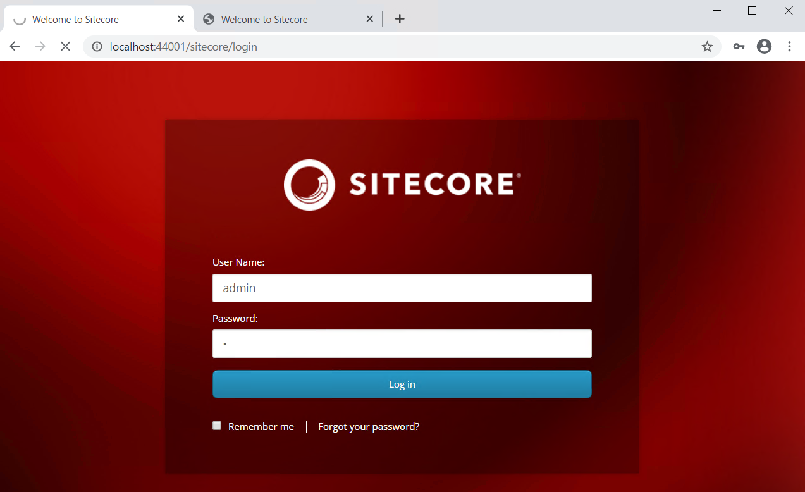
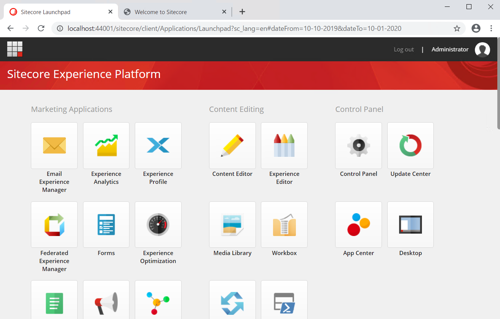
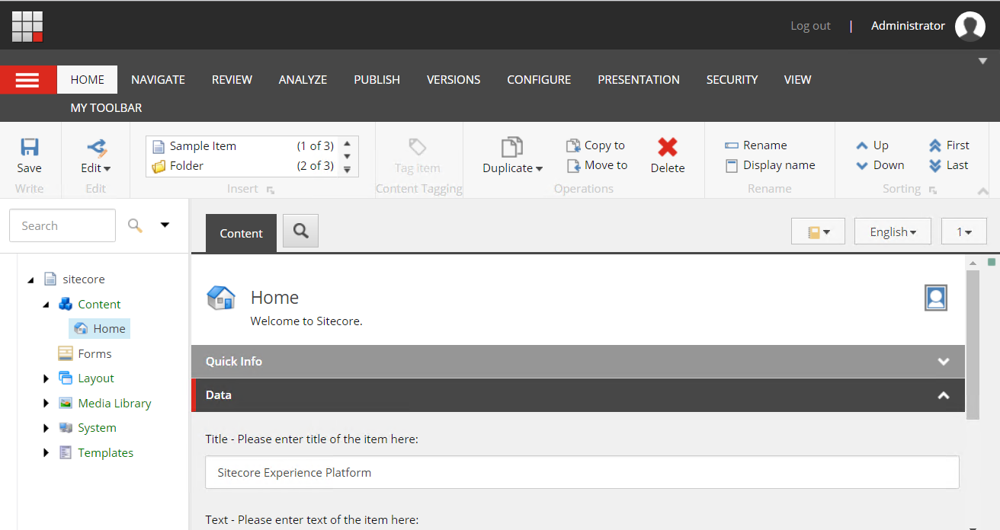
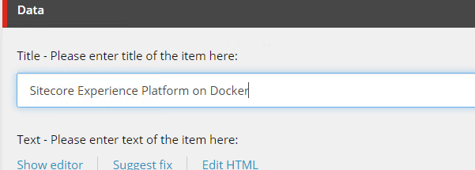
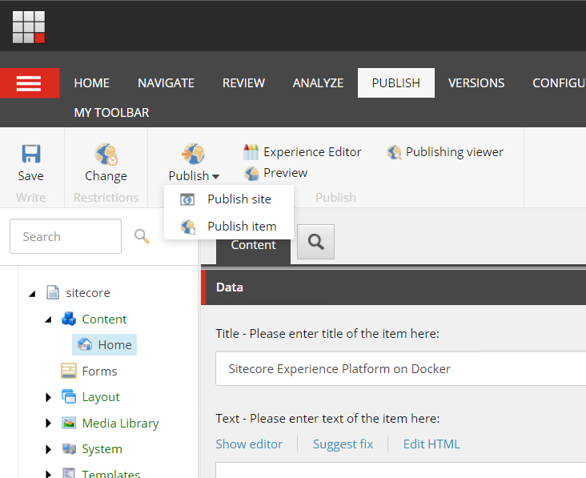
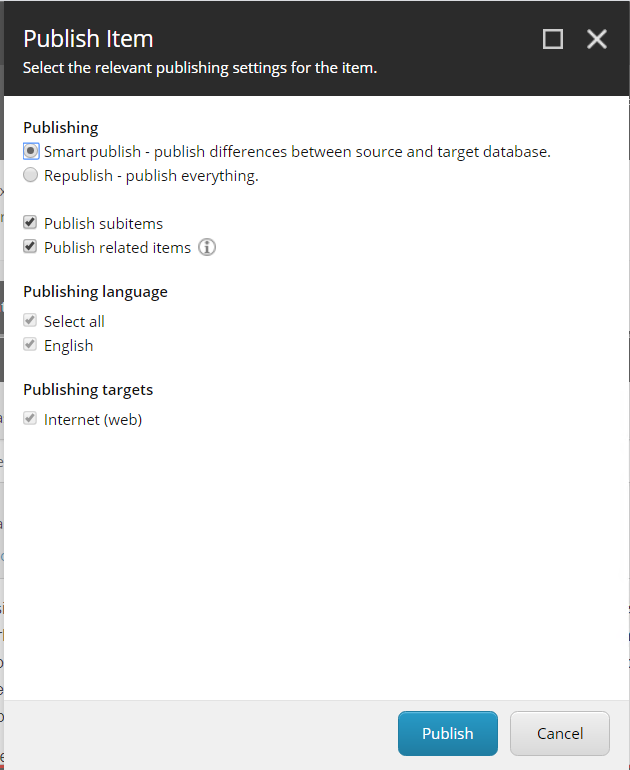
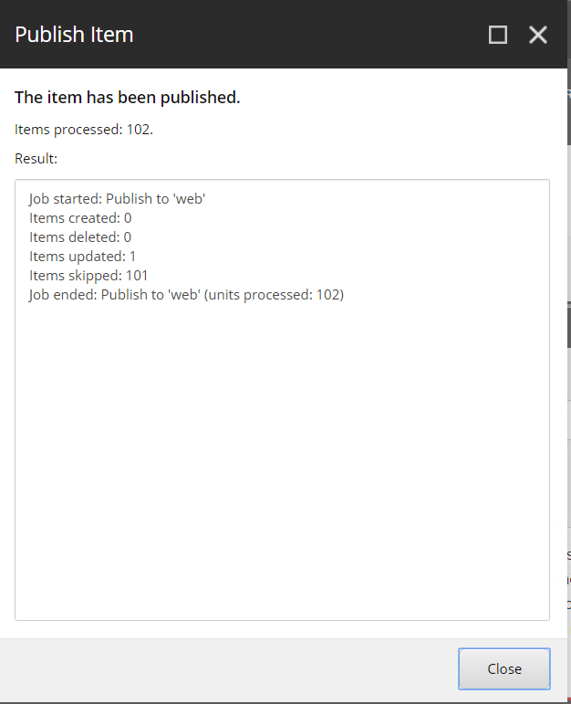
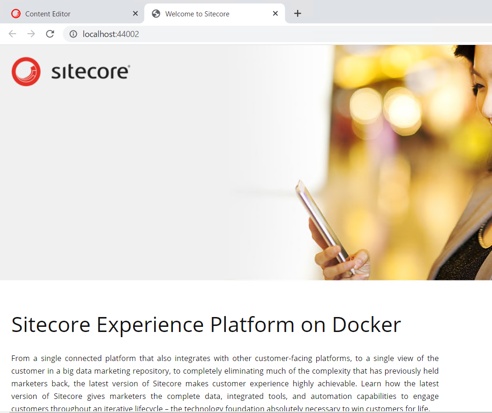

##########################
ページの更新
##########################

Sitecore は管理サーバー側で作業をして、ページの更新手続きをすると公開サーバーが変更される、という運用になります。今回はページの更新を実行します。まず、管理サーバーにログインをします（ /sitecore を URL に追加してください）。

管理者でログインをした後、`Content Editor` を開き、Home のアイテムを編集します。

   

編集が終わったあと、保存、Publish を実行します（Publishing は Smart Publish を実行）。

CD にアクセスしているページを再読込します。

on Docker がタイトルに追加されており、ページが更新されていることを確認できました。

