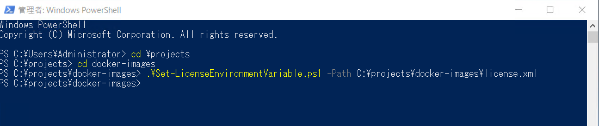
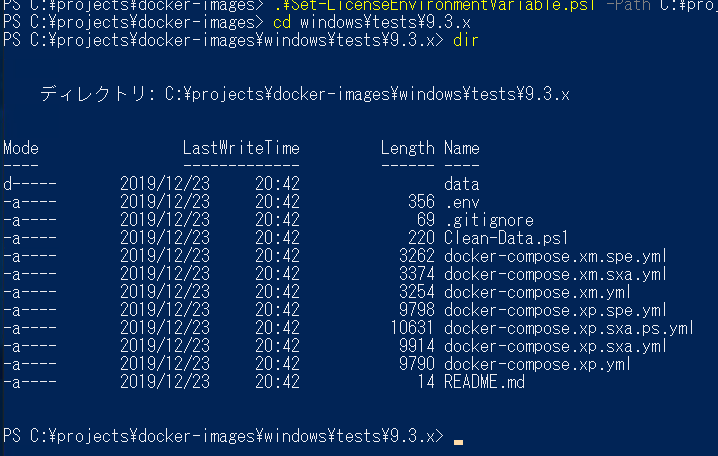
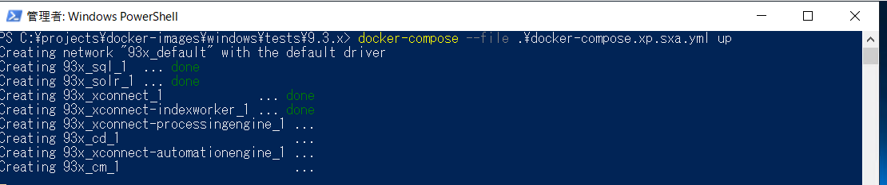
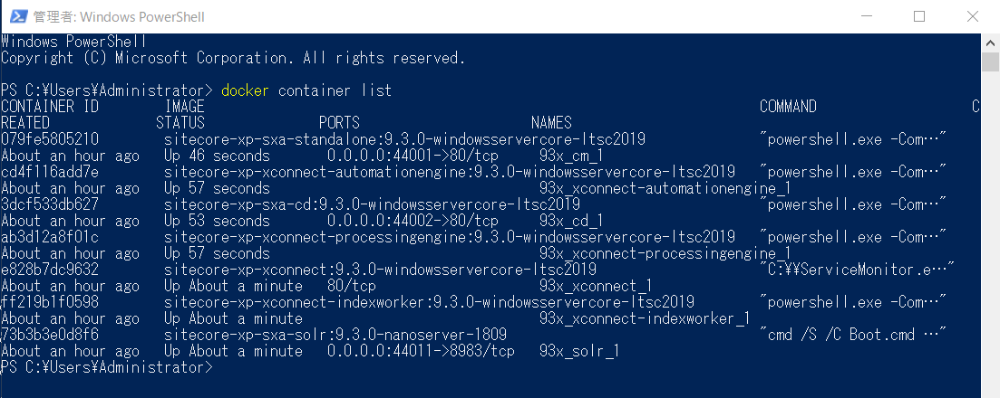
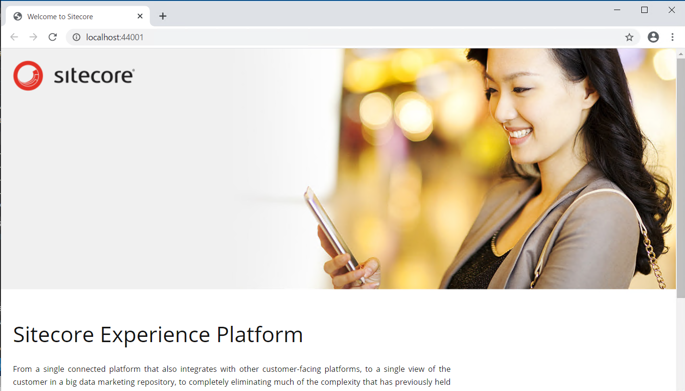
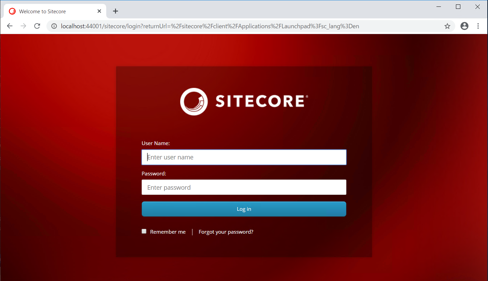
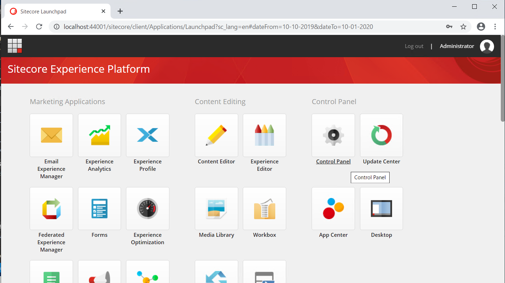
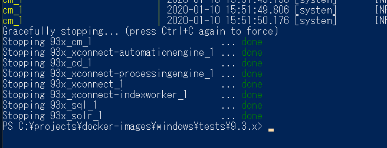

#############################
Sitecore の起動
#############################

ここでは作成をしたイメージを利用して、Sitecore を起動する手順を紹介しています。

**************************
ライセンスファイルの設定
**************************

Docker で Sitecore を立ち上げる際に、ライセンスファイルを適用する必要があります。今回、ライセンスファイルは `C:\\projects\\docker-images\\license.xml` に配置していることを前提とします。

.. code-block:: 

    Set-LicenseEnvironmentVariable.ps1 -Path C:\projects\docker-images\license.xml 

**************************
イメージを選択して起動
**************************

今回は Sitecore Experience Platform に Sitecore Experience Accelerator がインストールされている構成を起動します。動作確認用のファイルは、 `docker-images\\windows\\tests\\9.3.x` のフォルダに展開されています。

対象となるファイルは、 `docker-compose.xp.xsa.yml` ファイルです。Docker のコマンドを実行します。

.. code-block:: PowerShell

  docker-compose --file .\docker-compose.xp.sxa.yml up

上記のコマンドを実行すると、コンテナで Sitecore が起動します。

別の PowerShell を起動して、稼働しているコンテナのリストを参照します。

.. code-block:: 

    docker container list

起動しているコンテナを一覧で確認すると以下のように表示されます。

**************************
動作検証
**************************

コンテナを起動するときに利用した `docker-compose.xp.sxa.yml` のファイルを見ると以下の記載があります。

.. code-block:: 

    cm:
    image: ${REGISTRY}sitecore-xp-sxa-standalone:${SITECORE_VERSION}-windowsservercore-${WINDOWSSERVERCORE_VERSION}
    entrypoint: powershell.exe -Command "& C:\\tools\\entrypoints\\iis\\Development.ps1"
    ports:
      - "44001:80"

実際の cm: （編集サーバー）のコンテナにアクセスする際、localhost の 44001 のポートにアクセスすると、編集サーバーの 80 のポートに接続することができます。

ログイン画面も編集サーバーからアクセスができます。

管理画面が表示されました。

このように Docker を利用して Sitecore を立ち上げることができました。

動作を停止させる場合は、 `Ctrl + C` をクリックしてください。稼働しているコンテナが停止します。

**************************
参考動画
**************************

上記の手順を実行している YouTube の動画をご覧ください。

.. raw:: html

    <iframe width="560" height="315" src="https://www.youtube.com/embed/KvO458_PMxI" frameborder="0" allowfullscreen></iframe>
