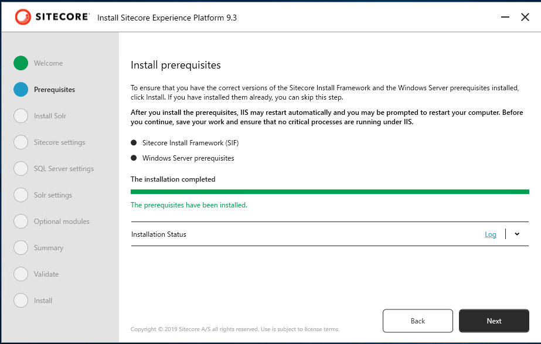
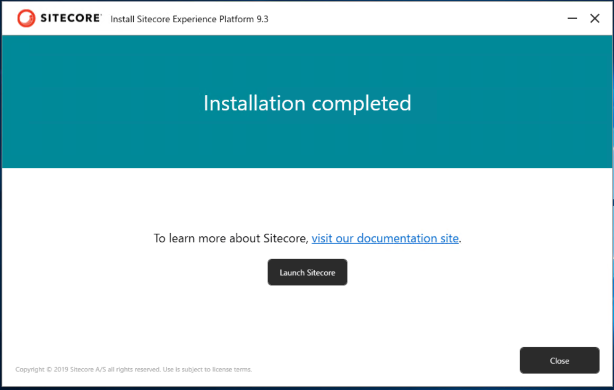

#############################################
Sitecore Experience Platform のインストール
#############################################

Sitecore Experience Platform 9.3 をインストールしために、Sitecore Instllation Assistant を利用して、まずは関連モジュールをインストールします。

今回は以下の環境にインストールをします。

* Windows Server 2019 Standard
* SQL Server 2019

****************************************
Sitecore のインストールプログラムの入手
****************************************

今回は Sitecore Install Assistant を利用してインストールを進めていきます。このため、以下の Web サイトからインストールファイルをダウンロードしてください。

* `Sitecore Experience Platform 9.3 Initial Release <https://dev.sitecore.net/Downloads/Sitecore_Experience_Platform/93/Sitecore_Experience_Platform_93_Initial_Release.aspx>`_

`Download options for On Premises deployment` のグループにある `Graphical setup package for XP Single` をダウンロードしてください。インストールファイルのダウンロードが完了した、ファイルを展開して次のステップに進みます。

***************************
モジュールのインストール
***************************

この手順に関しては、１つの環境で初回のみ実行するだけで完了です。すでに別の Sitecore をインストールしている場合は、スキップしてください。

Sitecore Install Assistant を立ち上げます。これはダウンロードをしたファイルを展開してください。ここでは、 `c:\\projects\\sif` に展開します。

.. image:: images/sia01.png
   :align: center
   :width: 400px
   :alt: フォルダ

`setup.exe` をダブルクリックすると、インストーラーが立ち上がり以下のような画面となります。

Start のボタンをクリックすると、モジュールのインストール画面になります。

.. image:: images/sia03.png
   :align: center
   :width: 400px
   :alt: モジュールインストール

Install のボタンをクリックして、必要なモジュールをインストールしてください。

.. image:: images/sia04.png
   :align: center
   :width: 400px
   :alt: インストール中

インストールが完了すると、`Close` のボタンが有効になります。

続いて Solr のセットアップに進みます。

***********************
Solr のインストール
***********************

Sitecore Install Assistant は 9.3 より Solr のインストールにも対応しています。実際には Sitecore Install Framework のツールが sitecore-solr.json ファイルを利用して、Solr のインストールを行います。ここでは、このファイルを利用してインストールを実行します。

まず、以下の項目が表示されます。

.. image:: images/solr01.png
   :align: center
   :width: 400px
   :alt: Solr のインストール

インストールを実行することで、Solr がサービスとして起動します。

********************
インストールの開始
********************

モジュールのインストールが完了すると、次は Sitecore のインストールとなります。

まず最初に、Sitecore をインストールする時の Prefix、管理者のパスワードおよびライセンスファイルを指定します。

.. image:: images/sia06.png
   :align: center
   :width: 400px
   :alt: インストールの基本設定

インストールを実行します。

続いて、SQL Server の設定を記入します。

.. image:: images/sia07.png
   :align: center
   :width: 400px
   :alt: インストール

インストールした Solr に関する設定があっているか確認をします。

SXA のモジュールも一緒にインストールするか確認をします。

.. image:: images/sia09.png
   :align: center
   :width: 400px
   :alt: インストール

インストールに関する設定項目の最終確認をします。

設定が正しいか、検証が実行されます。

以下の画面が表示されれば、インストールが無事完了します。

