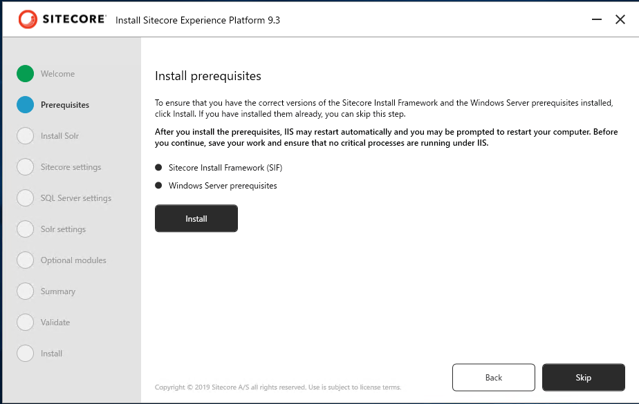

#############################################
Sitecore Experience Platform のインストール
#############################################

Sitecore 9.3 で提供する Sitecore Instllation Assistant は Solr も含めて自動的にセットアップをするインストール支援ツールになりました。これにより、 Windows Server と SQL Server がインストールされている環境に対して、簡単にインストールをすることができるようになりました。

今回は以下の環境にインストールをします。

* Windows Server 2019 Standard
* SQL Server 2019

****************************************
Sitecore のインストールプログラムの入手
****************************************

今回は Sitecore Install Assistant を利用してインストールを進めていきます。このため、以下の Web サイトからインストールファイルをダウンロードしてください。

* `Sitecore Experience Platform 9.3 Initial Release <https://dev.sitecore.net/Downloads/Sitecore_Experience_Platform/93/Sitecore_Experience_Platform_93_Initial_Release.aspx>`_

`Download options for On Premises deployment` のグループにある `Graphical setup package for XP Single` をダウンロードしてください。インストールファイルのダウンロードが完了した、ファイルを展開して次のステップに進みます。

***************************
モジュールのインストール
***************************

この手順に関しては、１つの環境で初回のみ実行するだけで完了です。すでに別の Sitecore をインストールしている場合は、スキップしてください。

Sitecore Install Assistant を立ち上げます。これはダウンロードをしたファイルを展開してください。ここでは、 `c:\\projects\\sif` に展開します。

`setup.exe` をダブルクリックすると、インストーラーが立ち上がり以下のような画面となります。

.. image:: images/sia02.png
   :align: center
   :width: 400px
   :alt: 起動画面

Start のボタンをクリックすると、モジュールのインストール画面になります。

Install のボタンをクリックして、必要なモジュールをインストールしてください。

インストールが完了すると、`Next` のボタンが有効になります。

.. image:: images/sia05.png
   :align: center
   :width: 400px
   :alt: Next が有効に

***********************
Solr のインストール
***********************

Sitecore Install Assistant は 9.3 より Solr のインストールにも対応しています。Java ランタイムなども一緒にインストールされます。なお、Solr を別途インストール済の場合は、スキップできます。

まず、以下の項目が表示されます。

================================ ============ ======================================
パラメータ                        入力値      説明 
================================ ============ ======================================
Solr port                         8983        Solr が利用するポート番号
Windows service and path prefix   93          インストールをする Solr の Prefix
Install path                      c:\solr     インストール先
================================ ============ ======================================

********************
インストールの開始
********************

モジュールのインストールが完了すると、次は Sitecore のインストールとなります。

Sitecore Settings 
=====================

インストールをする際の設定を記載します。以下の項目を入力してください。以下の値は例となります。

============================= ==================== =======================
パラメータ                     入力値                説明 
============================= ==================== =======================
Installation/Solution prefix  93                   DB 名、サイト名で利用
Sitecore admin password       P@ssw0rd             管理者のパスワードの設定
Sitecore license file         license.xml へのパス  ライセンスファイル
============================= ==================== =======================

SQL Server settings
=======================

続いてインストールをしている SQL Server に関する設定を入力します。

============================ ======== =======================
パラメータ                     力値     説明
============================ ======== =======================
SQL Server instance          (local)  サーバーのインスタンス名  
SQL Server admin user name   sa       管理者ユーザー名  
SQL Server admin password    ******   管理者パスワード 
============================ ======== =======================

.. image:: images/sia07.png
   :align: center
   :width: 400px
   :alt: SQL Server の設定

Solr の設定
================

すでにインストールしている Solr の設定を入力していきます。ここでは、[Solr 7.5 のインストール](./solr.md) でインストールしているパラメータを利用しています。

========================== ============================ ===============================
パラメータ                  入力値                        説明  
========================== ============================ ===============================
Solr service URL           https://localhost:8983/solr  Solr の URL
Solr file system root      C:\Solr\93Solr-8.1.1         Solr インストール先のディレクトリ
Solr Windows service name  93Solr-8.1.1                  サービスの名前
========================== ============================ ===============================

.. image:: images/sia08.png
   :align: center
   :width: 400px
   :alt: Solr の設定

SXA の設定
================

Sitecore Experience Accelerator を同時にインストールをするか、確認が表示されます。ここではインストールするためにチェックを入れておきます。

.. image:: images/sia09.png
   :align: center
   :width: 400px
   :alt: SXA 設定

インストール最終確認
=======================

設定をしたパラメーターの確認画面が表示されます。

.. image:: images/sia09.png
   :align: center
   :width: 400px
   :alt: パラメーターの確認

また各種ファイルの検証が行われます。

.. image:: images/sia10.png
   :align: center
   :width: 400px
   :alt: パラメーファイルの検証ターの確認

全てっチェックが完了したところで、Install のボタンをクリックしてください。

.. image:: images/sia11.png
   :align: center
   :width: 400px
   :alt: インストールの開始

これでインストールが無事完了します。完了をすると下のような画面が表示されますので、 Launch Sitecore のボタンをクリックしてください。

.. image:: images/sia12.png
   :align: center
   :width: 400px
   :alt: インストールの開始

ログイン画面が表示されれば、インストールが無事完了します。

*************
参考動画
*************

.. raw:: html

    <iframe width="560" height="315" src="https://www.youtube.com/embed/Bcjf2MjWvkk" frameborder="0" allowfullscreen></iframe>
