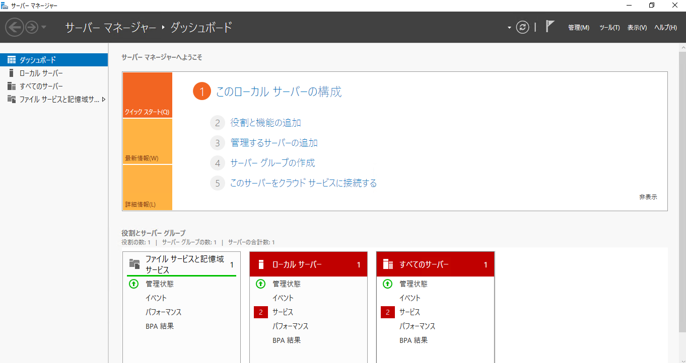
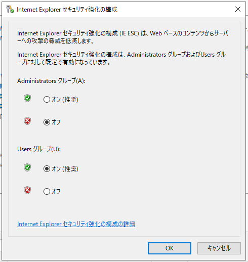

##########################
関連ツールのインストール
##########################

SQL Server Management Tool は事前にインストールをする必要があります。

* `SQL Server Management Studio <https://docs.microsoft.com/ja-jp/sql/ssms/download-sql-server-management-studio-ssms>`_

なお、以下のツールは便利なツールを紹介しています。特に必須ではないため、スキップしても問題ありません。

* `Visual Studio Code <https://code.visualstudio.com/>`_
* `Google Chrome <https://www.google.com/intl/ja_jp/chrome/>`_
* `Firefox <https://www.mozilla.org/ja/firefox/new/>`_
* `Git for Windows <https://gitforwindows.org/>`_
* `GitHub Desktop <https://desktop.github.com/>`_

ブラウザに関しては好みに合わせてご利用ください。

****************************
ダウンロードに関しての設定
****************************

Windows Server 2019 (2016 も含む）において、標準でインストールされているブラウザの Internet Explorer はセキュリティを強化するためにダウンロード機能が無効となっています。ここでは有効にする手順を紹介します。

1. サーバーマネージャーを起動します

2. 左のメニューから「ローカルサーバー」を選択します。

.. image:: images/wsm02.png
   :align: center
   :width: 400px
   :alt: ローカルサーバーを選択

3. サーバーのプロパティから `IE セキュリティ強化の構成` の `有効` をクリックします
4. Administrator グループのセキュリティの設定を `オフ` にします。

上記の設定をすることで、Internet Explorer でファイルのダウンロードができるようになります。

**********************************************
SQL Server Management Studio のインストール
**********************************************

SQL Server Management Studio は、マイクロソフトのサイトからダウンロードをすることができます。

* `SQL Server Management Studio <https://docs.microsoft.com/ja-jp/sql/ssms/download-sql-server-management-studio-ssms>`_

.. image:: images/ssms01.png
   :align: center
   :width: 400px
   :alt: ダウンロード

モジュールをダウンロードしたら、ダウンロードしたファイルをダブルクリックして、インストールを開始します。

暫くするとインストールが完了します。

インストールが完了したあと、SQL Server Management Studio を起動します。ログイン画面が出てきますので、SQL Server をインストールしたときのパスワードを利用して、ログインしてください。

.. image:: images/ssms04.png
   :align: center
   :width: 400px
   :alt: ログイン

*****************************
Visual Studio Code 追加作業
*****************************

Visual Studio Code は標準では英語の UI になっています。このため、日本語の UI をインストールします。

* Visual Studio Code を起動します
* 左側のメニューにある Extensions をクリック、Japanese と入力すると、Japanese Language Pack for visual Studio Code が表示されます

.. image:: images/vscode01.png
   :align: center
   :width: 400px
   :alt: 拡張機能

インストールが完了するとダイアログが表示され、Restart Now のボタンをクリックすると、Visual Studio Code の UI が日本語に切り替わります。
