#######################################################
Sitecore Connect for SFMC - Behavioral Data Exchange
#######################################################

この文書では、 Sitecore Connect for Salesforce Marketing Cloud 4.0 のモジュールのうち、Behavioral Data Exchange に関するセットアップの手順を紹介しています。

.. note:: Sitecore Connect for Salesforce Marketing Cloud 4.0 は Sitecore Experience Platform 9.3 向けのモジュールとなります。Sitecore 9.0, 9.0.1, 9.1, 9.2 を利用されている方は、別のバージョンのモジュールをご利用ください。

**************************
必要システム
**************************

Behavioral Data Exchange は、以下の環境で利用することが可能です。

* Sitecore Experience Platform 9.3.0
* `Data Exchange Framework 4.0.0 <https://dev.sitecore.net/Downloads/Data_Exchange_Framework/4x/Data_Exchange_Framework_400.aspx>`_ 
* Salesforce Marketing Cloud の管理者権限

すでに上記の環境が整っていることを前提として、インストール、設定に関して紹介をしていきます。

**************************
モジュールのインストール
**************************

以下の手順でインストールを進めていきます。

1. モジュールを Sitecore Connect for Salesforce Marketing Cloud 4.0 にある Behavioral Data Exchange の Installation Package をクリックしてダウンロードをします。
2. インストールをする Sitecore の環境に管理者権限でログインをします
3. 「コントロールパネル」－「管理」パネル－「パッケージをインストールする」を開きます
4. ダウンロードしたモジュールのインストールをします

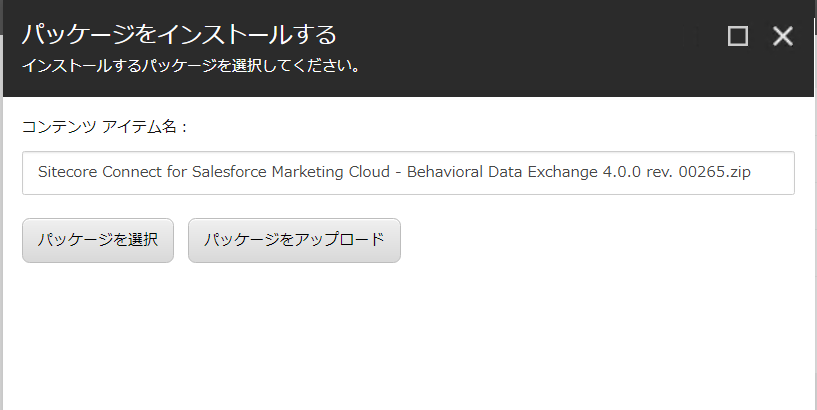

5．インストールの手順を確認します。

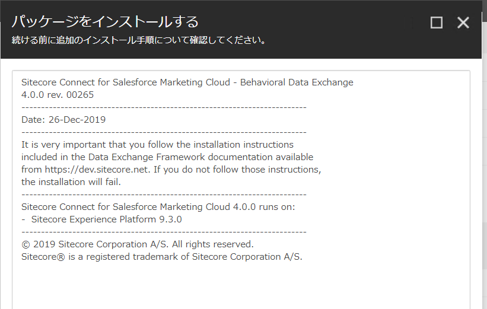

6. ファイルの上書きの警告が出た場合は、「はい」を選択してください。
7. インストールの手順で紹介されていた、「サイトコア クライアントを再起動します。」をチェックしてブラウザ側の設定をリセットします。

.. image:: images/sfmcbde03.png
   :align: center
   :width: 400px
   :alt: クライアントの再起動

8. コンテンツエディターを開いて、 `/sitecore/system/Data Exchange` のアイテムを右クリック、`SFMC テナント用接続` を選択できるようになっている段階で、モジュールのインストールは成功しています。

.. image:: images/sfmcbde04.png
   :align: center
   :width: 400px
   :alt: インストール完了の確認

*************************************
Salesforce Marketing Cloud との接続
*************************************

Salesforce Marketing Cloud にて以下の設定を進めていきます。

Salesforce Markering Cloud API 連携の設定
============================================

以下の手順で API 連携を作成します。

.. note:: API 連携に関しては、すでに :doc:`Sitecore Connect for SFMC - Content Exchange <salesforcemcce>` で作成している場合は共有することができます。この場合、アクセス権に関して既存の設定に追加してください。

1. 右上に表示されているアカウントにマウスカーソルを合わせて、表示されたメニューの「セットアップ」をクリックします。

.. image:: images/sfmcbde05.png
   :align: center
   :alt: セットアップ

2. 左側のメニューの「プラットフォームツール」－「アプリ」－「インストール済パッケージ」をクリックします。

.. image:: images/sfmcbde06.png
   :align: center
   :alt: インストール済パッケージ

3. 右上にある「新規」のボタンをクリックして、新しいパッケージを作成します。
4. 新しいパッケージの詳細のダイアログでアプリケーションの名前を設定してください。

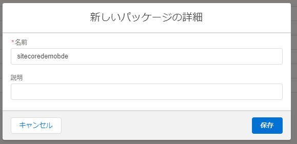

5. コンポーネントの追加をクリックします

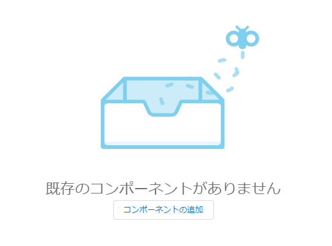

6. API 連携を選択して「次へ」をクリックします。

.. image:: images/sfmcbde09.png
   :align: center
   :width: 400px
   :alt: API 連携を選択

7. サーバー間連携を選択して「次へ」をクリックします。

.. image:: images/sfmcbde10.png
   :align: center
   :width: 400px
   :alt: サーバー間連携

8. コンポーネントの追加の画面では、以下の権限を設定してください。

=========== ================ ==================
カテゴリ　  タイプ　          権限
=========== ================ ==================
Data        Data Extensions   Read and Write
=========== ================ ==================

.. image:: images/sfmcbde11.png
   :align: center
   :width: 400px
   :alt: データタイプ

9. 設定が終わったら保存して、API 連携の設定は完了です。

Sitecore Connection String の設定
=====================================

Sitecore の設定としては、Salesforce Marketing Cloud で作成をしたパッケージを利用して接続文字列を作る必要があります。接続文字列のサンプルは以下の通りです。

.. code-block:: xml

  <add name="sfmc" connectionString="client id=Client Id;
      client secret=Client Secret;
      auth endpoint=Authentication Base URI;
      rest endpoint=REST Base URI;
      soap endpoint=SOAP Base URI" />

パラメーターは作成したパッケージから、以下の項目をそのまま反映させてください。

======================= ===========================
ConnectionString の表記  パッケージの表記
======================= ===========================
Client Id                クライアント ID
Client Secret            クライアントシークレット
Authentication Base URI  認証ベース URI
REST Base URI            REST ベース URI
SOAP Base URI            SOAP ベース URI 
======================= ===========================

ConnectionString の変更が終わったタイミングで、Sitecore のインスタンスを再起動して反映させます。

******************
テナントの設定
******************

テナントの作成
===============

Sitecore の設定を追加していきます。

1. コンテンツエディターを開いて、 `/sitecore/system/Data Exchange` のアイテムを右クリック、`SFMC テナント用接続` を選択してください。

.. image:: images/sfmcbde04.png
   :align: center
   :width: 400px
   :alt: コネクタを選択

2. テナントの名前を決めます

.. image:: images/sfmcbde12.png
   :align: center
   :width: 400px
   :alt: テナント名を設定

3. 自動的に必要とされるアイテムが作成されます。

.. image:: images/sfmcbde13.png
   :align: center
   :width: 400px
   :alt: テナントの作成

4. 作成したテナントアイテムを選択、「コンテンツ」タブを開いて `Enabled` をクイックしてください。

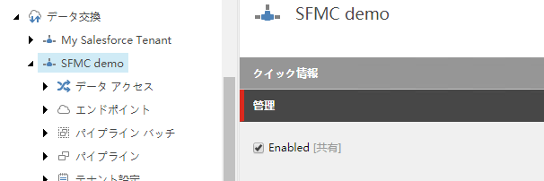

5. アイテムを保存します

エンドポイントの設定
========================

作成したテナントに必要な値を追加していきます。

1. 作成したテナントの `name>/Endpoints/Providers/SFMC/SFMC Endpoint` のアイテムを選択します
2. 接続文字列名の項目に `sfmc` を記入します（異なる接続文字列の場合は、設定している値にしてください）。

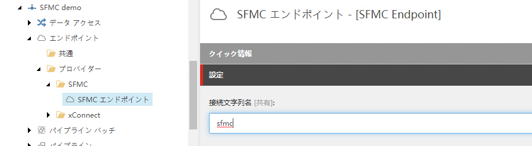

3. 「データ交換」のタブにあるボタン「トラブルシューティングツールを実行」をクリックしてください。

.. image:: images/sfmcbde16.png
   :align: center
   :width: 400px
   :alt: トラブルシューティングツールを実行

4. 「接続が正常に確立されました」と表示されれば、設定が正しい形となります。

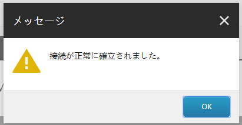

xConnect のエンドポイントの設定
================================

ここでは xConnect の接続に関して確認をします。

1. 作成したテナントの `/Endpoints/Providers/xConnect/xConnect Client Endpoint` のアイテムを選択します。
2. 以下の項目が設定されていることを確認します。

========================================== ============================================================
フィールド名　                              設定値     
========================================== ============================================================
コレクション モデル                         コレクションモデル/デフォルト/デフォルトコレクションモデル
コレクション サービス接続文字列名           xconnect.collection
コレクション サービス証明書の接続文字列名   xconnect.collection.certificate
========================================== ============================================================

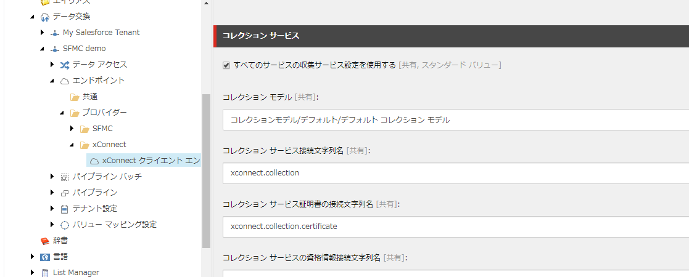

3. 「データ交換」のタブにあるボタン「トラブルシューティングツールを実行」をクリックしてください。

.. image:: images/sfmcbde16.png
   :align: center
   :width: 400px
   :alt: トラブルシューティングツールを実行

4. 「接続が正常に確立されました」と表示されれば、設定が正しい形となります。

パイプラインバッチの実行
================================

作成したテナントの `Pipeline Batches` のアイテムの下に、Salesforce Marketing Cloud 連携させるためのバッチが準備されています。

.. image:: images/sfmcbde19.png
   :align: center
   :width: 400px
   :alt: パイプラインバッチ

各バッチのアイテムを選択すると、リボンに「データ交換」のリボンが表示されて、「パイプラインバッチを実行」を選択することができます。

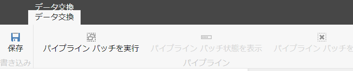

********************************************************
Sitecore のデータと Salesforce Data Extensions のリンク
********************************************************

実際に利用するにあたって、Sitecore のデータと Salesforce Marketing Cloud と連携させる必要があります。ここではその手順を紹介します。

.. note:: パイプラインバッチの「設定 - SFMC アカウントインフラストラクチャー」、「xConnect コンタクトをプッシュ」、「マーケティングリストをプッシュ」を実行してください。

コンタクトデータのリンク作成
=============================

1. Salesforce Marketing Cloud にログインをします。
2. Audience Build の項目にある Contact Builder を実行します

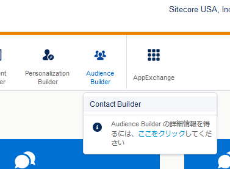

3. データデザイナーが起動します

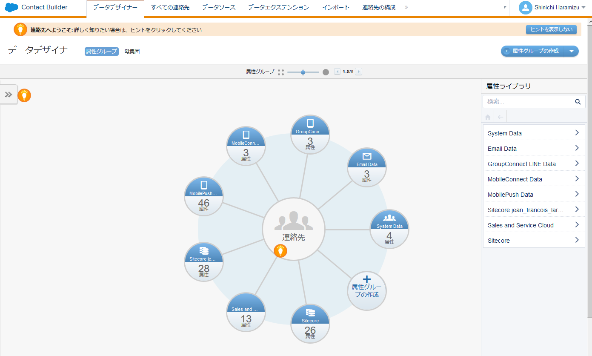

4. 「属性グループの作成」をクリックします

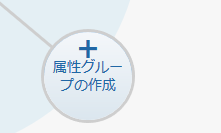

5. 属性グループに名前を設定します。アイコンはわかりやすいものを選択してください。

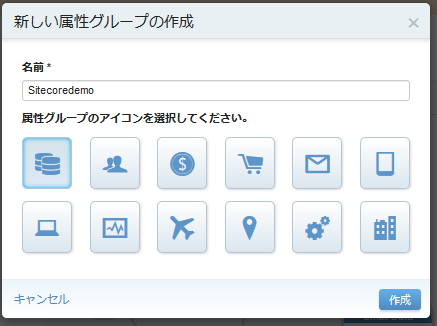

6. 作成した属性グループにおいて「データエクステンションのリンク」をクリックします。

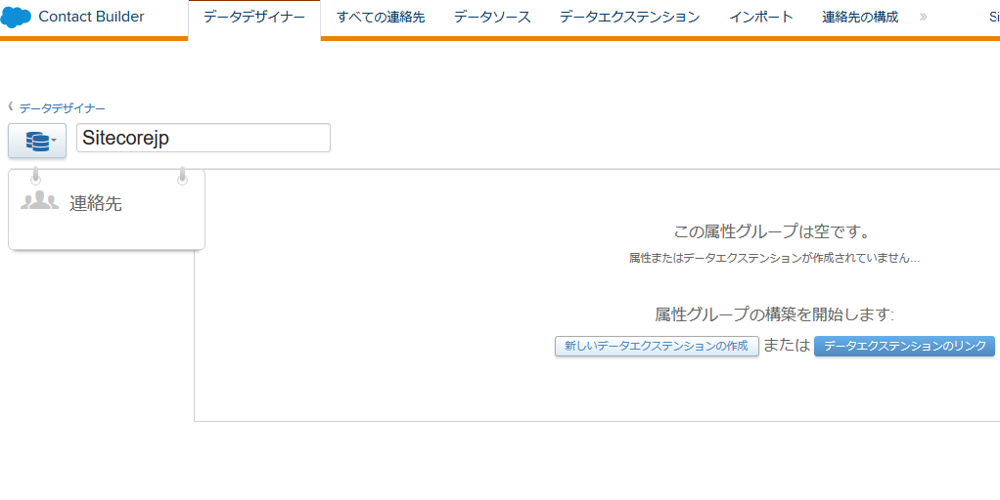

7. 新しいウィンドウで /Data Extensions/Sitecore を選択、xDB Contact をクリックします

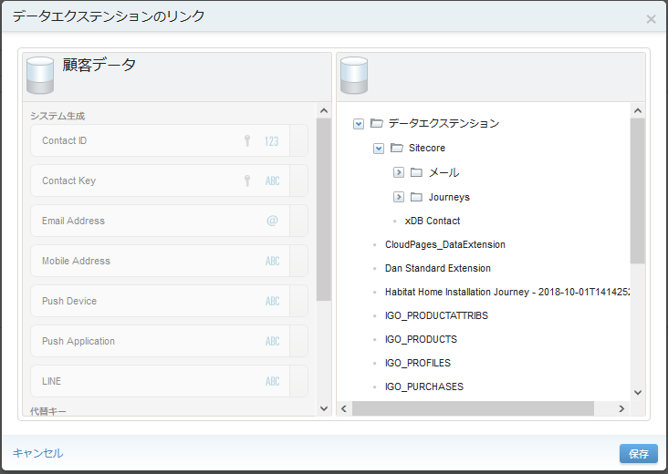

8. 顧客データの「Contact Key」とxDB Contact の「contactKey」をリンクさせます。右上にある設定は「One」を選択してください。

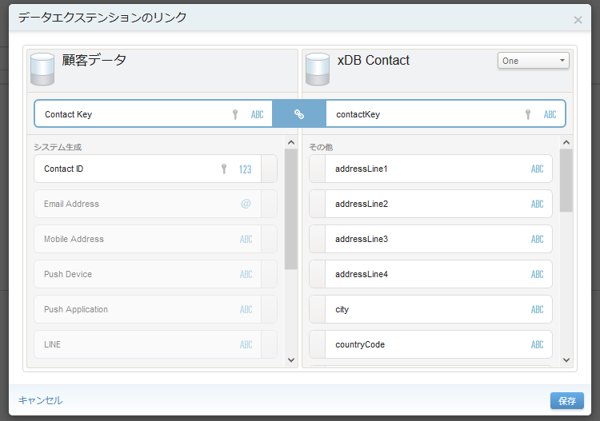

9. 「保存」をしてコンタクトデータのリンク作成を完了させます

コンタクトデータをメンバーシップデータに拡張する
================================================

上記の手順から続けて、Sitecore の属性グループを編集していきます。

1. 作成した属性グループを開きます
2. xDB Contact の右上にある拡張ボタンをクリックします。

.. image:: images/sfmcbde28.png
   :align: center
   :width: 400px
   :alt: 拡張アイコンをクリック

3. データエクステンションのリンク、の画面で 「データエクステンション」－「Sitecore」－「Journeys」の下にある `Audience Membership` を選択します

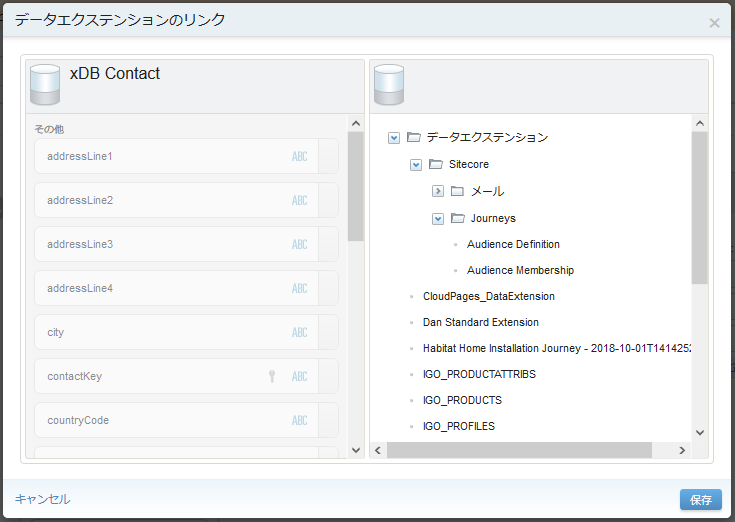

4. xDB Contact の設定は「One」を選択したまま contactKey を選択、Audience Membership に関しては Many を選択した上で Contact Key を選択できるようになっている段階で、モジュールのインストールは成功しています。

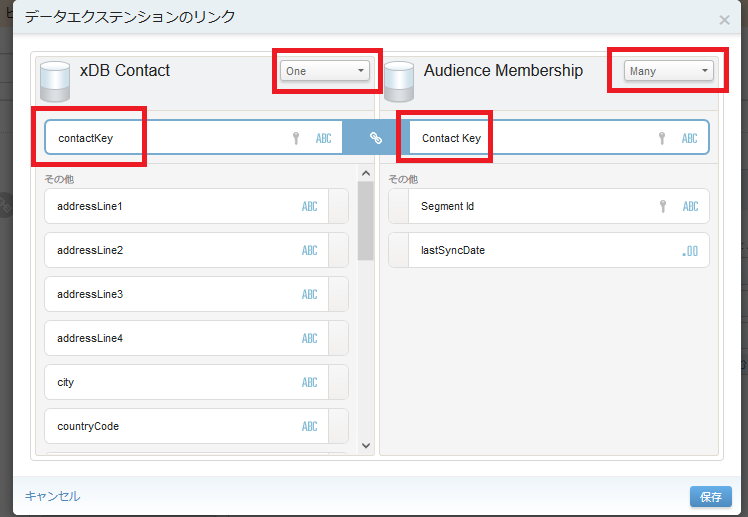

5. 作成をした `Audience Membership` の拡張リンクをクリックして、右側のダイアログでは「Sitecore」ー「Journeys」の下にある `Audience Definition` を選択します。

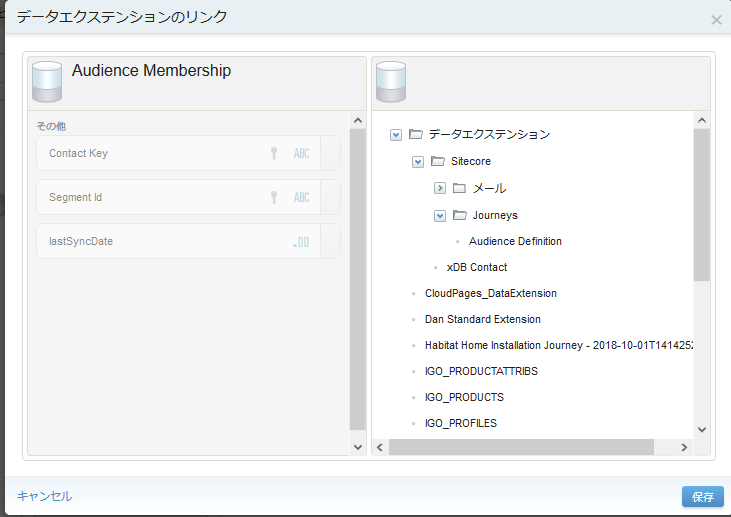

6. Audiende Membership の項目は `Many` の `Segment Id` を、合わせて Audience Definition も `Many` の `Segument Id` を選択してください。

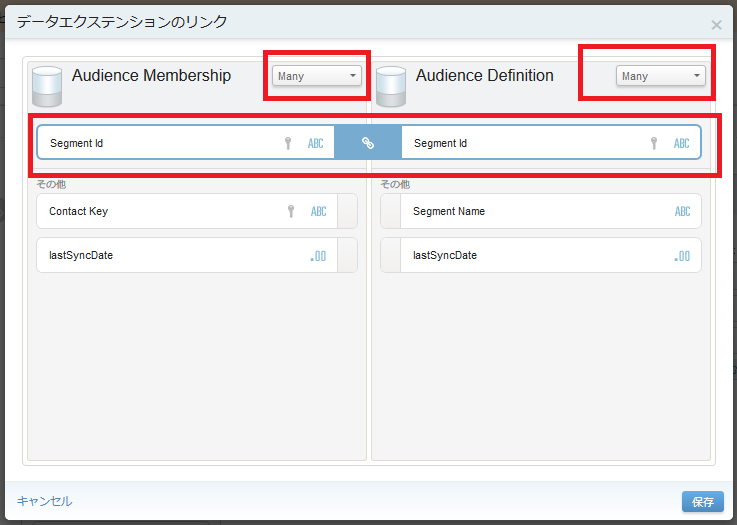

これで作成は完了です。

****************************
パイプラインバッチについて
****************************

ここからはパイプラインバッチの設定について紹介していきます。なお、Sitecore 側の設定に関しては作成したテナントの `Providers/SFMC/Object Definitions/Data Folders` のアイテムに設定が入っているため、外部キーなどを変更する必要があれば、このアイテムを変更してください。

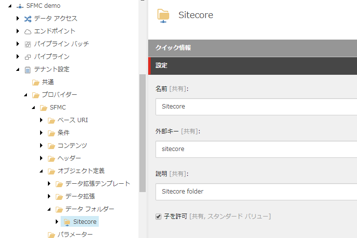

xConnect コンタクトをプッシュ
=============================

`/Data Extension/Sitecore` に設定されています。

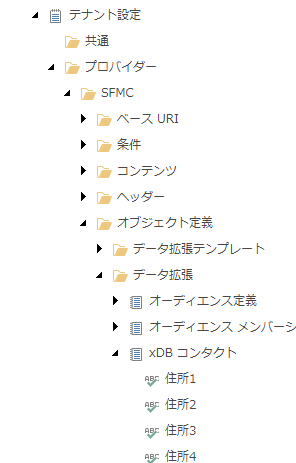

標準では xDB のコンタクトと以下の項目が連携します。

* Personal info
* Preferred email address
* Preferred phone number
* Preferred address
* Engagement measures

マーケティングリストをプッシュ
====================================

以下の項目がプッシュで展開されます。

====================== ================== ===================================================================================
SFMC アプリケーション   プッシュデータ      SFMC におけるデータ拡張 
====================== ================== ===================================================================================
Journey Builder         List definitions   Audience Definitions, in /Data Extensions/Sitecore/Journeys
Journey Builder         List memberships   Audience Memberships, in /Data Extensions/Sitecore/Journeys
Email Studio            List definitions   A separate data extension for each list, in /Data Extensions/Sitecore/Email
Email Studio            List memberships   Contacts are stored in a flat format, in /Data Extensions/Sitecore/xDB Contacts
====================== ================== ===================================================================================

xConnect コンタクトとマーケティングリスト
===========================================

このパイプラインバッチは、 `xConnect コンタクトのプッシュ` と `マーケティングリストをプッシュ` を実行するバッチです。

******************************************************************
Salesforce Marketing Cloud データエクステンション 連携に関して
******************************************************************

Sitecore が持っているデータと Salesforce Marketing Cloud の連携している項目に関しては、作成したテナントの `Providers/SFMC/Object Definitions` に定義が保存されています。どの項目が連携しているか、以下の項目を参照してください。

Email Studio テンプレート
==============================

`Email Studio テンプレート` の項目に関しては、テナントの `Providers/SFMC/Object Definitions/Data Extension Templates/Email Studio Template` にアイテムがあります。

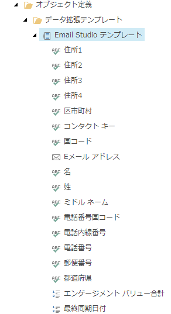

オーディエンス定義
======================

`オーディエンス定義`  の項目に関しては、テナントの `Providers/SFMC/Object Definitions/Data Extensions/Audience Definition` にアイテムがあります。

.. image:: images/sfmcbde36.png
   :align: center
   :alt: オーディエンス定義

オーディエンス メンバーシップ
================================

`オーディエンス メンバーシップ`  の項目に関しては、テナントの `Providers/SFMC/Object Definitions/Data Extensions/Audience Definition` にアイテムがあります。

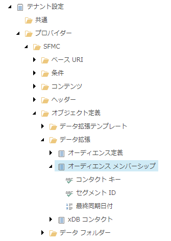

xDB コンタクト
===============

`xDB コンタクト` の項目に関しては、テナントの `Providers/SFMC/Object Definitions/Data Extensions/Audience Definition` にアイテムがあります。

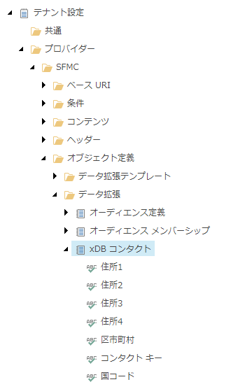

上記の項目に関しての拡張方法は、別途ガイダンスが提供されています。

