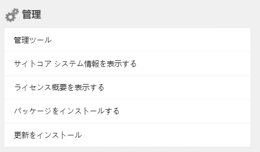
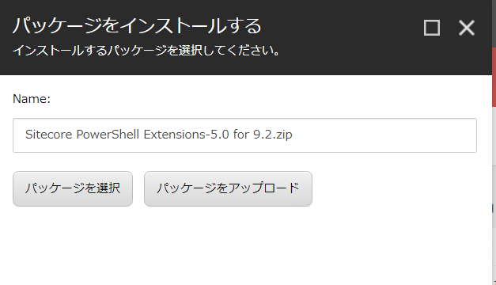
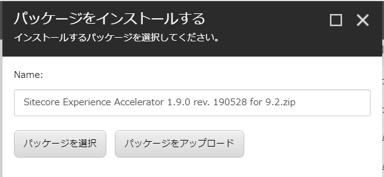
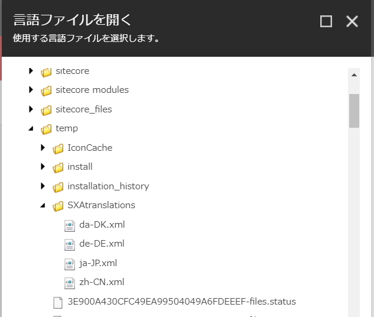

#####################################
Sitecore Experience Accelerator
#####################################

Sitecore Experience Accelerator 9.3 モジュールのインストールについて紹介をしています。

*************************
モジュールのダウンロード
*************************

モジュールに関しては、Sitecore Download サイトから入手することができます。

* `Sitecore Experience Accelerator 9.3.0 <https://dev.sitecore.net/Downloads/Sitecore_Experience_Accelerator/9x/Sitecore_Experience_Accelerator_930.aspx>`_ 

    * Sitecore Experience Accelerator for 9.3
    * Sitecore PowerShell Extension for Sitecore 9.3

上記のモジュールをダウンロードした後、次のステップに進みます。

****************************
モジュールのインストール
****************************

モジュールのインストールは以下の手順で進めていきます。

* 管理者の権限でログインをします
* スタート画面からコントロールパネルを選択
* 「管理」グループにある `パッケージをインストールする` を選択します

* まず最初に、`Sitecore PowerShell Extension for Sitecore 9.3` のファイルをアップロードします。

* インストールを実行します
* 続いて `Sitecore Experience Accelerator for 9.3` のファイルをアップロードします。

* インストールを完了させます。

*************************
日本語リソースの追加
*************************

Sitecore Experience Accelerator はコンポーネントに関する日本語リソースが提供されていますが、自動的にインポートされることはありません。このため、以下の手順でインポートをしてください。

* `グローバリゼーション` エリアの `言語ファイルをインポートする` をクリック
* モジュールのインストールが完了した後、 /temp/SXAtranslations のフォルダに `ja-JP.xml` が展開されているため、そのファイルを指定します。

* データベースとして `core` を対象としてインポートをします。

上記で Sitecore Experience Accelerator のインストールは完了となります。

*************
参考動画
*************

.. raw:: html

    <iframe width="560" height="315" src="https://www.youtube.com/embed/x7V2eGK2sM8" frameborder="0" allowfullscreen></iframe>

***************
次のステップ
***************

インストールが完了したあと、簡単な使い方を説明している :doc:`Sitecore Experience Accelerator クイックガイド</sxa/index>` を参考にしてください。
