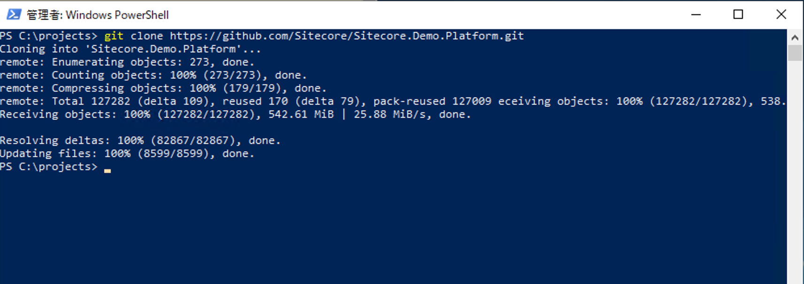

###############
セットアップ
###############

******************************
セットアップの準備
******************************

今回は projects\\sitecore.demo.platform のフォルダを作成して、リポジトリのクローンを準備します。 C:\\Projects に移動をして

.. code-block:: powershell

    git clone https://github.com/Sitecore/Sitecore.Demo.Platform.git

を実行します。また、利用するライセンスファイルを c:\licence のフォルダにコピーして

c:\\licence\\licence.xml

でアクセスできるようにします。

******************************
Docker の環境を整える
******************************

Switch to Windows Containers

.. image:: images/docker01.png
   :align: center
   :width: 400px
   :alt: Windows コンテナに切り替える

.. image:: images/docker02.png
   :align: center
   :width: 400px
   :alt: Windows コンテナに切り替える

Setting を開く

Docker Engine を選択して、以下のような設定とします。

.. code-block:: json

    {
    "registry-mirrors": [],
    "insecure-registries": [],
    "debug": false,
    "experimental": true,
    "dns": [
        "8.8.8.8"
    ]
    }

.. image:: images/docker03.png
   :align: center
   :width: 400px
   :alt: experimental を有効にする

******************************
デモ環境を展開する
******************************

PowerShell は管理者権限で実行。

ライセンスファイルを指定してセットアップに必要な値を自動的に設定する。

.. code-block:: powershell

    .\init.ps1 -InitEnv -LicenseXmlPath C:\license\license.xml -AdminPassword b

.. image:: images/docker04.png
   :align: center
   :width: 400px
   :alt: init.ps1 を実行する

イメージをダウンロードします。

.. code-block:: powershell

    docker-compose pull

エラーが出た場合も、もう一度 pull を実行することで完了させることができます。

続いて、コンテナを起動します。

.. code-block:: powershell

    docker-compose up -d

エラーが出た場合も、もう一度実行することで全てのコンテナが動くようになることがあります。

.. image:: images/docker06.png
   :align: center
   :width: 400px
   :alt: docker-compose up -d

初回起動に関しては、データをインポートするのに時間がかかります。以下のコマンドで、インポートの状況を確認してください。

.. code-block:: powershell

    docker-compose logs -f init

最後に以下の行が表示されれば、インポートが完了となります。

init_1                 |       3/3/2021 9:02:51 AM No jobs are running. Monitoring stopped.

.. image:: images/docker07.png
   :align: center
   :width: 400px
   :alt: Monitoring stopped.

******************************
デモ環境にアクセスする
******************************

Web サイトの URL は標準では以下のようになっています。

* https://cd.lighthouse.localhost
* https://cm.lighthouse.localhost/sitecore
