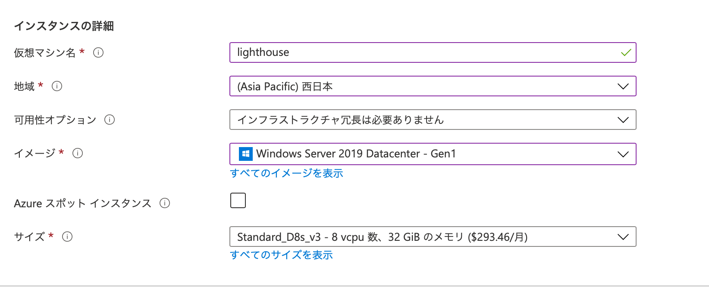
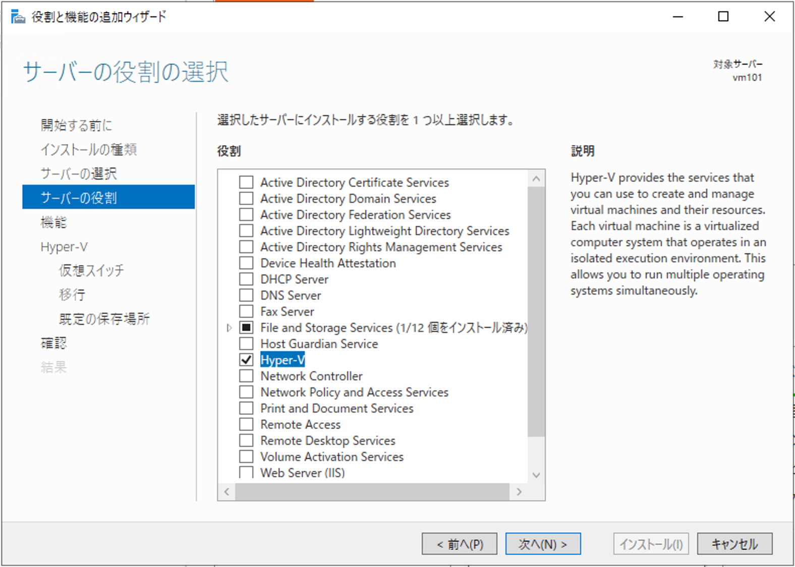
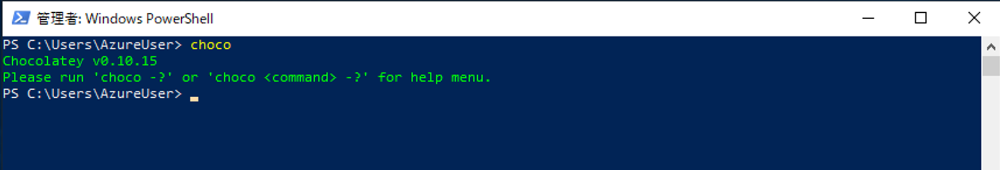
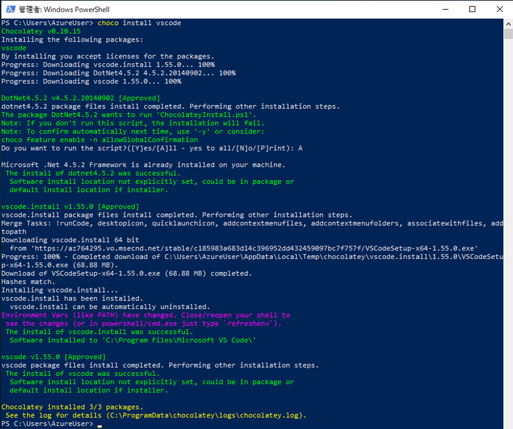

###################
必要システム
###################

**********************
環境の整備
**********************

Sitecore のデモ環境は、Docker の利用を前提として提供しています。そこでこの手順書では、Windows Server 2019 の仮想マシンの準備して、デモを立ち上げるところまで紹介をします。

******************************
Windows Server 2019 の準備
******************************

デモ環境は複数のコンテナを利用して展開するため、Windows Server 2019 の環境として、以下のような構成が求められます。

* メモリ 32GB 以上
* Hyper-V
* Windows Sybsystem for Linux

今回は Microsoft Azure 上で仮想マシンを準備します。なお、Hyper-V をすべてのイメージで利用できるわけではありません。今回は、以下のマシンを選択します。

* Standard D8s v3 (8 vcpu 数、32 GiB メモリ)

マシンの作成が完了したあと、リモートデスクトップでアクセスをしてください。Server Manager を起動して、メニューの Manage - Add Roles and Features を選択して、以下の機能を追加します。

まず最初に、Server Roles の画面で Hyper-V のチェックをします。

続いて Features の画面で、Containers および Windows Subsystem for Linux を選択します。

.. image:: images/server03.png
   :align: center
   :width: 400px
   :alt: Containers

.. image:: images/server04.png
   :align: center
   :width: 400px
   :alt: Windows Sybsystem for Linux

Hyper-V に関してはデフォルトの設定でインストールを進めていきます。最後に Install のボタンを押して、インストールを完了させてください。インストールが完了すると、再起動して、Windows Server 2019 の環境に関しては準備が調います。

******************************
追加ソフトウェアのインストール
******************************

今回利用するソフトウェアのインストールに関して、chocolatey というツールを利用して進めていきます。

* `Chocolatey <https://chocolatey.org>`_

インストールの方法はシンプルで、PowerShell コンソールを管理者権限で開き、以下のコマンドを実行してください。

.. code-block:: powershell

    Set-ExecutionPolicy Bypass -Scope Process -Force; [System.Net.ServicePointManager]::SecurityProtocol = [System.Net.ServicePointManager]::SecurityProtocol -bor 3072; iex ((New-Object System.Net.WebClient).DownloadString('https://chocolatey.org/install.ps1'))

.. image:: images/choco01.png
   :align: center
   :width: 400px
   :alt: Chocolatey インストール

コマンドラインで choco を実行するとバージョンが表示されれば、インストールは成功しています。

Github のリポジトリを利用するため、最初に git for Windows をインストールします。

.. code-block:: powershell

    choco install git

Dokcer を利用するためのコマンド、 docker-compose を有効にするために、以下のコマンドを実行します。

.. code-block:: powershell

   choco install docker-compose

.. image:: images/choco04.png
   :align: center
   :width: 400px
   :alt: docker-compose

続いてコードの変更などで便利なので、Visual Studio Code をインストールします。

.. code-block:: powershell

    choco install vscode

ブラウザを動かすことができるように、Google Chrome をインストールします。

.. code-block:: powershell

    choco install googlechrome

.. image:: images/choco06.png
   :align: center
   :width: 400px
   :alt: Google Chrome

Github Desktop をインストールしておくと便利なので、これは任意でご利用ください（今回の手順として特に必須ではありません）。

.. code-block:: powershell

    choco install github-desktop

.. image:: images/choco07.png
   :align: center
   :width: 400px
   :alt: Github Desktop
