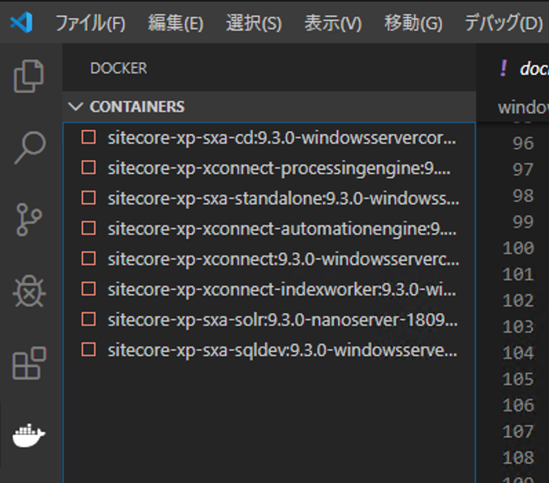
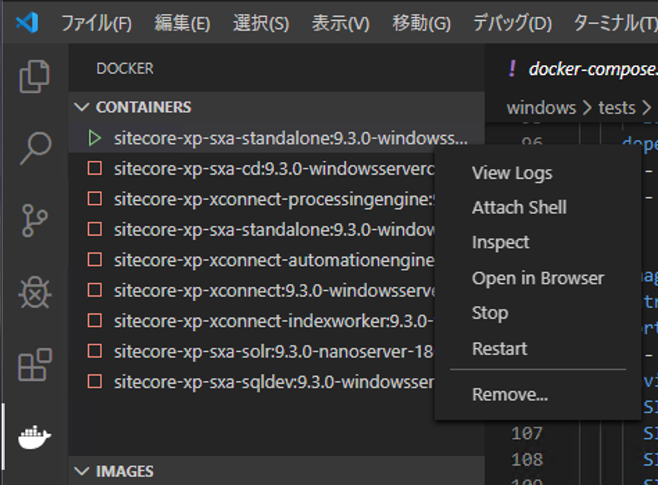
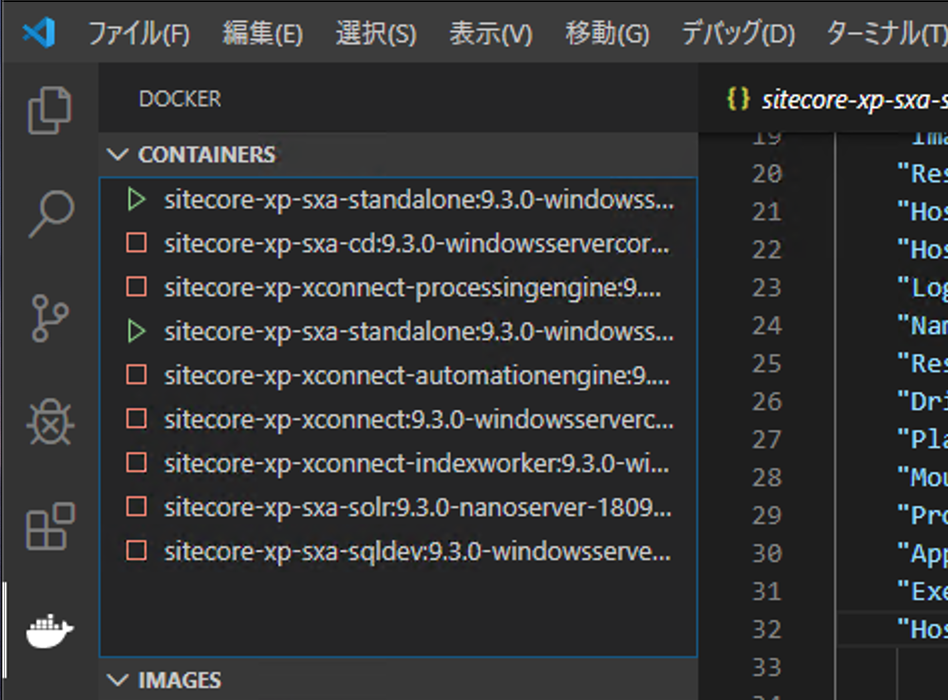

#################
イメージの確認
#################

このステップは、すでに Sitecore Experience Platform を動かすためのコンテナが作成されている状況を前提として紹介をします。

Visual Studio Code でコンテナが下記のようになっているのを前提としており、コンテナが止まっている形とします。

******************
イメージを起動する
******************

まずクリーンなイメージを確認するために、イメージを直接起動します。今回は、sitecore-xp-sxa-standalone のイメージを右クリックして、Run を選択します。

しばらくするとコンテナが可動している状況がわかります。

.. image:: images/checkimage03.png
   :align: center
   :width: 400px
   :alt: コンテナが可動しているのが分かります

可動しているコンテナを右クリックして、Attach Shell を実行してください。これで、可動しているコンテナの PowerShell にアクセスすることができるようになります。

コンテナの PowerShell に入ったタイミングでディレクトリを切り替えます。

.. code-block:: 

    PS C:\> cd \inetpub\wwwroot\app_data
    PS C:\inetpub\wwwroot\app_data> dir

        Directory: C:\inetpub\wwwroot\app_data

    Mode                LastWriteTime         Length Name
    ----                -------------         ------ ----
    d-----         1/9/2020   7:46 AM                debug
    d-----         1/9/2020   7:46 AM                packages
    d-----         1/9/2020  10:37 AM                poststeps
    d-----         1/9/2020  10:37 AM                SxaXdt
    d-----         1/9/2020   7:46 AM                tools
    d-----         1/9/2020  10:37 AM                Transforms
    d-----         1/9/2020   7:46 AM                viewstate

    PS C:\inetpub\wwwroot\app_data>

すでに Sitecore がインストールされているイメージであることがわかります。

******************
コンテナを確認する
******************

続いて、すでに Sitecore を展開済みのコンテナを展開します。sitecore-xp-sxa-standalone を右クリックして、Start を実行します。

.. image:: images/checkimage05.png
   :align: center
   :width: 400px
   :alt: Start 

起動すると、２つのコンテナが動いていることがわかります。

すでに展開していたコンテナを右クリックして、Attach Shell を選択します。起動しているコンテナの PowerShell が起動します。

 .. image:: images/checkimage07.png
   :align: center
   :width: 400px
   :alt: Attach Shell

ここで先ほどと同じコマンドでファイルを確認します。

.. code-block:: 

    PS C:\> cd \inetpub\wwwroot\app_data
    PS C:\inetpub\wwwroot\app_data> dir

        Directory: C:\inetpub\wwwroot\app_data

    Mode                LastWriteTime         Length Name
    ----                -------------         ------ ----
    d-----         1/9/2020   7:46 AM                debug
    d-----        1/10/2020  10:19 AM                DeviceDetection
    d-----        1/10/2020  10:18 AM                diagnostics
    d-----        1/10/2020   2:14 PM                logs
    d-----         1/9/2020   7:46 AM                packages
    d-----         1/9/2020  10:37 AM                poststeps
    d-----        1/10/2020  10:19 AM                Submit Queue
    d-----         1/9/2020  10:37 AM                SxaXdt
    d-----         1/9/2020   7:46 AM                tools
    d-----         1/9/2020  10:37 AM                Transforms
    d-----        1/10/2020   2:20 PM                viewstate
    -a----        1/10/2020  11:03 AM          65532 license.xml

    PS C:\inetpub\wwwroot\app_data>
    
上記のように、イメージを見るとファイルが増えていることがわかります。このフォルダにはライセンスファイルがあるため、分かりやすいので例として紹介しました。

