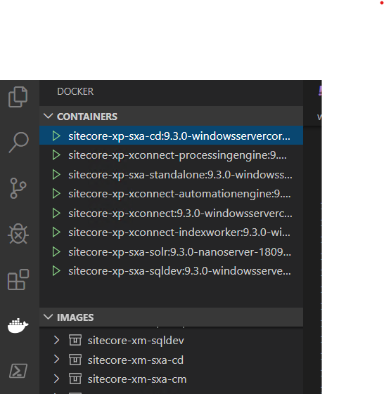
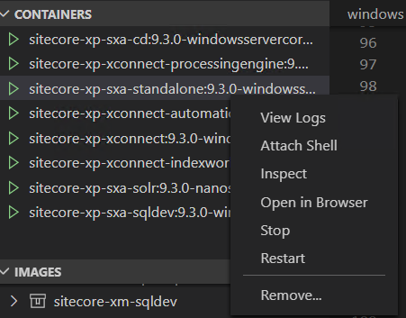
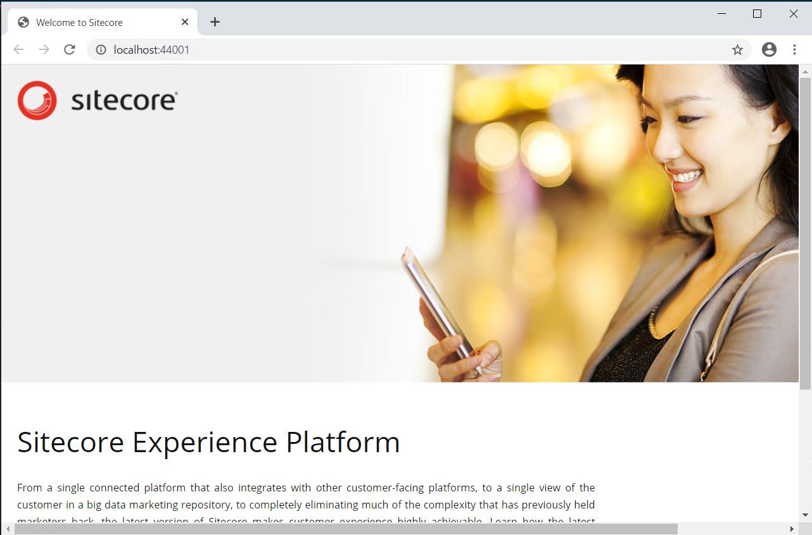
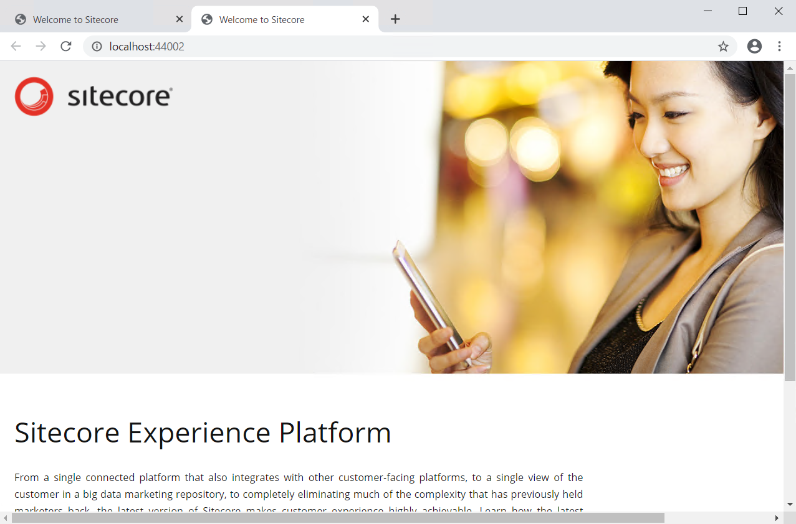

##########################
コンテナを確認する
##########################

前提条件として、この前のステップで紹介をしている docker-compose.xp.sxa の環境が立ち上がっていることをベースに以下の手順を確認していきます。

まず、Visual Studio Code の Docker のアイコンをクリックし、左側のメニューから Contaners を確認します。

コンテンツ管理サーバーとなる、sitecore-xp-sxa-standalone を右クリックして、`Open in Browser` を開いてください。しばらくすると Sitecore のトップページが表示されます。

続いて、sitecore-xp-sxa-cd を右クリックして同様にブラウザで開きます。CM と CD ではポート番号が異なる形です。

