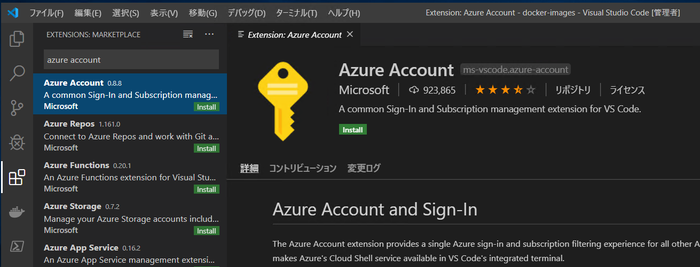
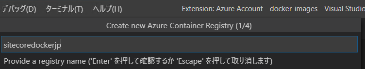
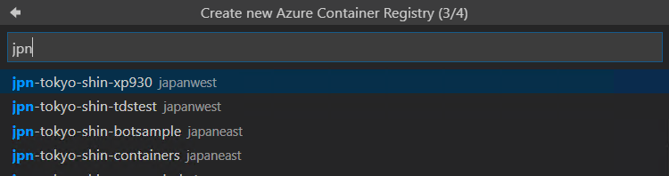

#############################
Microsoft Azure への展開
#############################

Microsoft Azure には Docker のコンテナを管理するためのサービスとして、`Container Registry <https://azure.microsoft.com/ja-jp/services/container-registry/>`_ を提供しています。

*******************************
Visual Studio Code の設定
*******************************

Visual Studio Code は多くの拡張機能に対応しており、Docker に関する作業を簡単にできる拡張機能も提供しています。ここでは 2 つの拡張機能を追加します。

Docker
=====================

Docker の機能拡張は、Visual Studio Code から Docker に関する機能を利用する上で便利な機能が提供されています。インストールでは `Docker` で検索をすると、以下のように Docker の機能拡張を見つけることができます。

.. image:: images/vscode01.png
   :align: center
   :width: 400px
   :alt: Docker エクステンション

実際にインストールをすると、左側のメニューに Docker のアイコンが追加されます。

.. image:: images/vscode02.png
   :align: center
   :alt: Docker アイコン

アイコンを選択すると左側に Docker の機能を操作することができるサイドバーが表示されます。

Azure Account
=====================

直接 Docker の拡張機能から Azure にログインをすることができますが、その機能を有効にするために、Azure Account をインストールします。

インストールをすると、Docker の拡張機能の `Registries` の項目から Azure にログインをすることができます。

*******************************
Container Registry の作成
*******************************

Azure ポータル画面、およびコマンドラインでも作成することができますが、ここでは Visual Studio Code のサイドバーで作業を進めます。まず作成をしたいサブスクリプションを選択して、右クリックしてください。メニューにある `Create Registry...` を選択します。

画面の上部にダイアログが表示されて、Registry name の入力を促してきます。

Enter を入力すると次のパラメーターが表示されます。どの価格を利用するのか、という選択肢となります。ここでは、 Standard を選択してください。

.. image:: images/vscode08.png
   :align: center
   :width: 400px
   :alt: プランの選択

続いてリソースグループを選択します。新規に作成することも可能です。

最後にデータセンターを選択してください。

実際に作成されたレジストリを見ることができます。

.. image:: images/vscode11.png
   :align: center
   :width: 400px
   :alt: 作成されたレジストリを確認

