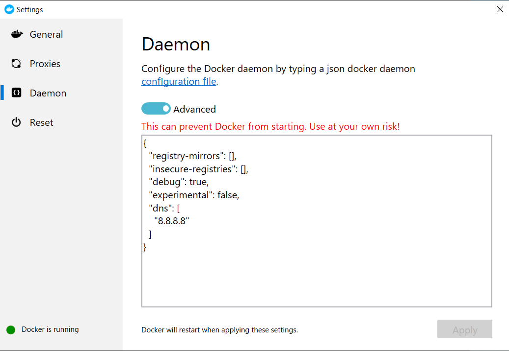

################
Docker Tips
################

********************
ネットワークの変更
********************

仮想マシンで Docker を利用している場合、再起動するなどで network の再設定が必要となる場合があります。この場合、以下のコマンドでネットワークの再設定をしてください。

.. code-block:: 

    docker network create -d nat <network name>
    docker network connect <network name> <container name>

93x_default のネットワークに 93x_sql_1 のコンテナを接続する場合は、以下のコマンドを実行します。

.. code-block:: 

    docker network create -d nat 93x_default
    docker network connect 93x_default 93x_sql_1

********************************
ダウンロードに失敗する
********************************

イメージを build しているときに必要なモジュールのダウンロードに失敗をすることがあります。

.. image:: images/tips01.png
   :align: center
   :width: 400px
   :alt: エラー画面

この場合は、Docker の設定に、以下の dns の項目を追加することで解決します。

.. code-block:: 

    {
    "registry-mirrors": [],
    "insecure-registries": [],
    "debug": true,
    "experimental": false,
    "dns": [
        "8.8.8.8"
    ]
    }

* 参考サイト `Sitecore Docker Setup; "curl: (6) Could not resolve host" <https://www.sitecoregabe.com/2019/10/sitecore-docker-setup-curl-6-could-not.html>`_

************************
Build に失敗をする
************************

エラーメッセージで以下のメッセージが出る場合があります。

.. code-block:: 

    hcsshim::PrepareLayer - failed failed in Win32: Incorrect function. (0x1) Windows Containers

このエラーが出る場合は、Box や Dropbox などのアプリケーションがインストールされているケースで発生します。削除して再起動することで、このエラーを回避することができます。
