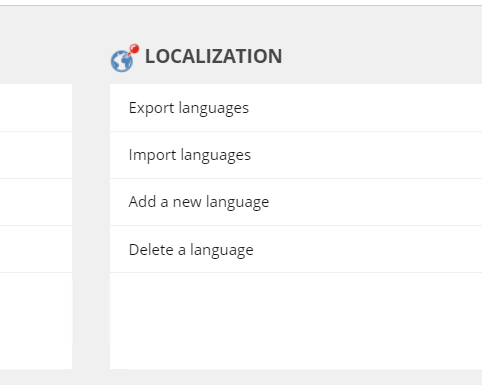
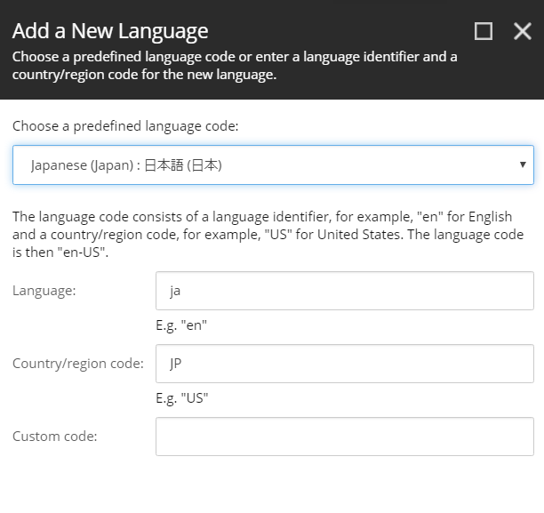
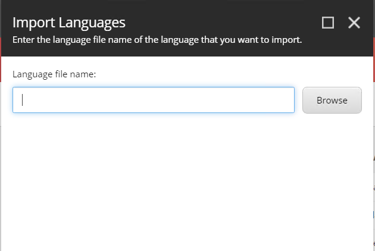
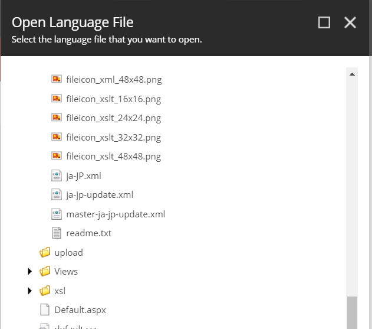
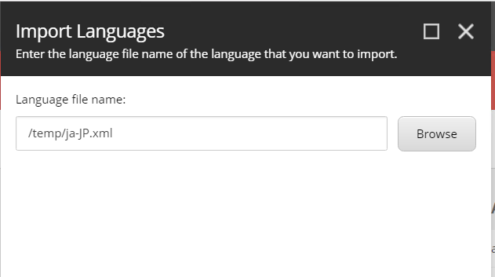
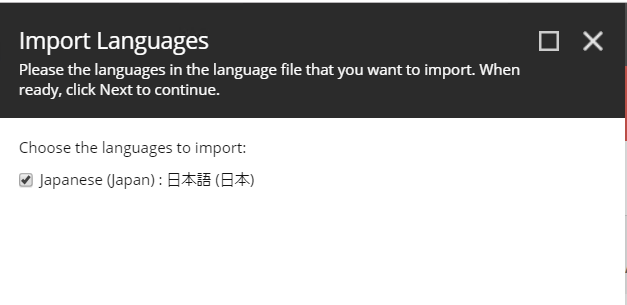
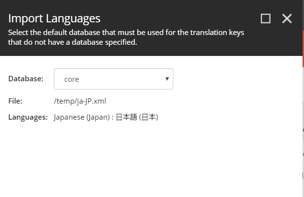
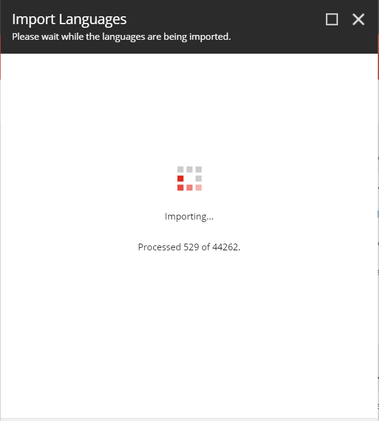

日本語リソースのインポート
================================

ここでは Sitecore に日本語リソースをインポートする方法を紹介しています。

日本語リソースファイルの準備
********************************

日本語リソースに関しては、Sitecore のダウンロードサイトからリソースファイルのダウンロードが可能です。

* `Sitecore Experience Platform 9.2 Initial Release <https://dev.sitecore.net/Downloads/Sitecore_Experience_Platform/92/Sitecore_Experience_Platform_92_Initial_Release.aspx>`_

ページの下のほうにある、`Client translations` の一覧にある `Japanese (ja-JP)` のファイルをダウンロードしてください。

また一部の日本語リソースを修正するためのファイルを、GitHub の `SitecoreaJapan/InstallScript <https://github.com/SitecoreJapan/InstallScript/tree/master/920>`_ のリポジトリに公開しています。以下の 2 つのファイルをダウンロードしてください。

* ja-jp-update.xml
* master-ja-jp-update.xml

日本語リソースの追加
************************

インストールをした Sitecore の環境に管理者としてログインをしてください。

.. image:: images/iis05.png
   :align: center
   :width: 400px
   :alt: スタート画面

* Desktop を起動します
* 右下に表示されている `master` をクリックして `core` に切り替えます

.. image:: images/jajp01.png
   :align: center
   :width: 400px
   :alt: データベースの切り替え

* 左上にある Sitecore メニューをクリックしてスタート画面に戻ります。

.. image:: images/jajp02.png
   :align: center
   :width: 400px
   :alt: Sitecore スタート画面に戻る

* `Controle Panel` を開きます
* `Localization` にある `Add a new language` をクリックします

* 一覧から `Japanese (Japan) : 日本語(日本)` を選択します。

* `codepage`、`Encoding` および `iso-2022-jp` に関しては標準の設定のままで次のダイアログに移動します。
* `Spellchecker file name` は空欄のまま次に進みます
* 追加が完了します

これで UI のリソースを追加する言語を追加することができました。続いて、コンテンツを追加できるように、データベースを戻します。

* スタート画面で `Desktop` を選択
* 右下のデータベースを `core` から `master` に戻します。

.. image:: images/jajp05.png
   :align: center
   :width: 400px
   :alt: データベースの切り替え

* `Controle Panel` を開いて、もう一度 `Localization` にある `Add a new language` から日本語を追加します（手順は上記と同じです）。

これでデータベースとして日本語のデータを扱うことができるようになりました。

日本語リソースのインポート
************************************************

* `Controle Panel` を開いて、今度は `Localization` にある `Import Language` を開きます。

ファイルの選択画面が表示されます。Browse をクリックします。

Web サーバのディレクトリが表示されます。この画面からアップロードをすることができますが、今回は手間を省くために以下のような作業を実施します。

* インストール先の `C:\\inetpub\\wwwroot\\92sc.dev.local\\temp` のフォルダを開きます
* ここにダウンロード済のファイルを展開します（ Sitecore 9.2.0 rev. 002893 (ja-JP).zip のファイルの中にある ja-jp.xml を temp にコピー）
* ディレクトリに3つのファイルが入っているのを確認します

.. image:: images/jajp07.png
   :align: center
   :width: 400px
   :alt: リソースファイル

* Sitecore の管理画面に戻ります
* `temp` フォルダの中に3つファイルがあることを確認します

* `ja-jp.xml` のファイルを選択します

* `Next` をクリックして言語を確認します。ここでは `Japanese(Japan):日本語(日本)` のみが選択肢として表示されます。

* データベースとして core を選択（デフォルト）のまま進めてインポートを開始します。

* インポートの進捗状況が表示されます。

* 上記の手続きを、`ja-jp-update.xml` に対しても同じ手続きでインポートをします。
* `master-ja-jp-update.xml` に関しては、インポートをするデータベースの画面のみ異なり、`master` を選択してください。

.. image:: images/jajp13.png
   :align: center
   :width: 400px
   :alt: Master データベースの選択

ユーザーの言語の切り替え
************************************************

3 つのリソースのインポートが完了した後、管理者が利用する言語を日本語の環境に指定します。

* スタート画面から `User Manager` を選択します
* ユーザー一覧から `Admin` の列をダブルクリックします
* `Language Settings` のタブを開きます

.. image:: images/user01.png
   :align: center
   :width: 400px
   :alt: ユーザー情報を開く

以下の項目を変更します

========================= ============================= =======================
項目名                     設定値                        この設定の説明
========================= ============================= =======================
Client Language           Japanese (Japan):日本語(日本)  管理画面の言語
Regional ISO Code         Default                       特に変更せず
Default Content Language  Japanese (Japan):日本語(日本)  編集するコンテンツの言語
========================= ============================= =======================

.. image:: images/user02.png
   :align: center
   :width: 400px
   :alt: ユーザー情報の更新

設定を変更後、ログオフして再度ログインをしてください。管理画面が日本語に切り替わっていることを確認できます。

.. image:: images/user03.png
   :align: center
   :width: 400px
   :alt: 日本語の管理画面

日本語画面に切り替わりました。最後に多くのリソースを追加したので、インデックスを更新します。