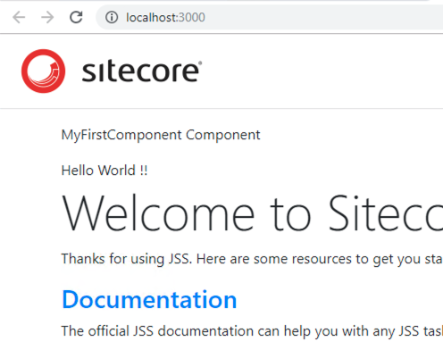

##########################
最初のコンポーネントの追加
##########################

*****************
Scaffolding
*****************

コンポーネントを追加する際、Scaffolding というコマンドを利用してコンポーネント追加に必要なデータをプロジェクトに追加することができます。

.. code-block:: 

   jss scaffold <componentName>

プロジェクトのルートとなるエリアで、以下のコマンドを実行します。

.. code-block:: 

  PS C:\Users\Sitecore\sample-app> jss scaffold MyFirstComponent
  > npm run scaffold -- MyFirstComponent

  > sample-app@12.0.0 scaffold C:\Users\Sitecore\sample-app
  > node scripts/scaffold-component.js "MyFirstComponent"

  Component MyFirstComponent has been scaffolded.
  Next steps:
  * Define the component's data in sitecore\definitions\components\MyFirstComponent.sitecore.js
  * Implement the React component in src\components\MyFirstComponent\index.js
  * Add the component to a route layout (/data/routes) and test it with jss start
  PS C:\Users\Sitecore\sample-app>

実行結果に表示されているように、コマンドを実行することで ２つのファイルが追加されています。

MyFirstComponent.sitecore.js
==============================

コンポーネントとなるファイルを確認します。対象となるファイルは `sitecore\definitions\components\MyFirstComponent.sitecore.js` となります。コードでポイントとなるのは、フィールドの定義となります。

.. code-block:: javascript

    // eslint-disable-next-line no-unused-vars
    import { CommonFieldTypes, SitecoreIcon, Manifest } from '@sitecore-jss/sitecore-jss-manifest';

    /**
    * Adds the MyFirstComponent component to the disconnected manifest.
    * This function is invoked by convention (*.sitecore.js) when 'jss manifest' is run.
    * @param {Manifest} manifest Manifest instance to add components to
    */
    export default function(manifest) {
    manifest.addComponent({
        name: 'MyFirstComponent',
        icon: SitecoreIcon.DocumentTag,
        fields: [
        { name: 'heading', type: CommonFieldTypes.SingleLineText },
        ],
        /*
        If the component implementation uses <Placeholder> or withPlaceholder to expose a placeholder,
        register it here, or components added to that placeholder will not be returned by Sitecore:
        placeholders: ['exposed-placeholder-name']
        */
    });
    }

Sitecore の開発でテンプレートでデータ定義を設定することができますが、Sitecore JSS では Component で定義をします。

MyFirstComponent\index.js
============================

上記のコンポーネントファイルと合わせて作成されているファイルが `src\components\MyFirstComponent\index.js` となります。実際にファイルの内容を確認すると以下のようになっています。

.. code-block:: 

    import React from 'react';
    import { Text } from '@sitecore-jss/sitecore-jss-react';

    const MyFirstComponent = (props) => (
    

        
MyFirstComponent Component

        <Text field={props.fields.heading} />
    

    );

    export default MyFirstComponent;

実際に HTML として出力するコード、合わせて管理しているデータとして何を表示するのかが定義されています。これは Sitecore でのサブレイアウトと同様に、デザインを定義するコードとなります。

***********************
コンポーネントの追加
***********************

作成したコンポーネントを追加します。サンプルはあまりコンテンツとして揃っていないため、サンプルのトップページに作成したコンポーネントを追加します。

対象となるファイルは `/data/routes/en.yml` です。

.. code-block:: yaml

    placeholders:
    jss-main:
    - componentName: ContentBlock
        fields:
        heading: Welcome to Sitecore JSS

今回作成したコンポーネントを追加します。

.. code-block:: yaml

    placeholders:
    jss-main:
    - componentName: MyFirstComponent
        fields:
        heading: Hello World!
    - componentName: ContentBlock
        fields:
        heading: Welcome to Sitecore JSS

設定を反映させたあと、 `jss start` を実行して、アプリを起動してください。作成したコンポーネントが表示されていることがわかります。

上記のファイルを見ると以下のことがわかります。

* データ形式の定義
* データを表示する定義
* コンテンツおよびコンポーネントの情報

これを Sitecore JSS のレイアウトエンジンが Web ページとして表示している形となります。

**************
関連サイト
**************

* `Building your first JSS component <https://jss.sitecore.com/docs/getting-started/first-component>`_