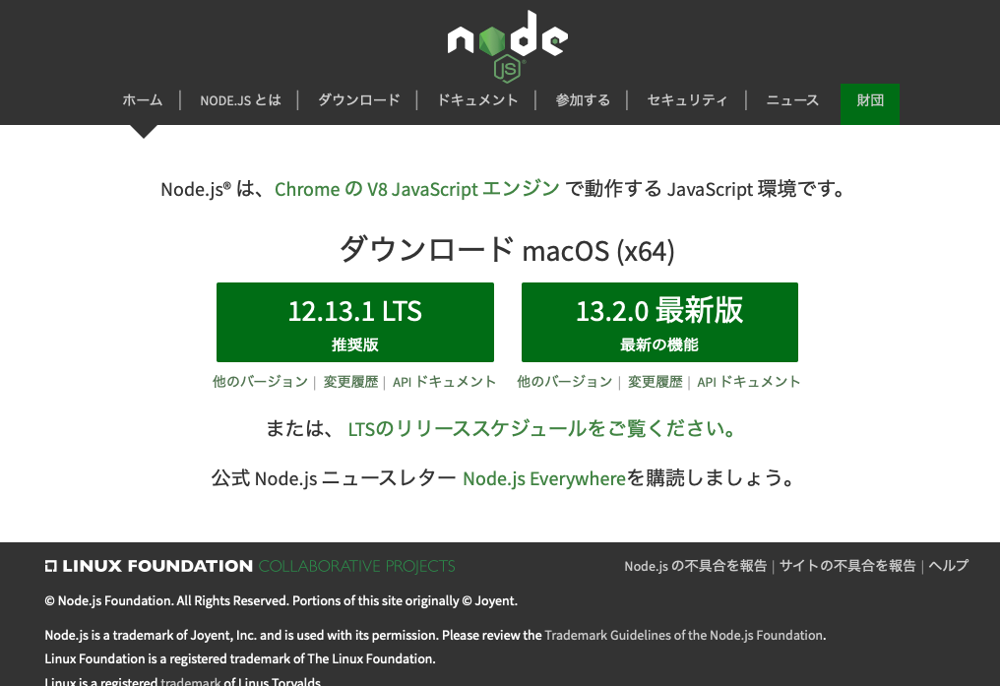
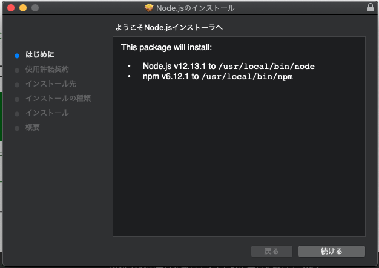
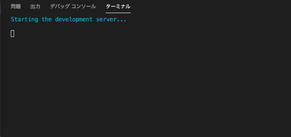
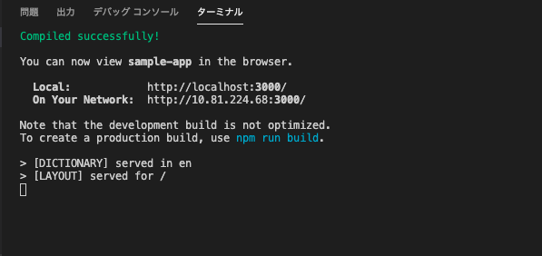
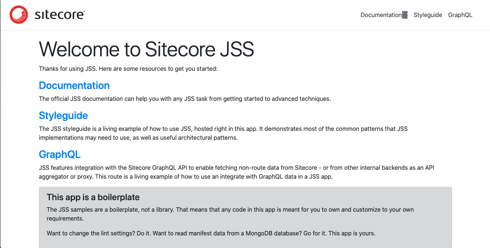

###########################
環境の整備 ( macOS 編)
###########################

************************
システム環境の整備
************************

環境を整えるために、以下のコンポーネントをインストールしてください。

1. `Node.js <https://nodejs.org/ja/>`_ (LTS版) をダウンロードします

2. ダウンロードしたファイルをインストールします。

3. ターミナルでバージョンを確認します。

.. code-block:: bash

  mizumac:Documents shinichi$ node --version
  v12.13.1
  mizumac:Documents shinichi$ 
   
******************************
JSS コマンドのインストール
******************************

JSS アプリを作るためのコマンドをインストールします。今回は以下のような手順で進めました。

.. code-block:: bash

  mizumac:Quickstart.Docs shinichi$ cd ~
  mizumac:~ shinichi$ sudo npm -g install @sitecore-jss/sitecore-jss-cli
  Password:

  + @sitecore-jss/sitecore-jss-cli@12.0.0
  updated 2 packages in 18.077s

コマンドラインのインストールが完了です。

***************************
サンプルプロジェクトの作成
***************************

今回は React のプロジェクトを作成します。アプリ名を決めて、以下のようにコマンドを実行してください。

.. code-block:: bash

  jss create <your-app-name> <app-template-name>

後者の sample に関しては、 `Sitecore JavaScript Services <https://github.com/Sitecore/jss>`_ からソースコードをダウンロードする形となります。
今回は、以下のように実行します。

.. code-block:: bash

  Mizumac:~ shinichi$ jss create sample-app react
  JSS CLI is running in global mode because it was not installed in the local node_modules folder.
  Acquiring templates from https://github.com/Sitecore/jss/archive/master.zip...

                      __________
                    __ / / __/ __/
                   / // /\ \_\ \  
                   \___/___/___/
  
  JSS application sample-app is ready!

  Next steps:
  * Enable source control (i.e. git init)
  * Try out your application with cd sample-app then jss start
  * Connect to Sitecore with jss setup (optional)
  * Check out the JSS documentation at https://jss.sitecore.net

  Enjoy!

Enjoy! まで表示されれば、`sample-app` のフォルダの中にサンプルプロジェクトが出来上がります。

********************
サンプルアプリの実行
********************

早速作成されたディレクトリに移動して実行します。

.. code-block:: bash

  cd sample-app
  jss start

コマンドで `jss start` を実行すると、しばらくするとアクセスできる URL が表示されます（環境によってはブラウザが起動して表示されます）。

表示された URL はサンプルのページが表示されています。

ページが表示されていれば、完了となります。

**************
関連サイト
**************

* `Quick Start <https://jss.sitecore.com/docs/getting-started/quick-start>`_
