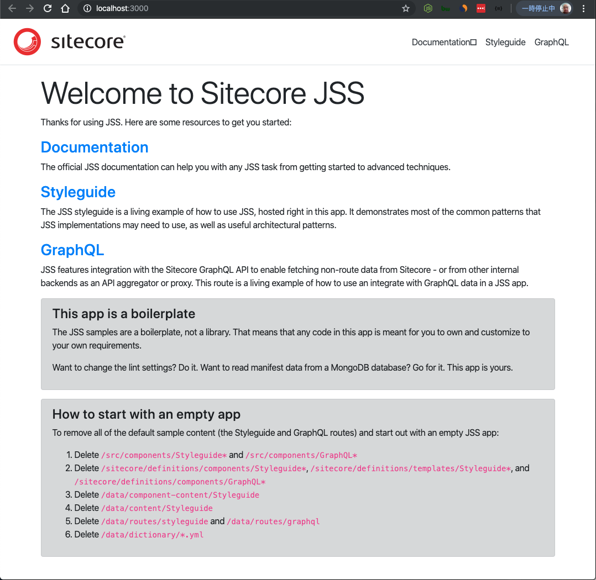

############################
サンプルのアプリを作成する
############################

まず、コマンドを利用して React のプロジェクトを作成します。

.. code-block:: bash

  mizumac:~ shinichi$ jss create myapp react
  JSS CLI is running in global mode because it was not installed in the local node_modules folder. 
  Acquiring templates from https://github.com/Sitecore/jss/archive/master.zip...
  Extracting template react...

  JSS application myapp is ready!

  Next steps:
  * Enable source control (i.e. git init)
  * Try out your application with cd myapp then jss start
  * Connect to Sitecore with jss setup (optional)
  * Check out the JSS documentation at https://jss.sitecore.net

  Enjoy!

実際に作成された `myapp` を参照します。

.. code-block:: bash

  mizumac:~ shinichi$ cd myapp
  mizumac:myapp shinichi$ jss start

しばらくするとサンプルのサイトが立ち上がります。

出来上がったコードに関しては、Step 1 のフォルダに格納されています。