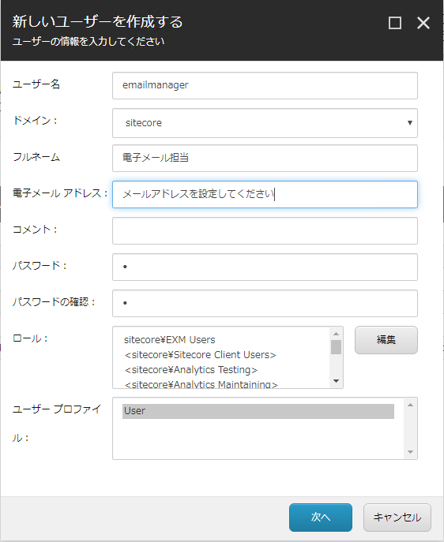
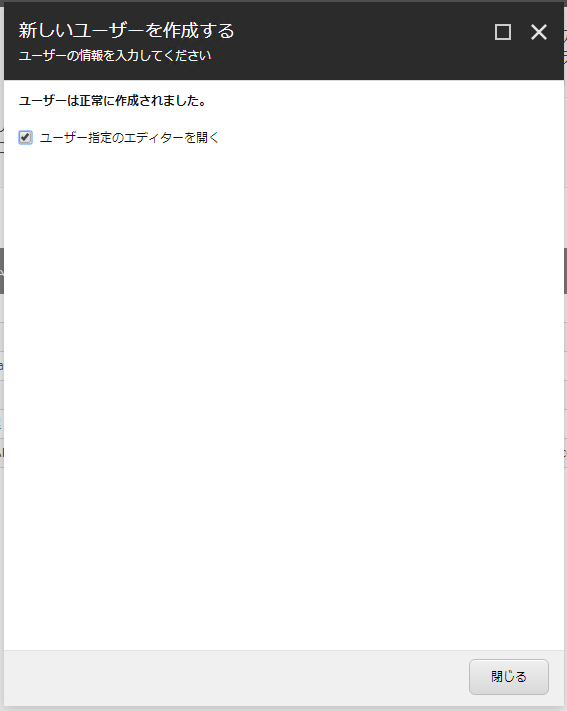
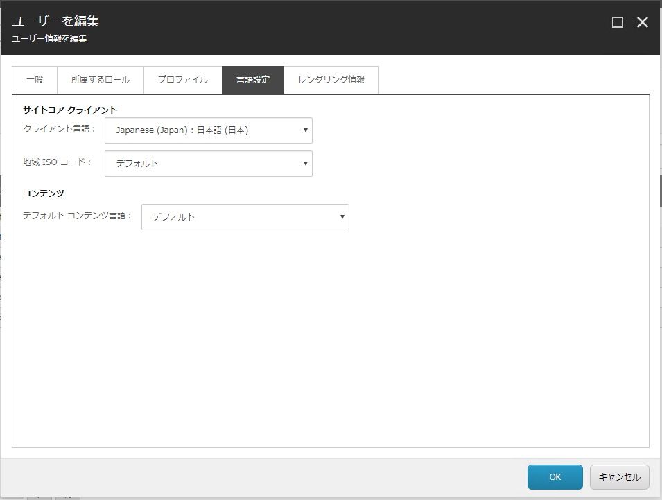

# アカウントの作成

続いて Email Experience Manager の作業をするためのアカウントを作成します。

## ユーザーマネージャを開く

ユーザーマネージャーを開き、今回は以下のように設定をします。

| 設定項目 | 設定値 |
| --- | --- |
| ユーザー名 | emailmanager |
| ドメイン | sitecore |
| フルネーム | 電子メール担当 |
| 電子メールアドレス | (自分のメールアドレスなど)) |
| コメント | 任意 |
| パスワード | e |
| パスワードの確認 | e |
| ロール | sitecore\EXM Users | 

設定が完了したところで、「次へ」をクリックします。作成が完了したら以下の画面が表示されます。

「ユーザー指定のエディターを開く」のチェックボックスをクリックして、「閉じる」をクリックすると、以下の画面が表示されます。「言語設定」のタブを開き、クライアント言語「Japanese (Japan) : 日本語 (日本) 」を設定、デフォルトコンテンツ言語を「デフォルト」を選択してください。

これで設定は完了となります。

---
[戻る](./)