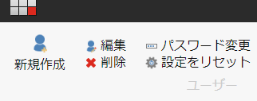
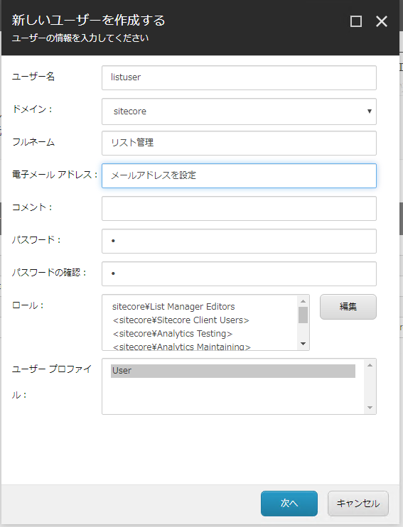
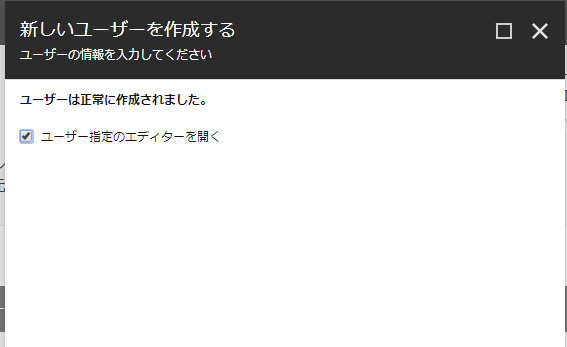
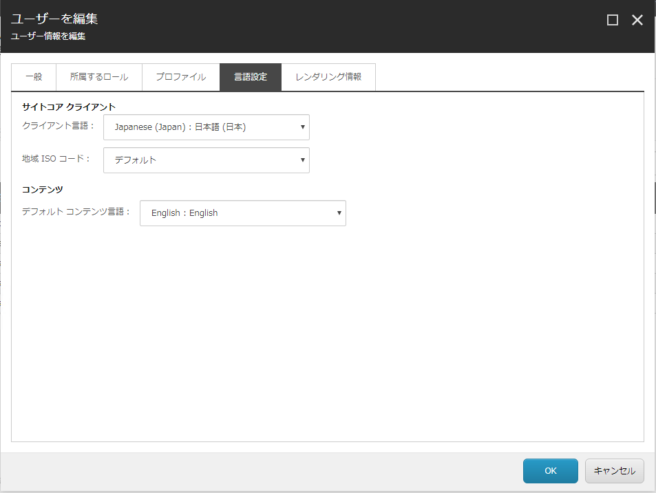
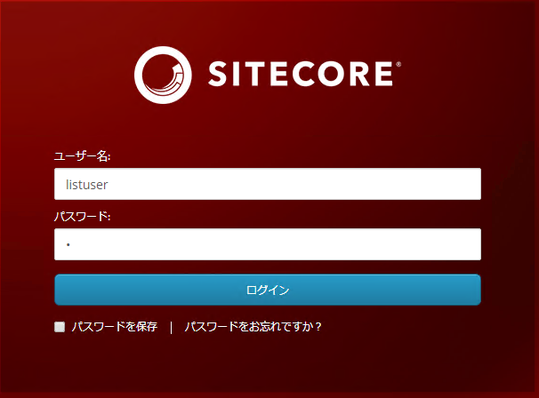
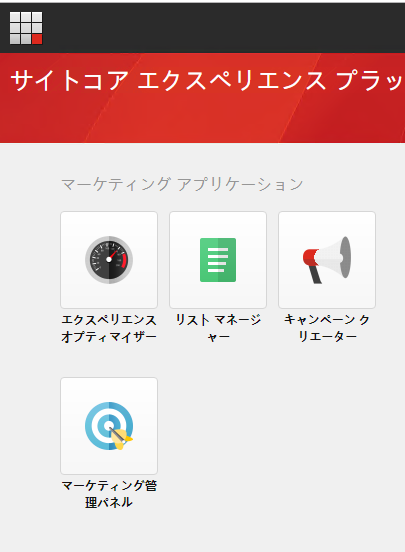

# リストマネージャーユーザーの作成

まず最初に、リストマネージャーを利用することができる専用のアカウントを作成します。実際の運用では設定を組み合わせて、他の作業と一緒にできるようにロールの設定をすることは可能ですが、ここではわかりやすく専用のユーザーを作成します。

## ユーザーの作成

ユーザーを作成する際には、スタート画面から「ユーザーマネージャー」を開きます。ユーザーマネージャーを開いたときに、左上にある「新規作成」をクリックしてください。

作成用のダイアログが開きます。今回は以下のように設定をします。メールアドレスは利用可能なものとしてください。

| 設定項目 | 設定値 |
| --- | --- |
| ユーザー名 | listuser |
| ドメイン | sitecore |
| フルネーム | リスト管理 |
| 電子メールアドレス | (自分のメールアドレスなど)) |
| コメント | 任意 |
| パスワード | l |
| パスワードの確認 | l |
| ロール | sitecore\List Manager Editors | 

設定が完了したところで、「次へ」をクリックします。作成が完了したら以下の画面が表示されます。

「ユーザー指定のエディターを開く」のチェックボックスをクリックして、「閉じる」をクリックすると、以下の画面が表示されます。「言語設定」のタブを開き、クライアント言語「Japanese (Japan) : 日本語 (日本) 」を設定、デフォルトコンテンツ言語を「English : English 」を選択してください。

設定が完了しました。OK を押して設定を反映し、ログオフをしてください。

## 権限の確認

作成をしたユーザーでログインをします。

リストマネージャーが表示されているのを確認して、一度ログオフをしてください。

---
[戻る](./) | [Core データベースの拡張](updateCoreDB.md)