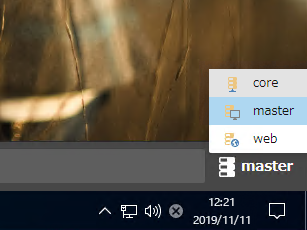
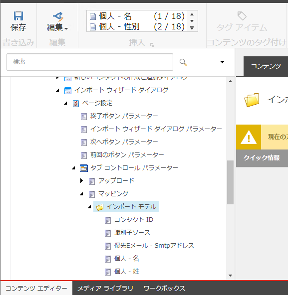
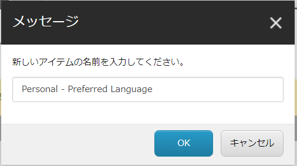
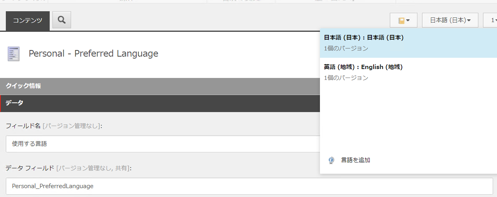

# Core データベースの拡張

今回インポートをするデータとしては、名前、メールアドレス、言語を設定したリストをインポートします。この際、名前、メールアドレスに関しては標準で項目として用意されていますが、言語に関しては用意されていないため、この項目を追加します。なお、設定だけで追加できる項目に関しては、Sitecore の文書で公開されています。

* [Configure the Import contacts wizard to include custom contact facets](https://doc.sitecore.com/users/92/sitecore-experience-platform/en/configure-the-import-contacts-wizard-to-include-custom-contact-facets.html)

## Core データベースに切り替える

ここからの作業は管理者の権限で進めていきます。「デスクトップ」ツールを起動して、右下にあるデータベースの項目で「Core」に切り替えてください。

左下にある Sitecore メニューを開き、コンテンツエディターを起動します。

以下のアイテム `/sitecore/client/Applications/List Manager/Dialogs/ImportWizardDialog/PageSettings/TabControl Parameters/Map/ImportModel` を選択します。

アイテムを選択すると、追加できるアイテム一覧に「個人 - 優先言語」というテンプレートがあります。これを選択します。

アイテム名として `Personal - Preferred Language` と設定します。

アイテムを保存します。このアイテムに関しては、日本語と英語のリソースがあるように、言語のコンテンツが不足している場合は追加してください。

アイテムの日本語と英語が揃っている形で準備が完了となります。

---
[戻る](./) | [インポート](importCSV.md)