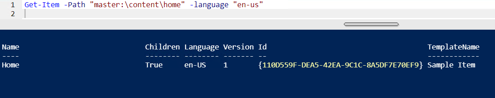
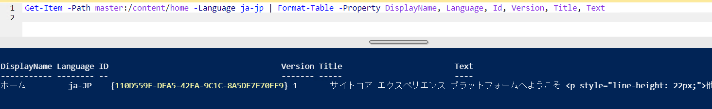
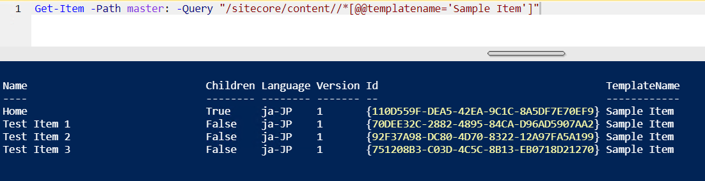
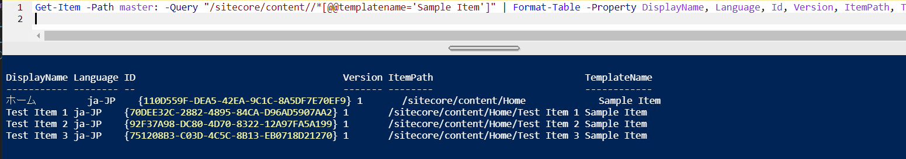
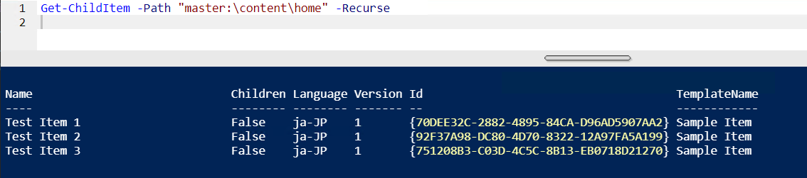
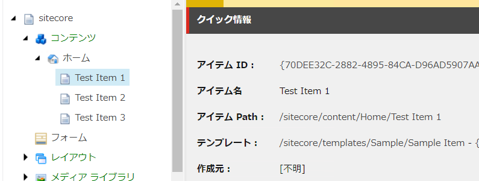
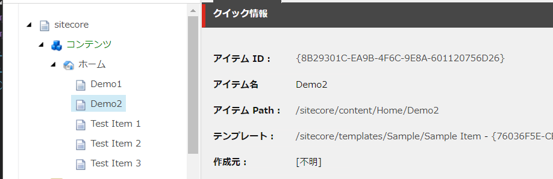

##########################
アイテムに関するコマンド
##########################

アイテムを操作するためのコマンドとして、以下のコマンドが用意されています。

Get-Item
***********

アイテムの情報を取得することができます。

.. code-block:: PowerShell

  Get-Item -Path "master:\content\home"

結果

.. image:: images/getitem1.png
   :align: center
   :width: 400px
   :alt: Get-Item

言語を指定する場合は、`-language "en-us"` を追加します。

.. code-block:: PowerShell

  Get-Item -Path "master:\content\home" -language "en-us"

結果

すべての言語を指定する場合は以下の通り。

.. code-block:: PowerShell

  Get-Item -Path "master:\content\home" -language "*"

結果

.. image:: images/getitem3.png
   :align: center
   :width: 400px
   :alt: Get-Item

アイテムの情報を表示します

.. code-block:: 

  Get-Item -Path master:/content/home -Language ja-jp | Format-Table -Property DisplayName, Language, Id, Version, Title, Text

結果

Sitecore Query を利用して取得することもできます。

.. code-block:: 

  Get-Item -Path master: -Query "/sitecore/content//*[@@templatename='Sample Item']"

結果

Sitecore Query で取得したデータを一覧で表示

.. code-block:: 

  Get-Item -Path master: -Query "/sitecore/content//*[@@templatename='Sample Item']" | Format-Table -Property DisplayName, Language, Id, Version, ItemPath, TemplateName 

結果

Get-ChildItem
*****************

アイテムの子アイテムに関して取得することができます

.. code-block:: PowerShell

  Get-ChildItem -Path "master:\content\home" -Recurse

結果

New-Item
*****************

新しいアイテムを作成するコマンドです。

.. code-block:: PowerShell

  New-Item -Path "master:\content\home" -Name "Demo" -ItemType "Sample/Sample Item"
  # or
  New-Item -Path "master:\content\home" -Name "Demo" -ItemType "{76036F5E-CBCE-46D1-AF0A-4143F9B557AA}"

結果

.. image:: images/getitem8.png
   :align: center
   :width: 400px
   :alt: New-Item

Remove-Item
*****************

アイテムを削除するためのコマンドです。

.. code-block:: PowerShell

  Get-Item -Path "master:\content\home\Demo" | Remove-Item

結果

Move-Item
*****************

アイテムを移動させるためのコマンドです。

.. code-block:: PowerShell

  Move-Item -Path "master:\content\home\Demo" -Destination "master:\content\home\Demo1"

結果

.. image:: images/getitema.png
   :align: center
   :width: 400px
   :alt: Move-Item

Copy-Item
*****************

.. code-block:: PowerShell

  Copy-Item -Path "master:\content\home\Demo1" -Destination "master:\content\home\Demo2"

結果

参考記事
*****************
* `Working with Items <https://doc.sitecorepowershell.com/working-with-items>`_