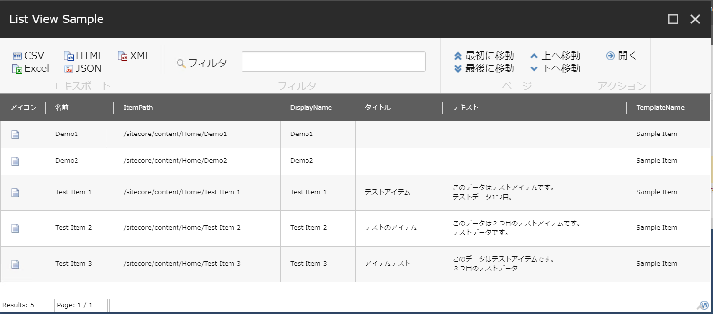

# コンテンツのエクスポート

Sitecore で持っているアイテムを CSV 形式で出力します。以下は、`/sitecore/content/home` の直下にあるアイテム一覧を CSV に出力しています
```PowerShell
Get-ChildItem '/sitecore/content/home' -Language 'ja-jp' | Select-Object Name,ItemPath,DisplayName,Title,Text | Export-CSV 'C:\Temp\test.csv' -Encoding UTF8 -NoTypeInformation
```
## リストビューで表示
Sitecore で持っているアイテムをリストビューで表示して、出力形式を選択することができます。` Show-ListView` を利用している点が異なります。
```PowerShell
Get-ChildItem '/sitecore/content/home' -Language 'ja-jp' | Show-ListView -Property Name,ItemPath,DisplayName,Title,Text,TemplateName -Title "List View Sample"
```
結果


このリストビューで表示されたデータから、フィルタをしてデータを絞り込んだあと CSV 以外にも Excel、JSON 等のデータにも出力することができます。

## 参考記事
* [Sitecore PowerShell Extensionsを使ってアイテムをCSVファイルにエクスポート
](https://www.pine4.net/Memo2/Article/Archive/Export-Item-to-CSV-with-Sitecore-PowerShell-Extensions)

---
[目次に戻る](../)