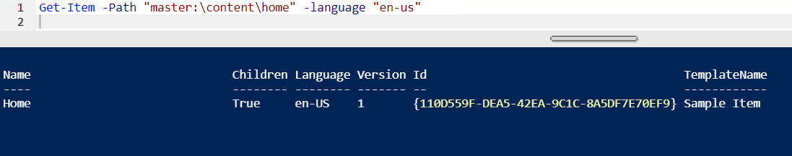
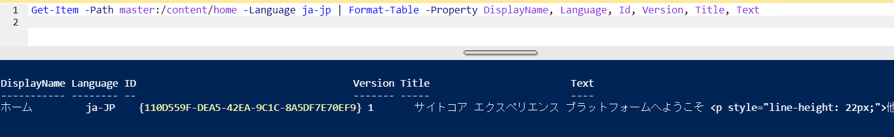
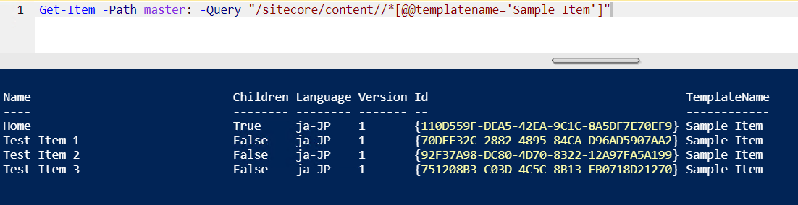
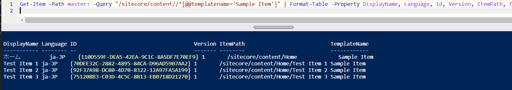
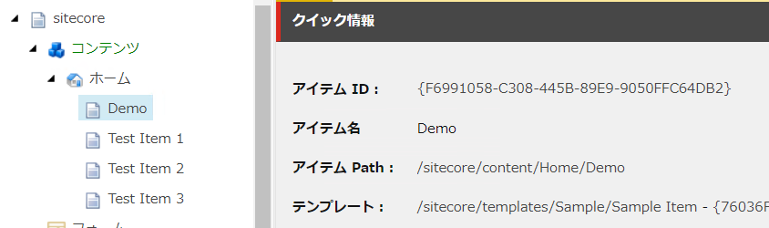
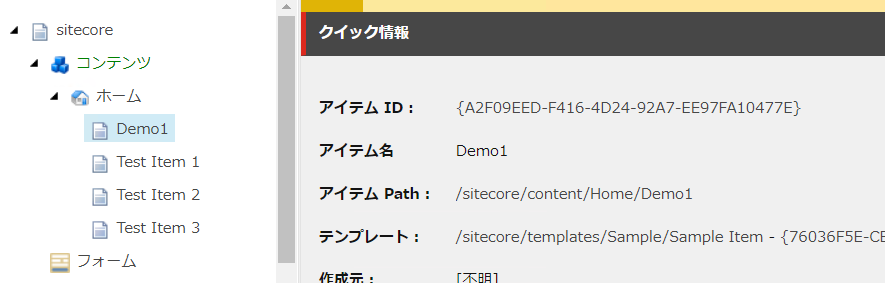

# アイテムに関するコマンド

アイテムを操作するためのコマンドとして、以下のコマンドが用意されています。

## Get-Item
アイテムの情報を取得することができます。
```PowerShell
Get-Item -Path "master:\content\home"
```
結果


言語を指定する場合は、`-language "en-us"` を追加します。

```PowerShell
Get-Item -Path "master:\content\home" -language "en-us"
```
結果


すべての言語を指定する場合は以下の通り。
```PowerShell
Get-Item -Path "master:\content\home" -language "*"
```
結果


アイテムの情報を表示します
```PowerShell
Get-Item -Path master:/content/home -Language ja-jp | Format-Table -Property DisplayName, Language, Id, Version, Title, Text
```
結果


Sitecore Query を利用して取得することもできます。
```PowerShell
Get-Item -Path master: -Query "/sitecore/content//*[@@templatename='Sample Item']"
```
結果


Sitecore Query で取得したデータを一覧で表示
```PowerShell
Get-Item -Path master: -Query "/sitecore/content//*[@@templatename='Sample Item']" | Format-Table -Property DisplayName, Language, Id, Version, ItemPath, TemplateName 
```
結果


## Get-ChildItem
アイテムの子アイテムに関して取得することができます
```PowerShell
Get-ChildItem -Path "master:\content\home" -Recurse
```
結果


## New-Item
新しいアイテムを作成するコマンドです。

```PowerShell
New-Item -Path "master:\content\home" -Name "Demo" -ItemType "Sample/Sample Item"
# or
New-Item -Path "master:\content\home" -Name "Demo" -ItemType "{76036F5E-CBCE-46D1-AF0A-4143F9B557AA}"
```
結果


## Remove-Item
アイテムを削除するためのコマンドです。

```PowerShell
Get-Item -Path "master:\content\home\Demo" | Remove-Item
```
結果


## Move-Item
アイテムを移動させるためのコマンドです。
```PowerShell
Move-Item -Path "master:\content\home\Demo" -Destination "master:\content\home\Demo1"
```
結果


## Copy-Item
```PowerShell
Copy-Item -Path "master:\content\home\Demo1" -Destination "master:\content\home\Demo2"
```
結果


## 参考記事
* [Working with Items](https://doc.sitecorepowershell.com/working-with-items)

---
[目次に戻る](../)