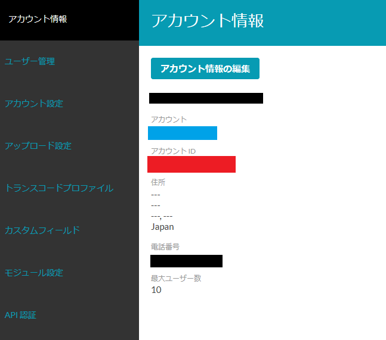
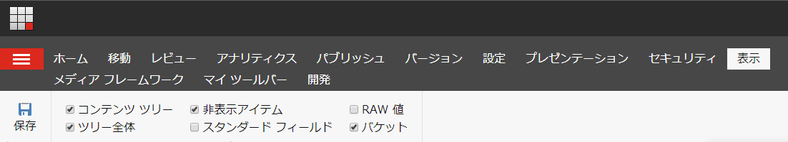

#####################################
Brightcove Connector for Sitecore
#####################################

動画配信サービスの Brightcove Video Cloud と連携することができます。公式サイトは以下の通りです。

* `Getting Started with Brightcove Video Connect for the Sitecore Experience Platform <https://support.brightcove.com/getting-started-brightcove-video-connect-sitecore-experience-platform>`_
* `BrightcoveOS/Sitecore-Connector <https://github.com/BrightcoveOS/Sitecore-Connector>`_

.. note:: 本記事執筆の時点（2019年11月05日）において、Sitecore 9.1.1 向けのモジュールが提供されています 。Sitecore 9.2.0 ではモジュールのインストールができませんので、9.2.0 の環境での検証はできません。

*************************
モジュールのインストール
*************************
 
Sitecore の管理画面から、モジュールのインストールを進めていきます。コントロールパネルを開いて、「管理」－「モジュールのインストール」を選択します。

.. image:: images/brightcove01.png
   :align: center
   :width: 400px
   :alt: モジュールの選択

モジュールのインストールを進めると、確認画面が表示されます。対象となる Sitecore のバージョンになっているか、確認をしてください。

.. image:: images/brightcove02.png
   :align: center
   :width: 400px
   :alt: 確認画面

****************************
日本語リソースのインポート
****************************

Brightcove Video Connect for the Sitecore Experience Platform の日本語リソースを用意しました。ダウンロード、インポートしてください。インポートは「コントロールパネル」－「グローバリゼーション」メニューにある「言語ファイルをインポート」からアップロード、実行します。

* `リソースファイル <https://github.com/SitecoreJapan/InstallScript/tree/master/demo/Brightcove/9.1.1>`_ 

インポート先のデータベースは「Core」を選択してください。一部 Master データベースにも反映されますが、リソースファイルにその記載があるため、1回のインポートで完了します。

***************************
アイテムをパブリッシュする
***************************

ワークボックスに作成されている、Brightcove 連携で利用するアイテムを公開します。まず、ワークボックスを開きます。

ワークフローのグループから「アナリティクスワークフロー」を選択します。

下書きのアイテムが表示されます。このアイテムをすべて公開作業を実行するために、「配置（すべて）」をクリックしてください。

.. image:: images/brightcove07.png
   :align: center
   :width: 400px
   :alt: すべて配置を選択

該当アイテムが下書きグループに表示されない段階で、公開が完了となります。

*******************
データベースの追加
*******************

Brigthcove が利用する Analytics に関するテーブルを追加する必要があります。モジュールをインポートすると、 /temp フォルダに `Sitecore 9.0 Media Framework Reporting Data Update Script.sql` というファイルが展開されています。これを、SQL Server Management Studio で開いて、Reporting データベースを対象として、実行してください。

********************
アカウントのリンク
********************

Sitecore と Brightcove Video Cloud（以下 Video Cloud ）の接続をするために、ここからは Video Cloud の管理画面での作業となります。

まず管理者でログインをしたあと、アカウント情報を開いてください。この画面で表示される `アカウントID` が設定で必要となります。

続いて API 認証のメニューを選択してください。

.. image:: images/brightcove11.png
   :align: center
   :width: 400px
   :alt: OAuth認証

今回は新規の接続となるため、`新規アプリケーションの登録` をクリックします。設定項目に関しては、以下の情報を参考にしてください

========================== ======================== =================
設定項目                    設定内容                今回の設定  
========================== ======================== =================
名前                        アプリケーションの名前    sitecoredemo 
説明                        アプリケーションの説明  （任意） 
認証のためのアカウント選択  利用するアカウント   
========================== ======================== =================

========================= ================
公開される Brightcove API
========================= ================
Analytics                 チェック 
Audience                  チェック無し 
Dynamic Ingest            全てチェック 
Gallery Experiences       チェック無し 
Ingestion Profiles        全てチェック 
Players                   全てチェック 
========================= ================

設定済の画面は以下の通りとなります。

保存をすると、クライアントID およびクライアントシークレットが表示されます。このクライアントシークレットは今後表示されないため、大切なキーとして保護してください。

.. image:: images/brightcove13.png
   :align: center
   :width: 400px
   :alt: クライアントシークレットの画面

作業が完了すると、以下のような表示となります。

.. image:: images/brightcove14.png
   :align: center
   :width: 400px
   :alt: アプリケーションの画面

これで必要なパラメータが準備できました。

**************************
メディアライブラリの設定
**************************

Video Cloud の設定情報を取得したので、これらのデータを Sitecore のメディアライブラリに設定をします。管理者権限でログインをしてメディアライブラリを開くと、Media Framwork – Accounts というアイテムができています。

.. image:: images/brightcove15.png
   :align: center
   :width: 400px
   :alt: メディアライブラリ

Accounts のアイテムを選択し、リボンの `バージョン` グループの言語で `英語（地域）:English(地域）` を選択してください。これは、設定に関して英語のリソースを参照しに行くためです。

タブを「フォルダー」に切り替えて、Brightcove アカウントのボタンをクリックして、アカウントのアイテムを作成します。

ここでは Brightcove Demo を作成します。

.. image:: images/brightcove18.png
   :align: center
   :width: 400px
   :alt: デモ

作成したアイテムに対して、以下の項目を設定します。

============= ===============================================
フィールド名  設定値 
============= ===============================================
Publisher ID  アカウント ID 
Client ID     アプリケーションの Client ID 
Client Secret アプリケーションのクライアントシークレット 
============= ===============================================

設定している参考画面は以下の通りです。

.. image:: images/brightcove19.png
   :align: center
   :width: 400px
   :alt: デモ

***********
動作確認
***********

上記の設定が完了した後、以下の手順で連携ができているか確認をします。

1. コンテンツエディターを開く
2. `表示` タブにある `表示` グループにある `バケット` をチェックします

3. `メディア フレームワーク` タブを開く
4. `すべてをインポート` を実行します

.. image:: images/brightcove21.png
   :align: center
   :width: 400px
   :alt: インポート

5. 動画データを Brightcove からインポートをします

.. image:: images/brightcove22.png
   :align: center
   :width: 400px
   :alt: インポート状態

インポートをしたデータは、メディアライブラリに登録されます。

ファイルのフィールドを参照すると、以下のようなメタデータが保存されています。

.. image:: images/brightcove24.png
   :align: center
   :width: 400px
   :alt: アイテムの確認

これにより、Brightcove に保存されている動画に関して、Sitecore のメディアライブラリからアクセスすることができるようになりました。
