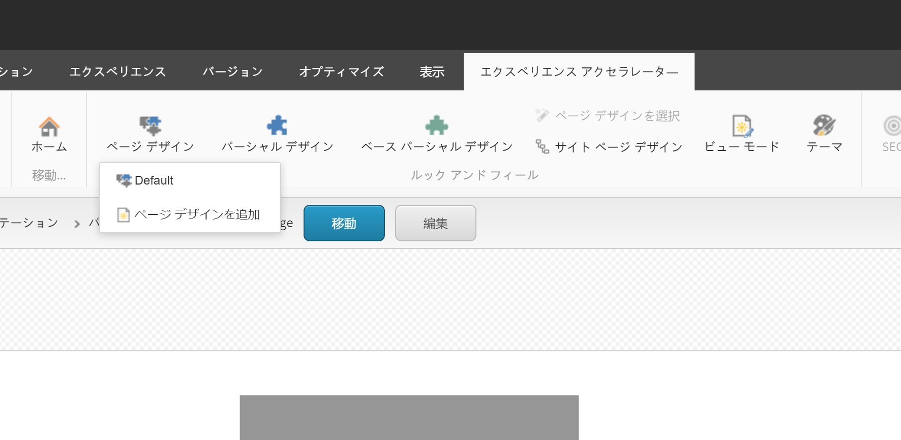
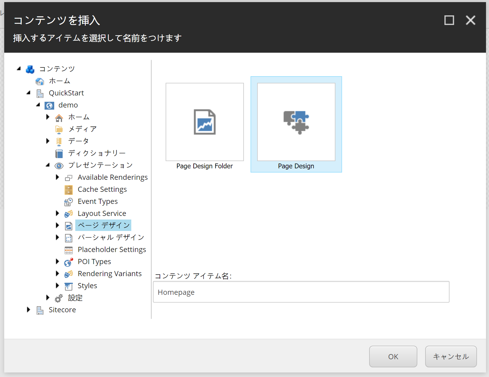
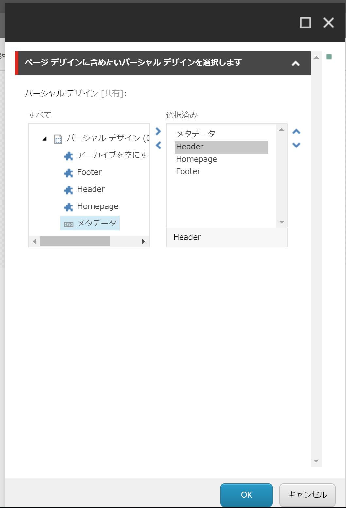
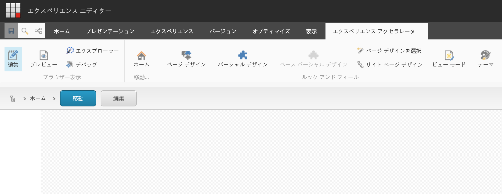
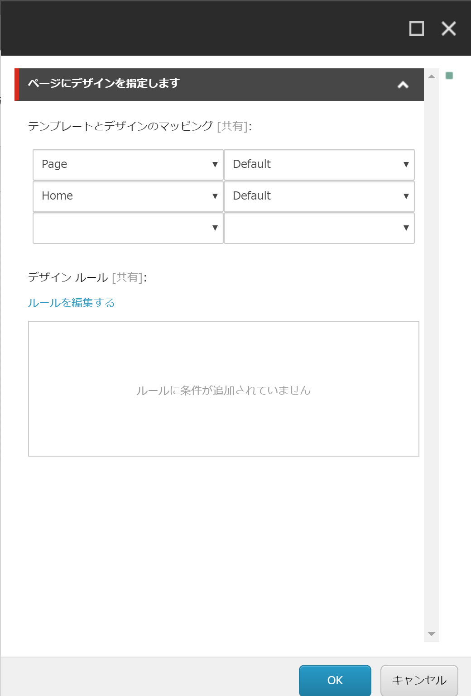
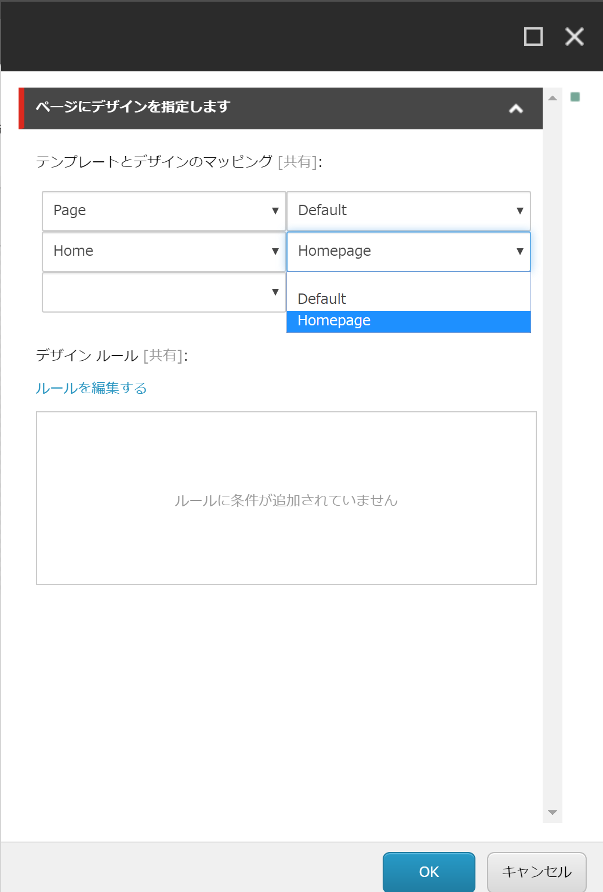
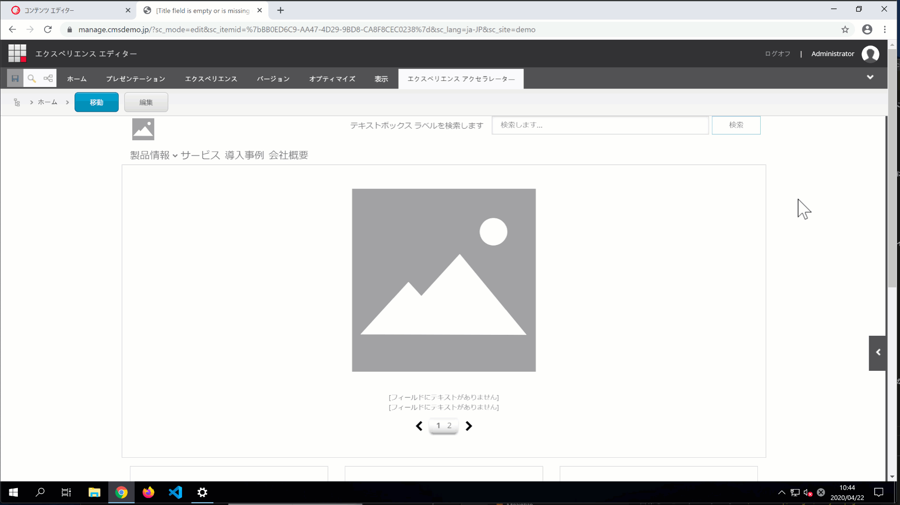

#########################
ページデザインの作成
#########################

パーシャルデザインの準備が出来ているところで、ページデザインを作成していきます。ページデザインは、ページデザインにはパーシャルデザインを並べていく形になります。

表示されたダイアログ

どのパーシャルデザインを利用するのかを設定するダイアログが開きます。ここでは、Footer、Header、Homepage およびメタデータを選択、順番を並べ替えます。

作成したパーシャルデザインを保存します。保存をしたあと、ホームアイテムに移動をします。エクスペリエンスアクセラレーターのタブにある「ホーム」のアイコンをクリックしてください。

続いて、エクスペリエンスアクセラレーターのタブから、「サイトページデザイン」をクリックしてダイアログを表示します。

ホームのテンプレートに対して、作成をしたページデザインを適用します。

保存をすると、作成したページデザインがトップページに適用されることがわかります。

これでデフォルトのページのデザインが出来ました。ページのタイプの数だけ、ページデザインを作る形となります。

*************
参考動画
*************

.. raw:: html

    <iframe width="560" height="315" src="https://www.youtube.com/embed/oy8fVbEpO3o" frameborder="0" allowfullscreen></iframe>
