##################
ボディの作成
##################

ヘッダー、フッターと作成したので、今回はトップページのボディ部分を作成します。まずはベースとなるパーシャルデザインを追加します。

.. image:: images/body01.png
   :align: center
   :width: 400px
   :alt: パーシャルデザインを追加

今回も同じ手順ですが、アイテム名として `homepage` を設定します。

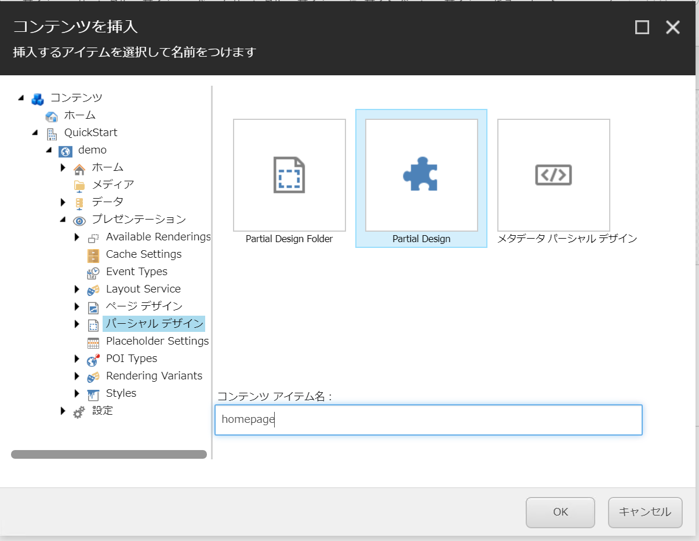
   

最初に、ページ構造のモジュール「スプリッター（行）」をボディエリアにドラッグ＆ドロップで配置します。

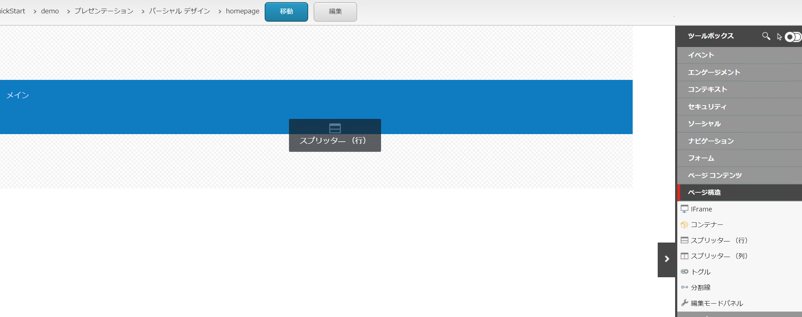
   

今回は、ボディエリアが上下２つに分かれました。続いて、下部のエリアに「スプリッター（列）」をドラッグ＆ドロップで配置します。

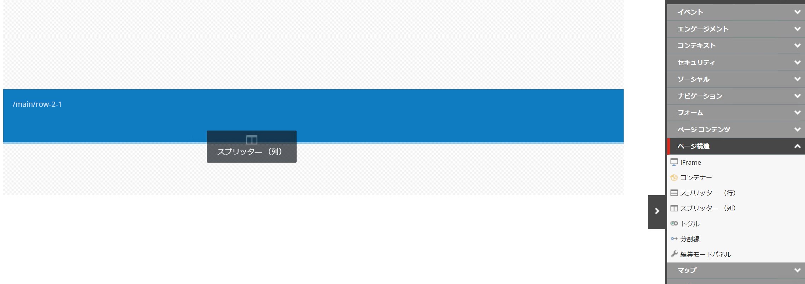
   

今回はスプリッター（列）を利用して、エリアを3つに分けます。まず、カラムを1つ選択すると、以下のようなメニューが表示されます。

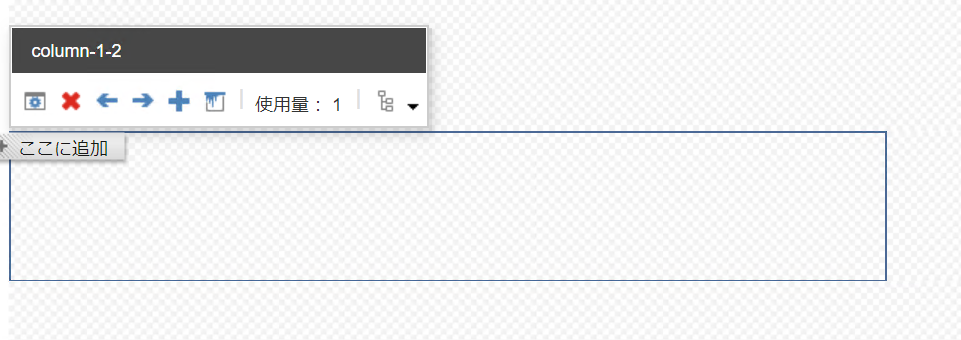
   

このアイコンのうち ＋ のアイコンをクリックするとカラムを追加することができます。

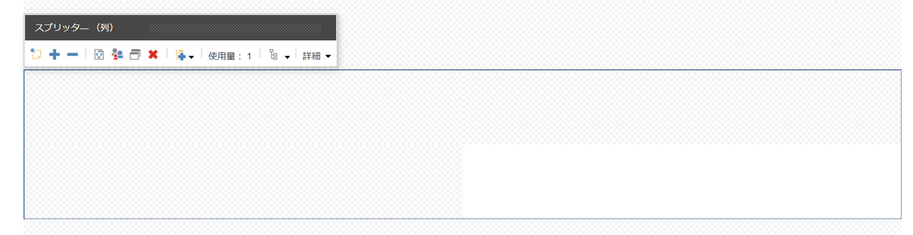
   

３つのカラムに関して、エリアのサイズを 6 から 4 にすべて変更をします。

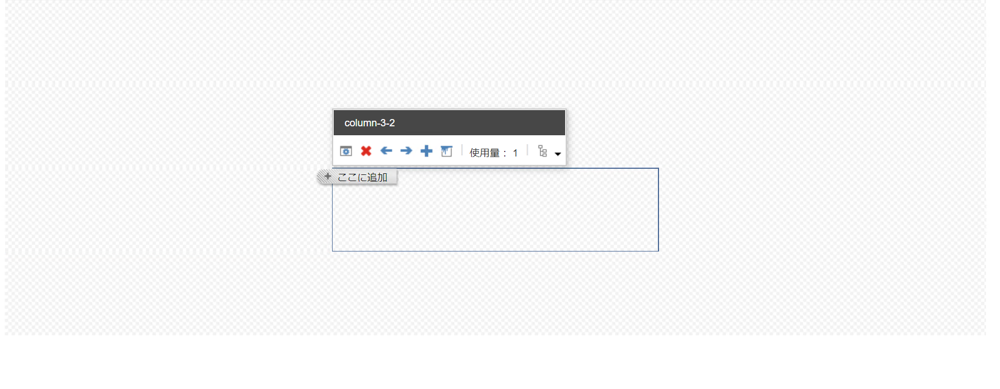
   

この３つのエリアに対してはコンテナーをすべてドラッグ＆ドロップで配置します。

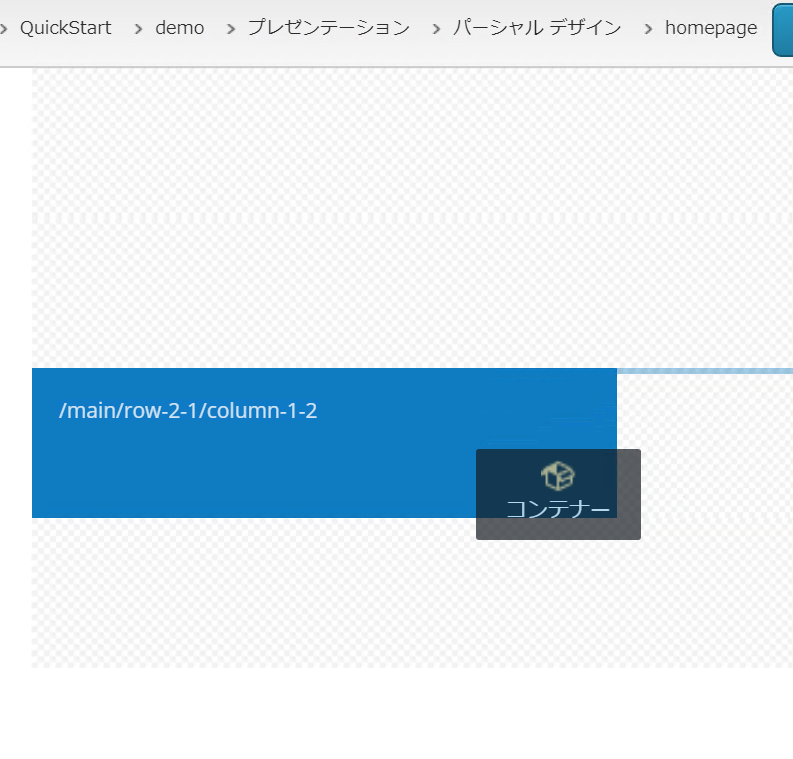
   

最後に、スプリッターの上のエリアに対して、複合グループにある「カルーセル」をドラッグ＆ドロップで配置します。

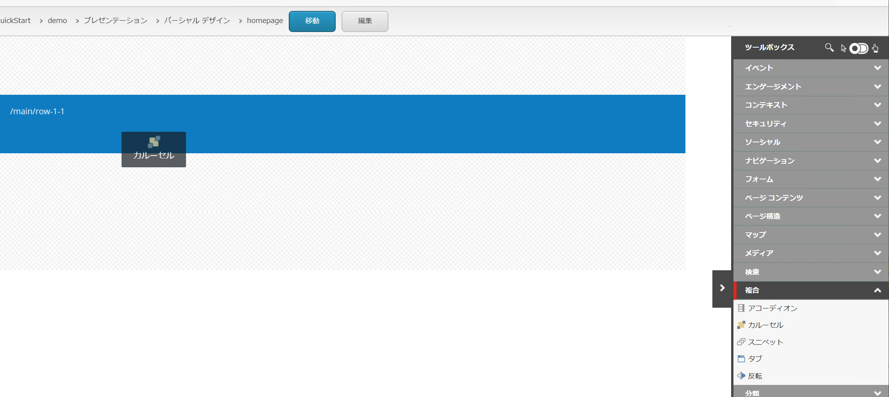
   

カルーセルのアイテムを選択するダイアログが表示されます。この際、まだ作成をしていない場合は、ここで作成をする必要があります。

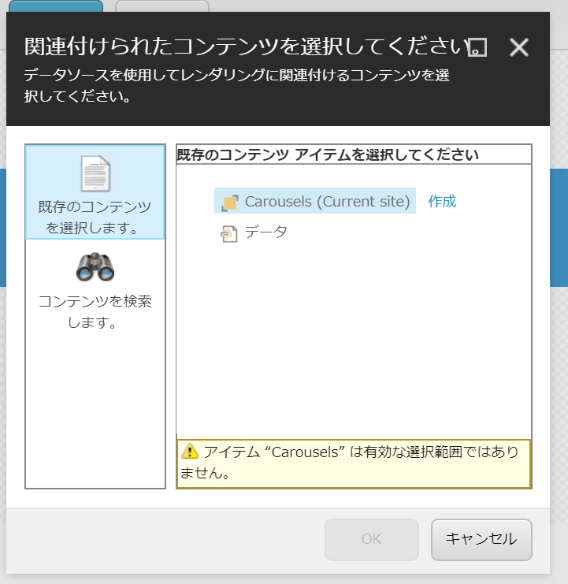

上のアイテム「Carousels(Curent site)」の右側にある「作成」をクリックします。するとカルーセル作成のダイアログが起動します。今回は「カルーセル」を選択、アイテム名としては Homepage を入力します。

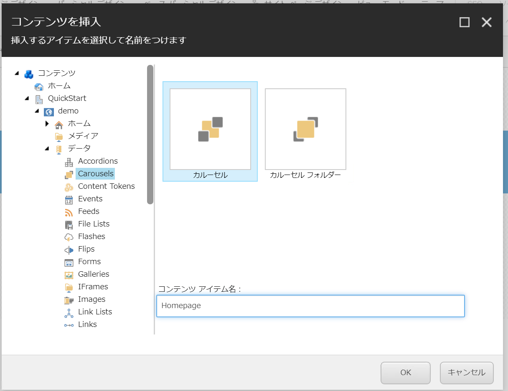
   
OK を押すと、カルーセルモジュールが追加されます。

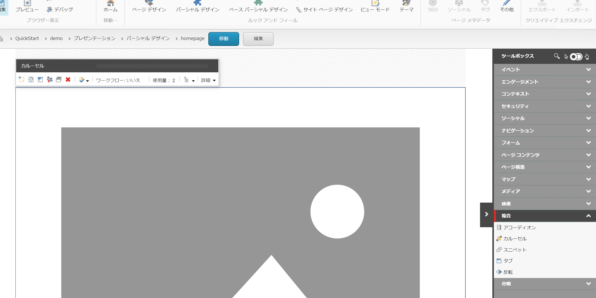

３つのエリアには、プロモのアイテムを置いていきます。

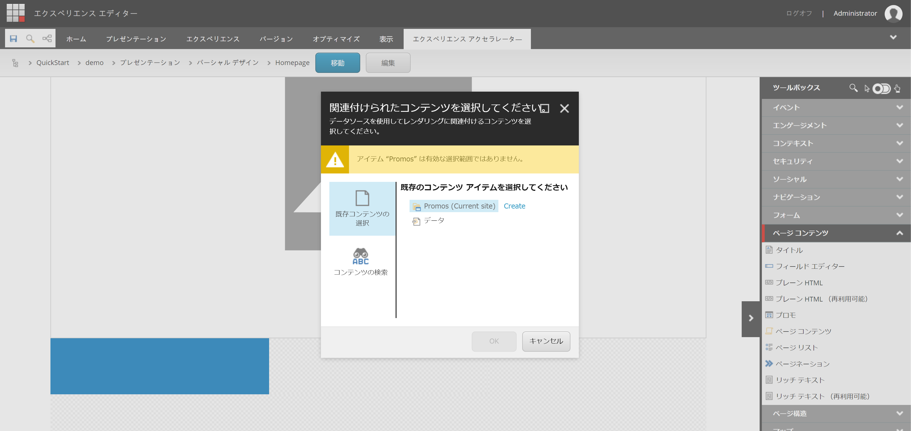

プロモのアイテムがないため、Create をクリック、新しいアイテムを作成して指定します。

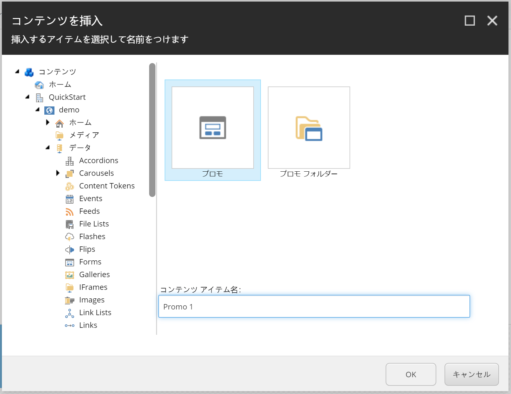

プロモに関しては３つアイテムを作成して仕上がりは以下の様になります。

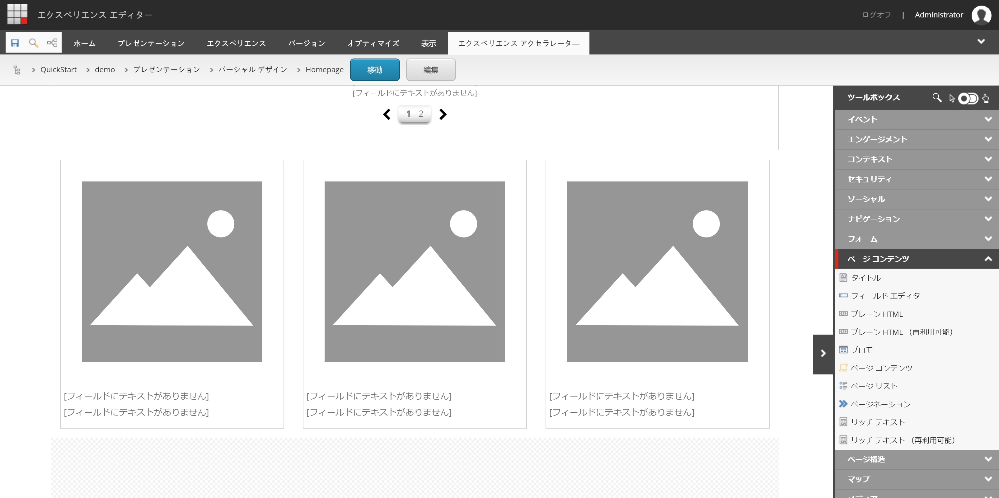

上記で、ボディのアイテム作成は完了しました。保存をして、エクスペリエンスエディターを一度閉じてください。

*************
参考動画
*************

.. raw:: html

    <iframe width="560" height="315" src="https://www.youtube.com/embed/M4X3oHWw370" frameborder="0" allowfullscreen></iframe>
